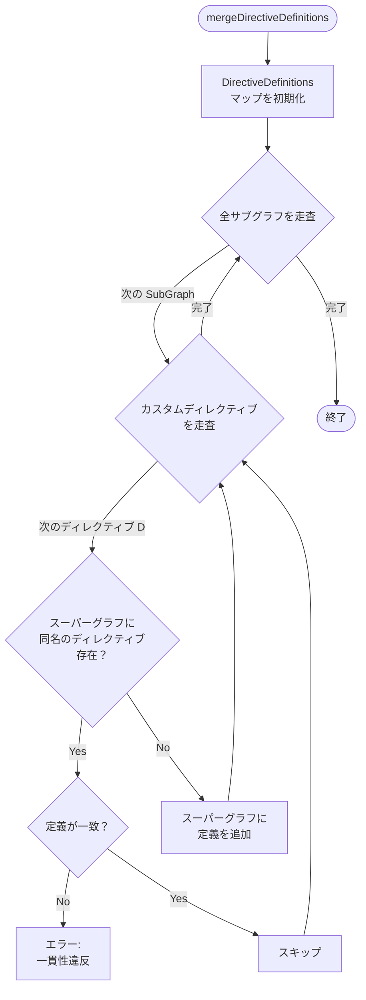
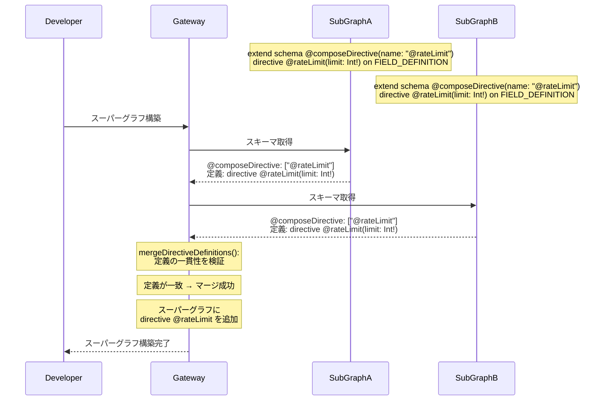
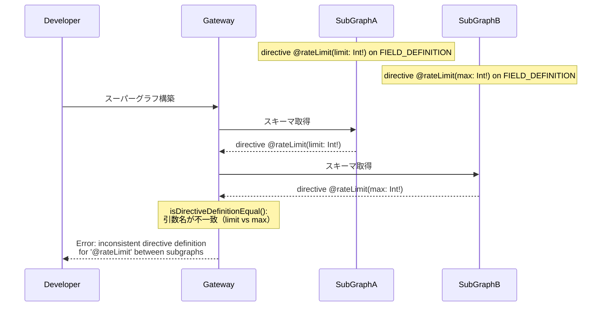

# Design Doc : Federation Compose Directive

## Background

現在の go-graphql-federation-gateway は、`@composeDirective` ディレクティブのパース機能は実装されているものの、このディレクティブが持つ本来の役割である「カスタムディレクティブのスーパーグラフへの伝搬」の機能が実装されていません。

Apollo Federation v2 の仕様では、`@composeDirective` ディレクティブは以下の目的で使用されます：
- サブグラフで定義したカスタムディレクティブをスーパーグラフスキーマに含める
- カスタムディレクティブがサブグラフ間で一貫して適用されるようにする
- ドキュメント生成やツールでカスタムディレクティブを活用できるようにする

例えば、レート制限やキャッシュ制御のカスタムディレクティブを定義する場合：

```graphql
# Subgraph schema
extend schema
  @link(url: "https://specs.apollo.dev/federation/v2.0",
        import: ["@key", "@composeDirective"])
  @composeDirective(name: "@rateLimit")
  @composeDirective(name: "@cacheControl")

directive @rateLimit(limit: Int!, duration: Int!) on FIELD_DEFINITION
directive @cacheControl(maxAge: Int!) on FIELD_DEFINITION | OBJECT

type Query {
  expensiveQuery: String! @rateLimit(limit: 10, duration: 60)
  cachedData: Data! @cacheControl(maxAge: 3600)
}
```

これにより、カスタムディレクティブがスーパーグラフスキーマに含まれ、クライアントやツールが認識できるようになります。

## Summary

このドキュメントでは、`@composeDirective` ディレクティブの完全な実装のための設計方針と実装アプローチを提案します。具体的には、カスタムディレクティブ定義のスーパーグラフへのマージ、ディレクティブ情報の検証、およびスキーマ構成時のディレクティブ伝搬を実装します。

## Goals

- `@composeDirective` で指定されたカスタムディレクティブ定義をスーパーグラフに含める機能の実装
- 複数サブグラフで同名のカスタムディレクティブが定義されている場合の一貫性検証
- カスタムディレクティブがフィールド、型、引数に適用されている場合の伝搬処理

## Non-Goals

- カスタムディレクティブの実行ロジックの実装（ディレクティブはメタデータとしてのみ扱う）
- @link ディレクティブの完全な実装（@composeDirective の抽出に必要な最小限のみ）
- カスタムディレクティブのバリデーションルールの動的な追加
- Apollo Router との完全な互換性（基本的な伝搬のみを実装）

## Algorithm

### 現在の実装状況

**パース機能（実装済み）:**

```go
// subgraph_v2.go:269-292
func extractSchemaComposeDirectives(doc *ast.Document) []string {
    var directives []string
    for _, def := range doc.Definitions {
        if schemaDef, ok := def.(*ast.SchemaDefinition); ok {
            for _, d := range schemaDef.Directives {
                if d.Name == "composeDirective" {
                    for _, arg := range d.Arguments {
                        if arg.Name.String() == "name" {
                            name := strings.Trim(arg.Value.String(), "\"")
                            directives = append(directives, name)
                        }
                    }
                }
            }
        }
    }
    return directives
}

// subgraph_v2.go:289-292
func (sg *SubGraphV2) GetComposeDirectives() []string {
    return sg.ComposeDirectives
}
```

**未実装箇所:**
- カスタムディレクティブ定義の抽出
- スーパーグラフへのディレクティブ定義のマージ
- ディレクティブ定義の一貫性検証
- カスタムディレクティブが適用されたフィールド等の情報伝搬

### 修正箇所 1: subgraph_v2.go でのカスタムディレクティブ定義の抽出

**実装方針:**

```go
// SubGraphV2 にカスタムディレクティブ定義を保持
type SubGraphV2 struct {
    Name              string
    Host              string
    Schema            *ast.Document
    entities          map[string]*Entity
    ComposeDirectives []string                           // compose すべきディレクティブ名のリスト
    DirectiveDefinitions map[string]*ast.DirectiveDefinition // ← 追加
}

// extractDirectiveDefinitions() を追加
func extractDirectiveDefinitions(
    doc *ast.Document,
    composeDirectives []string,
) map[string]*ast.DirectiveDefinition {
    definitions := make(map[string]*ast.DirectiveDefinition)

    // composeDirectives に指定されたディレクティブのみを抽出
    composeSet := make(map[string]bool)
    for _, name := range composeDirectives {
        // "@rateLimit" -> "rateLimit" に変換
        cleanName := strings.TrimPrefix(name, "@")
        composeSet[cleanName] = true
    }

    for _, def := range doc.Definitions {
        if directiveDef, ok := def.(*ast.DirectiveDefinition); ok {
            if composeSet[directiveDef.Name] {
                definitions[directiveDef.Name] = directiveDef
            }
        }
    }

    return definitions
}

// NewSubGraphV2() で呼び出し
sg.DirectiveDefinitions = extractDirectiveDefinitions(doc, sg.ComposeDirectives)
```

### 修正箇所 2: super_graph_v2.go でのディレクティブ定義のマージ

**実装方針:**

```go
// SuperGraphV2 にカスタムディレクティブ定義を保持
type SuperGraphV2 struct {
    Schema            *ast.Document
    SubGraphs         []*SubGraphV2
    DirectiveDefinitions map[string]*ast.DirectiveDefinition // ← 追加
    // ...
}

// mergeDirectiveDefinitions() を追加
func (sg *SuperGraphV2) mergeDirectiveDefinitions() error {
    sg.DirectiveDefinitions = make(map[string]*ast.DirectiveDefinition)

    for _, subGraph := range sg.SubGraphs {
        for name, directiveDef := range subGraph.DirectiveDefinitions {
            if existing, ok := sg.DirectiveDefinitions[name]; ok {
                // 既存の定義と一致するか検証
                if !isDirectiveDefinitionEqual(existing, directiveDef) {
                    return fmt.Errorf(
                        "inconsistent directive definition for '@%s' between subgraphs",
                        name,
                    )
                }
                // 一致する場合はスキップ
                continue
            }

            // 新しいディレクティブ定義を追加
            sg.DirectiveDefinitions[name] = directiveDef
            sg.Schema.Definitions = append(sg.Schema.Definitions, directiveDef)
        }
    }

    return nil
}

// ディレクティブ定義の等価性をチェック
func isDirectiveDefinitionEqual(
    a, b *ast.DirectiveDefinition,
) bool {
    // 名前のチェック
    if a.Name != b.Name {
        return false
    }

    // 引数の数をチェック
    if len(a.Arguments) != len(b.Arguments) {
        return false
    }

    // 各引数の型と名前をチェック
    for i := range a.Arguments {
        if a.Arguments[i].Name.String() != b.Arguments[i].Name.String() {
            return false
        }
        if !isTypeEqual(a.Arguments[i].Type, b.Arguments[i].Type) {
            return false
        }
    }

    // 適用場所（Locations）のチェック
    if len(a.Locations) != len(b.Locations) {
        return false
    }
    locSet := make(map[string]bool)
    for _, loc := range a.Locations {
        locSet[loc.String()] = true
    }
    for _, loc := range b.Locations {
        if !locSet[loc.String()] {
            return false
        }
    }

    return true
}

// 型の等価性をチェック
func isTypeEqual(a, b ast.Type) bool {
    // Named, List, NonNull の再帰的な比較
    // 実装詳細は省略
    return a.String() == b.String()
}
```



### 修正箇所 3: schema 定義への @composeDirective の追加（オプション）

**実装方針:**

スーパーグラフスキーマの schema 定義に @composeDirective を追加することで、どのカスタムディレクティブがスーパーグラフに含まれているかを明示できます。

```go
// スーパーグラフ構築時に schema 定義を追加または更新
func (sg *SuperGraphV2) addSchemaDefinition() {
    // 既存の schema 定義を検索
    var schemaDef *ast.SchemaDefinition
    for _, def := range sg.Schema.Definitions {
        if sd, ok := def.(*ast.SchemaDefinition); ok {
            schemaDef = sd
            break
        }
    }

    // schema 定義がない場合は作成
    if schemaDef == nil {
        schemaDef = &ast.SchemaDefinition{
            Directives: []*ast.Directive{},
        }
        sg.Schema.Definitions = append([]ast.Definition{schemaDef}, sg.Schema.Definitions...)
    }

    // @composeDirective を追加
    for directiveName := range sg.DirectiveDefinitions {
        composeDir := &ast.Directive{
            Name: "composeDirective",
            Arguments: []*ast.Argument{
                {
                    Name:  &ast.Ident{Value: "name"},
                    Value: &ast.StringValue{Value: "@" + directiveName},
                },
            },
        }
        schemaDef.Directives = append(schemaDef.Directives, composeDir)
    }
}
```

---

## Request Sequence

### カスタムディレクティブの伝搬



### ディレクティブ定義の不一致検出



---

## Development Command For AI Agent

### Process

1. **SubGraph V2 拡張**
   1.1. `subgraph_v2.go` を修正
        - SubGraphV2 構造に DirectiveDefinitions フィールドを追加
        - extractDirectiveDefinitions() 関数を追加
        - NewSubGraphV2() で extractDirectiveDefinitions() を呼び出し
   1.2. `subgraph_v2_test.go` にテストを追加
        - @composeDirective のパース（既存）
        - カスタムディレクティブ定義の抽出
        - 複数のカスタムディレクティブの処理

2. **SuperGraph V2 拡張**
   2.1. `super_graph_v2.go` を修正
        - SuperGraphV2 構造に DirectiveDefinitions フィールドを追加
        - mergeDirectiveDefinitions() 関数を追加
        - isDirectiveDefinitionEqual() ヘルパー関数を追加
        - isTypeEqual() ヘルパー関数を追加
        - NewSuperGraphV2() で mergeDirectiveDefinitions() を呼び出し
   2.2. schema 定義への @composeDirective 追加（オプション）
        - addSchemaDefinition() 関数を追加
   2.3. `super_graph_v2_test.go` にテストを追加
        - カスタムディレクティブ定義のマージ
        - ディレクティブ定義の一貫性検証（一致する場合）
        - ディレクティブ定義の一貫性検証（不一致の場合、エラー）
        - 複数サブグラフからの異なるカスタムディレクティブのマージ

3. **統合テスト**
   3.1. カスタムディレクティブを使用するサンプルスキーマの作成
   3.2. スーパーグラフにカスタムディレクティブが含まれることの確認

4. **ドキュメント**
   4.1. @composeDirective の使用方法を README に追加
   4.2. カスタムディレクティブのサンプルを追加

5. **結合テスト**
   5.1. `make test-all` で全ドメインのテストが通ることを確認
   5.2. カスタムディレクティブ機能が既存の動作を壊していないことを確認

### Expected Outcomes

- `@composeDirective` で指定されたカスタムディレクティブがスーパーグラフに含まれる
- ディレクティブ定義の一貫性が検証される
- カスタムディレクティブをドキュメント生成やツールで活用できる
- Apollo Federation v2 仕様の @composeDirective への準拠度が向上する
- サブグラフ間でカスタムディレクティブを一貫して使用できる
