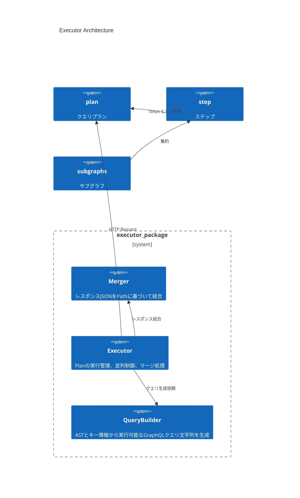
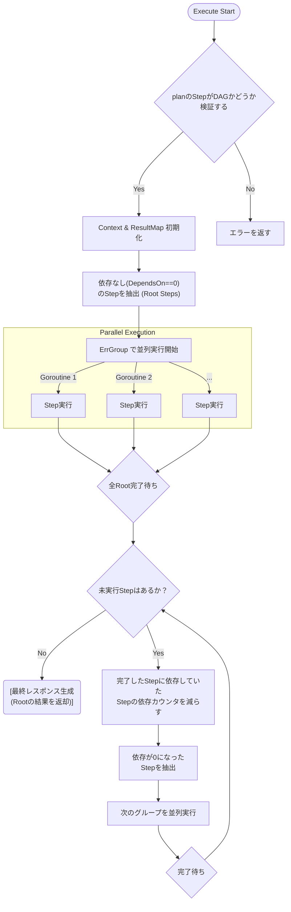
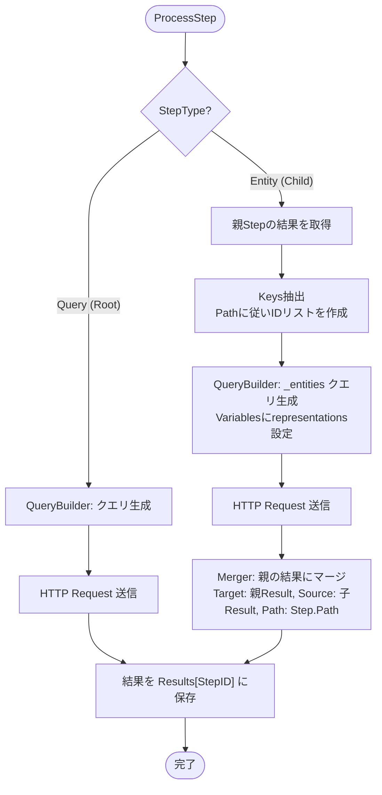
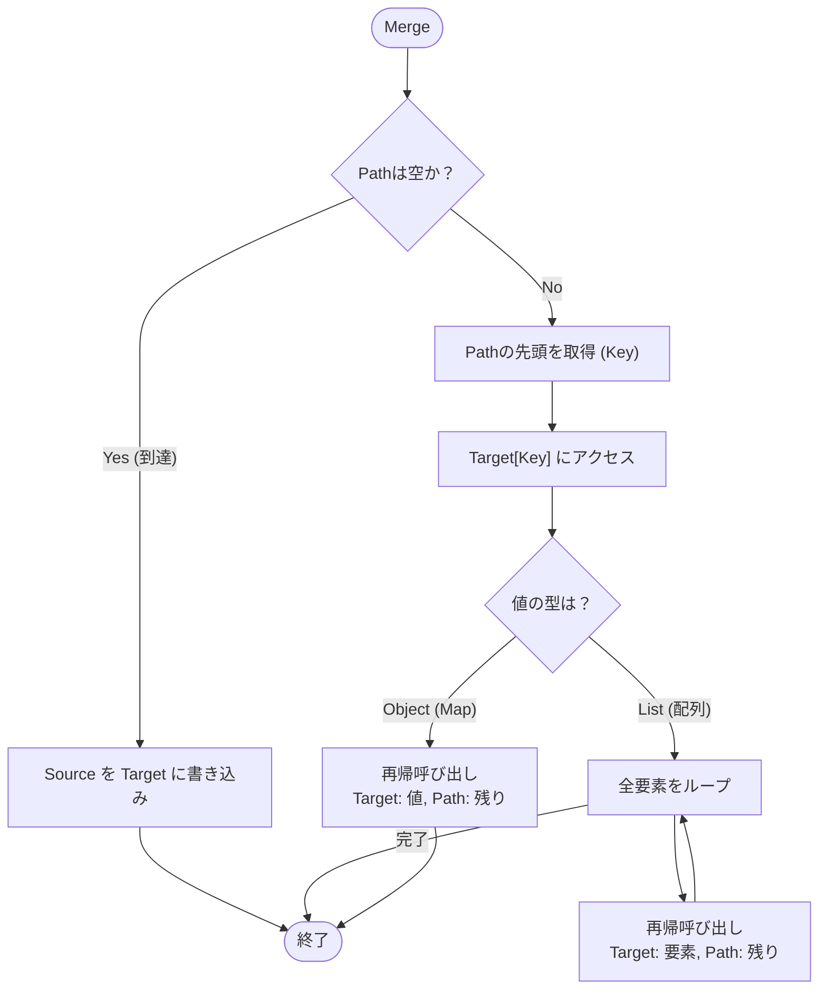

# DesignDoc for Federation Execution

# Summary

GraphQL Federation の実行を整理し、設計する


# Background

GraphQL Federation のコアロジックであるクエリプランは、docs/federation-logic/ja/designdoc.md に記載している。これらは、graph/\*v2.go および planner/\*v2.go に実装を反映をしている。

# Author

 - N9tE9

# Architecture

## Overlook

Executor は、planner が生成するプランのステップに応じて QueryBuilder によってクエリを組み立て、サブグラフと通信をする。



## Components

### Executor

プランナーから渡される plan.steps に含まれるサブグラフからクエリビルダーでクエリを生成し、対応するサービスに対してリクエストを実施する。
各 step は DependsOn という形で、ステップ間の依存関係を表現している。例えば、ec ドメインで product -> reviews -> accounts という依存に合わせてリクエストする場合は、reviews は product、accounts は reviews に依存するという構成を取る

### QueryBuilder

Executor から渡される Step に応じてサービスに送るリクエストの GraphQL クエリを組み立てる責務を持つ。
Root の SelectionSet であれば、`query { product { id } }` といったクエリを組み立て、それに依存するステップがある場合は `query ($representations: [_Any!]!) { _entities(representations: $representations) { ... on Product { reviews { body } } } }` といったクエリを組み立てる。
必要に応じて、ルートクエリの変数定義や、_entities クエリの variables 定義も行う。
QueryBuilder は n9te9/graphql-parser の AST からクエリを生成できるため、それを利用している。

### Merger

親 Step の実行結果（JSON）に対し、子 Step の実行結果（JSON）を正しい位置 (Path) にマージする。
配列（List）の展開処理もここで行う。

## Datastructure

### ExecutionContext

Gateway へのリクエストをされた時のクエリ実行スコープを持ち回す構造体

| プロパティ名 | データ型 | 例 |
| --- | --- | --- |
| ctx | context.Context | - |
| plan | *Plan | - |
| results | map[int]interface{} | 1 -> {"product": {"id": 1}} |
| mu | sync.RWMutex | - |

## Usecases / Algorithms

### Execute (Planの実行フロー)

Executor が循環参照しないようにトポロジカルソートでDAGであるかどうかを検証する。
Plan を受け取り、依存関係解決しながら実行するメインフローである。
依存数カウンタを用いて実行順序を制御する。



**Note**: 上記は概念的なフロー。実装時は「再帰的な実行」で実装をする。
各ステップの Goroutine が完了した時点でchanを用いることができるが、再帰的な実装の方がコードがシンプルになると考えているため、そちらを採用する。

### ProcessStep (個別のStep実行)

ひとつの Step を処理する詳細フローである。




### Merge Logic (レスポンス結合)

plan の Step.Path に従って、親の結果に子の結果をマージするロジックである。



## QA

Apollo Federation と同様の互換性を持たせるような形でテストケースを設計する。

### Executor / Merger / QueryBuilder の単体テスト

下記のような形で TDT を実践する。

```go
  tests := []struct {
    name string
    plan *Plan
    subgraphResponses map[string]interface{}
    expectedResponse interface{}
  }{
    {
      name: "Simple Root Query",
      plan: &Plan{
        Steps: []*Step{
          {
            ID: 1,
            Type: StepTypeQuery,
            Subgraph: "products",
            SelectionSet: &SelectionSet{...},
          },
        },
      },
      subgraphResponses: map[string]interface{}{
        "products": map[string]interface{}{
          "data": map[string]interface{}{
            "product": map[string]interface{}{
              "id": 1,
            },
          },
        },
      },
      expectedResponse: map[string]interface{}{
        "data": map[string]interface{}{
          "product": map[string]interface{}{
            "id": 1,
          },
        },
      },
    },
  }

  for _, tt := range tests {
    t.Run(tt.name, func(t *testing.T) {
        // Test Executor ロジック
    })
  }
```