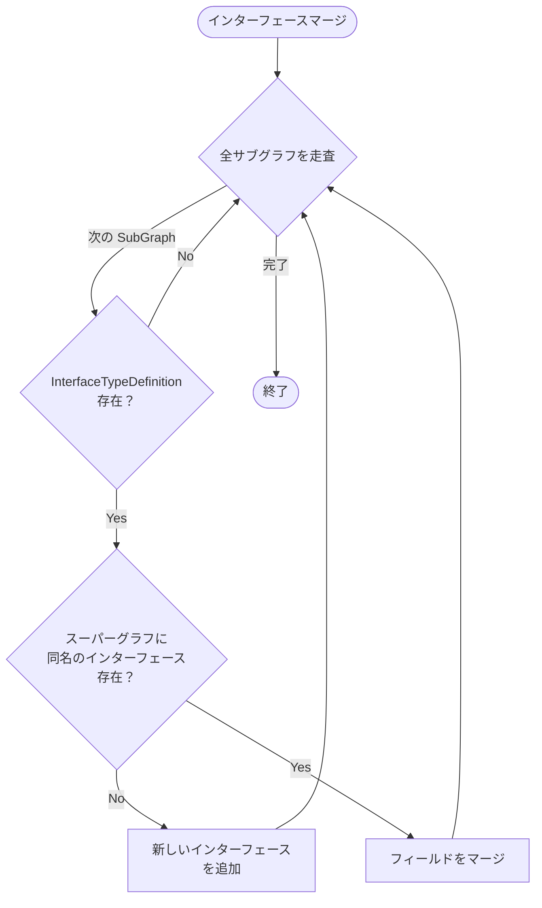
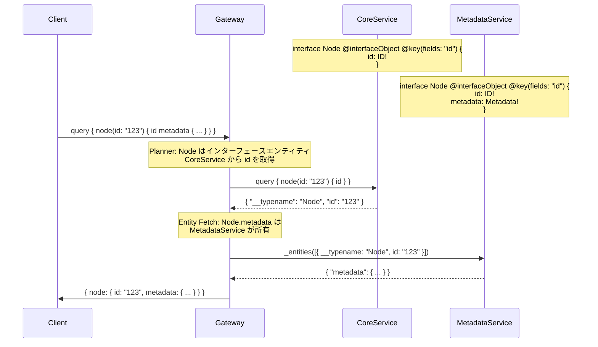
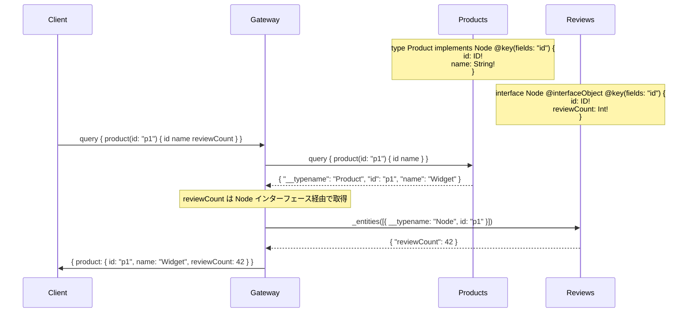

# Design Doc : Federation InterfaceObject Directive

## Background

現在の go-graphql-federation-gateway は、`@interfaceObject` ディレクティブのパース機能は実装されているものの、このディレクティブが持つ本来の役割である「インターフェース型のエンティティ表現」の完全なサポートが不足しています。

Apollo Federation v2 の仕様では、`@interfaceObject` ディレクティブは以下の目的で使用されます：
- インターフェース型自体をエンティティとして扱う
- インターフェースの実装型ではなく、インターフェース型として _entities クエリで解決できるようにする
- 異なるサブグラフでインターフェースのフィールドを拡張する

例えば、Node インターフェースを複数のサブグラフで拡張する場合：

```graphql
# Subgraph A
interface Node @interfaceObject @key(fields: "id") {
  id: ID!
}

# Subgraph B
interface Node @interfaceObject @key(fields: "id") {
  id: ID!
  createdAt: DateTime!
}
```

これにより、`node(id: "123")` クエリで異なるサブグラフのフィールドを統合できます。

## Summary

このドキュメントでは、`@interfaceObject` ディレクティブの完全な実装のための設計方針と実装アプローチを提案します。具体的には、インターフェース型のエンティティ解決、_entities クエリでのインターフェース型の処理、およびフィールドマージロジックの実装を行います。

## Goals

- `@interfaceObject` でマークされたインターフェース型をエンティティとして扱う機能の実装
- インターフェース型の _entities クエリ解決の実装
- 異なるサブグラフのインターフェースフィールドのマージ機能の実装
- インターフェース型のエンティティキー解決の実装

## Non-Goals

- インターフェースの実装型の自動推論
- @interfaceObject と通常のインターフェースの混在パターンの最適化
- Relay スタイルの Connection インターフェースの特別処理

## Algorithm

### 現在の実装状況

**パース機能（実装済み）:**

```go
// subgraph_v2.go:87
isInterfaceObject: hasDirective(objType.Directives, "interfaceObject"),

// subgraph_v2.go:249-251
func (e *Entity) IsInterfaceObject() bool {
    return e.isInterfaceObject
}
```

**未実装箇所:**
- インターフェース型定義の @interfaceObject パース
- SuperGraph でのインターフェースエンティティのマージ
- Planner でのインターフェースエンティティ解決
- Executor での __typename: "InterfaceName" の処理

### 修正箇所 1: subgraph_v2.go でのインターフェース型パース

**実装方針:**

```go
// InterfaceTypeDefinition と InterfaceTypeExtension も Entity として扱う
for _, def := range doc.Definitions {
    // 既存: ObjectTypeDefinition の処理
    // ...

    // 追加: InterfaceTypeDefinition の処理
    if intfType, ok := def.(*ast.InterfaceTypeDefinition); ok {
        if hasDirective(intfType.Directives, "interfaceObject") {
            entity := &Entity{
                Keys:              parseEntityKeys(intfType.Directives),
                isExtension:       false,
                Fields:            make(map[string]*Field),
                isInterfaceObject: true,
            }

            for _, field := range intfType.Fields {
                entity.Fields[field.Name.String()] = parseField(field)
            }

            sg.entities[intfType.Name.String()] = entity
        }
    }

    // 追加: InterfaceTypeExtension の処理
    if intfExt, ok := def.(*ast.InterfaceTypeExtension); ok {
        if hasDirective(intfExt.Directives, "interfaceObject") {
            entity := &Entity{
                Keys:              parseEntityKeys(intfExt.Directives),
                isExtension:       true,
                Fields:            make(map[string]*Field),
                isInterfaceObject: true,
            }

            for _, field := range intfExt.Fields {
                entity.Fields[field.Name.String()] = parseField(field)
            }

            sg.entities[intfExt.Name.String()] = entity
        }
    }
}
```

### 修正箇所 2: super_graph_v2.go でのインターフェースマージ

**実装方針:**

```go
// mergeSchemaDeepPass1() でインターフェース定義もマージ
func (sg *SuperGraphV2) mergeSchemaDeepPass1() error {
    // 既存: ObjectTypeDefinition のマージ
    // ...

    // 追加: InterfaceTypeDefinition のマージ
    for _, subGraph := range sg.SubGraphs {
        for _, def := range subGraph.Schema.Definitions {
            if intfType, ok := def.(*ast.InterfaceTypeDefinition); ok {
                existingIntf := findInterfaceType(sg.Schema, intfType.Name.String())
                if existingIntf == nil {
                    // 新しいインターフェースを追加
                    sg.Schema.Definitions = append(sg.Schema.Definitions, intfType)
                } else {
                    // フィールドをマージ
                    mergeInterfaceFields(existingIntf, intfType)
                }
            }
        }
    }
    return nil
}

// インターフェースフィールドのマージ
func mergeInterfaceFields(
    existing *ast.InterfaceTypeDefinition,
    new *ast.InterfaceTypeDefinition,
) {
    for _, newField := range new.Fields {
        found := false
        for _, existingField := range existing.Fields {
            if existingField.Name.String() == newField.Name.String() {
                found = true
                break
            }
        }
        if !found {
            existing.Fields = append(existing.Fields, newField)
        }
    }
}
```



### 修正箇所 3: planner_v2.go でのインターフェースエンティティ解決

**実装方針:**

```go
// selectSubGraphForEntityResolution() を拡張
func (p *PlannerV2) selectSubGraphForEntityResolution(
    typeName string,
    parentSubGraph string,
) *graph.SubGraphV2 {
    // インターフェース型の場合
    for _, sg := range p.SuperGraph.SubGraphs {
        if entity, ok := sg.GetEntity(typeName); ok {
            if entity.IsInterfaceObject() && entity.IsResolvable() {
                return sg
            }
        }
    }

    // 通常のエンティティ解決
    return p.SuperGraph.GetEntityOwnerSubGraph(typeName)
}
```

### 修正箇所 4: executor_v2.go での __typename 処理

**実装方針:**

```go
// buildRepresentation() でインターフェース型を正しく処理
func buildRepresentation(
    entity map[string]interface{},
    keyFields []string,
    typename string, // ← 追加: 明示的に typename を渡す
) map[string]interface{} {
    repr := map[string]interface{}{
        "__typename": typename, // インターフェース名を使用
    }

    for _, kf := range keyFields {
        if val, ok := entity[kf]; ok {
            repr[kf] = val
        }
    }

    return repr
}

// extractRepresentations() で typename を保持
// インターフェース型の場合、実装型ではなくインターフェース名を使用
```

---

## Request Sequence

### インターフェースオブジェクトの解決



### 実装型とインターフェースの混在



---

## Development Command For AI Agent

### Process

**重要:** 以下のプロセスは TDD（テスト駆動開発）を厳守すること。各機能の実装前に必ずテストを書き、Red → Green → Refactor のサイクルを回すこと。

1. **SubGraph V2 拡張 (TDD)**
   1.1. **RED: テストを先に書く** - `subgraph_v2_test.go`
        - インターフェース型のエンティティパーステスト
        - @key, @requires, @provides の組み合わせテスト
        - テストを実行して失敗することを確認
   1.2. **GREEN: 最小限の実装** - `subgraph_v2.go`
        - InterfaceTypeDefinition の @interfaceObject パース
        - InterfaceTypeExtension の @interfaceObject パース
        - テストを実行して成功することを確認
   1.3. **REFACTOR: リファクタリング**
        - コードの重複を排除
        - 可読性を向上
        - テストが引き続き成功することを確認

2. **SuperGraph V2 拡張 (TDD)**
   2.1. **RED: テストを先に書く** - `super_graph_v2_test.go`
        - 複数サブグラフでのインターフェースマージテスト
        - フィールドの重複処理テスト
        - @interfaceObject と通常のインターフェースの区別テスト
        - テストを実行して失敗することを確認
   2.2. **GREEN: 最小限の実装** - `super_graph_v2.go`
        - mergeSchemaDeepPass1() でインターフェースマージ
        - mergeSchemaDeepPass2() でインターフェース拡張マージ
        - mergeInterfaceFields() ヘルパー関数追加
        - テストを実行して成功することを確認
   2.3. **REFACTOR: リファクタリング**
        - コードの重複を排除
        - 可読性を向上
        - テストが引き続き成功することを確認

3. **Planner V2 拡張 (TDD)**
   3.1. **RED: テストを先に書く** - `planner_v2_interfaceobject_test.go` (新規作成)
        - インターフェースオブジェクトのクエリプランニングテスト
        - 実装型とインターフェースの混在パターンテスト
        - 複数サブグラフでのインターフェースフィールド解決テスト
        - テストを実行して失敗することを確認
   3.2. **GREEN: 最小限の実装** - `planner_v2.go`
        - selectSubGraphForEntityResolution() でインターフェース型を考慮
        - インターフェースエンティティの Entity Fetch 生成
        - テストを実行して成功することを確認
   3.3. **REFACTOR: リファクタリング**
        - コードの重複を排除
        - 可読性を向上
        - テストが引き続き成功することを確認

4. **Executor V2 拡張 (TDD)**
   4.1. **RED: テストを先に書く** - `executor_v2_test.go`
        - インターフェース型の _entities クエリ実行テスト
        - __typename の正しい伝搬テスト
        - テストを実行して失敗することを確認
   4.2. **GREEN: 最小限の実装** - `executor_v2.go`
        - buildRepresentation() に typename 引数を追加
        - インターフェース型の representation 構築
        - extractRepresentations() でインターフェース型を正しく処理
        - テストを実行して成功することを確認
   4.3. **REFACTOR: リファクタリング**
        - コードの重複を排除
        - 可読性を向上
        - テストが引き続き成功することを確認

5. **結合テスト**
   5.1. `_example` にインターフェースオブジェクトのシナリオを追加（オプション）
   5.2. `make test-all` で全ドメインのテストが通ることを確認

**TDD チェックリスト:**
- [ ] 各機能について、実装前にテストを書いたか？
- [ ] テストが最初は失敗することを確認したか？（RED）
- [ ] テストが成功する最小限のコードを書いたか？（GREEN）
- [ ] リファクタリング後もテストが成功することを確認したか？（REFACTOR）
- [ ] 全てのテストが通ることを確認したか？

### Expected Outcomes

- インターフェース型がエンティティとして正しく解決される
- 異なるサブグラフのインターフェースフィールドが正しくマージされる
- `@interfaceObject` ディレクティブが Apollo Federation v2 仕様に準拠して動作する
- Relay スタイルの Node インターフェースパターンがサポートされる
