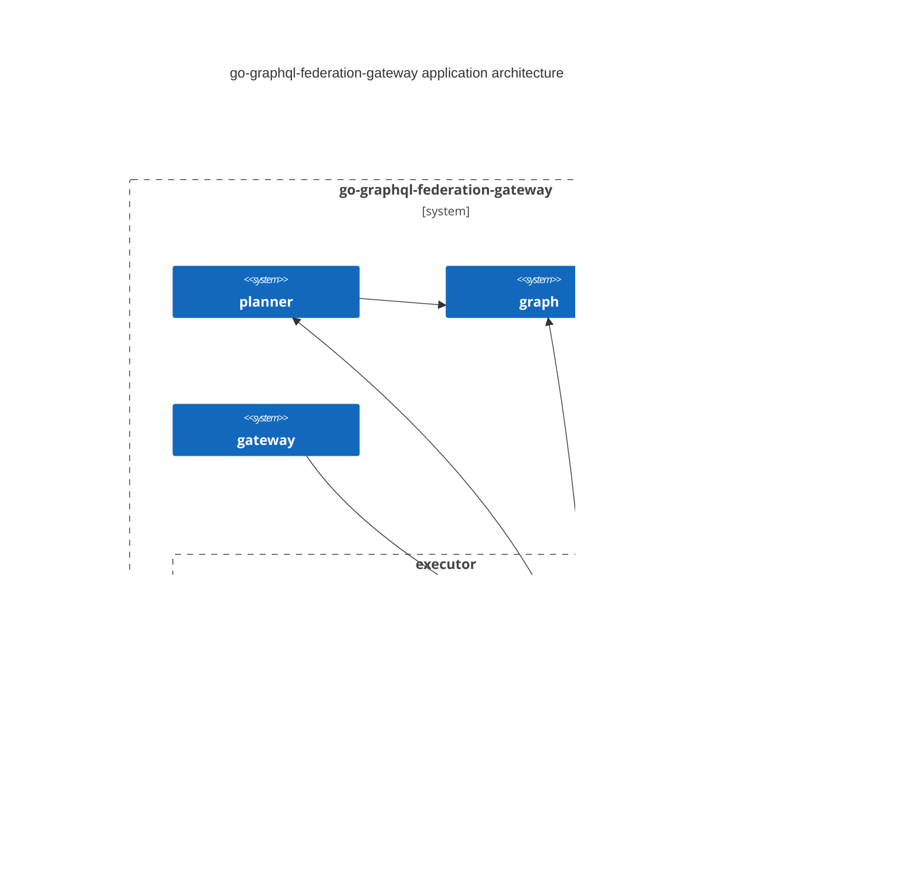

# DesignDoc for Federation Logic

# Summary

GraphQL Federation のロジックを整理し、設計をする

# Author

 - N9tE9

# Architecture

アプリケーションアーキテクチャの構成は下記のC4図の構成になっている。

## graph

### SubGraph

サブグラフは、1つのサービスに紐づいているものである。
例えば、ec のドメインが、product, inventory, review, account の4つのサービスで構成されていた時、
各サービスに紐づくグラフをサブグラフとして定義する。
EC ドメインは、4つのサブグラフで構成される。
サブグラフは下記のプロパティを保持する。

| プロパティ名 | データ型 | 値の例 |
| --- | --- | --- |
| Name | string | product |
| Host | string | product.example.com |
| Schema | *ast.Schema | - |
| entities | map[string]Entity | - |

サブグラフに紐づく Entity を保持する構造体は下記のような設計になる。
Entity は、@key ディレクティブが付与された ObjectType を指す。

| プロパティ名 | データ型 | 値の例 |
| --- | --- | --- |
| Keys | []EntityKey | id |
| isExtension | bool | true |
| Fields | map[string]Field | - |

Keys を保持する EntityKey の設計は下記のようになる。

| プロパティ名 | データ型 | 値の例 |
| --- | --- | --- |
| FieldSet | string | id |
| Resolvable | bool | true |

Entity 内部で保持する Field の構造体は下記のような設計とする。

| プロパティ名 | データ型 | 値の例 |
| --- | --- | --- |
| Name | string | reviews |
| Type | *ast.Type | [Review] |
| Requires | []string | - |
| Provides | []string | - |
| isShareable | bool | true |

### SuperGraph

スーパーグラフは、複数サービスを集約したものである。
例えば、ec のドメインが、product, inventory, review, account の4つのサービスで構成されている場合、
それぞれのサービスを集約したグラフをスーパーグラフとして定義する。
スーパーグラフは下記のプロパティを保持する。

| プロパティ名 | データ型 | 値の例 |
| --- | --- | --- |
| SubGraphs | []SubGraph | - |
| Schema | *ast.Schema | - |
| Ownership | map[string][]SubGraph | "Product.id" -> [SubGraph(Product)], "Query.product" -> [SubGraph(Product)] |

## Step

ステップは、サービスへのリクエストの単位として考える。
実行時に必要な下記のようなフィールドを持つ

| プロパティ名 | データ型 | 値の例 |
| --- | --- | --- |
| ID | int | 0 |
| SubGraph | SubGraph | - |
| StepType | iota(int) | 0 |
| ParentType | string | - |
| SelectionSet | *ast.SelectionSet | - |
| Path | []string | ["Query", "products", "id"] |
| DependsOn | []int | [0, 1] |

## Plan

Federation は、クエリからスーパーグラフ、サブグラフの依存解決からクエリの実行計画を組み立てる。
Plan は、下記のいくつかの構成要素で構成される。

| プロパティ名 | データ型 | 値の例 |
| --- | --- | --- |
| Steps | []Step | - |
| RootStepIndexes | []int | [0, 2] |

## Planner

Planner は、Plan メソッドによってクエリの実行計画を生成する。
Plan は、下記のいくつかの構成要素で構成される。

| プロパティ名 | データ型 | 値の例 |
| --- | --- | --- |
| SuperGraph | *SuperGraph | - |

# Usecases / Algorithms

## SubGraph を初期化する

ゲートウェイを初期化する時に、サブグラフを初期化する。

## スーパーグラフを初期化する

スーパーグラフ を初期化する。

## クエリプランを構築する

クエリプランによって各ステップを構築し、グラフの依存関係を解決する。

