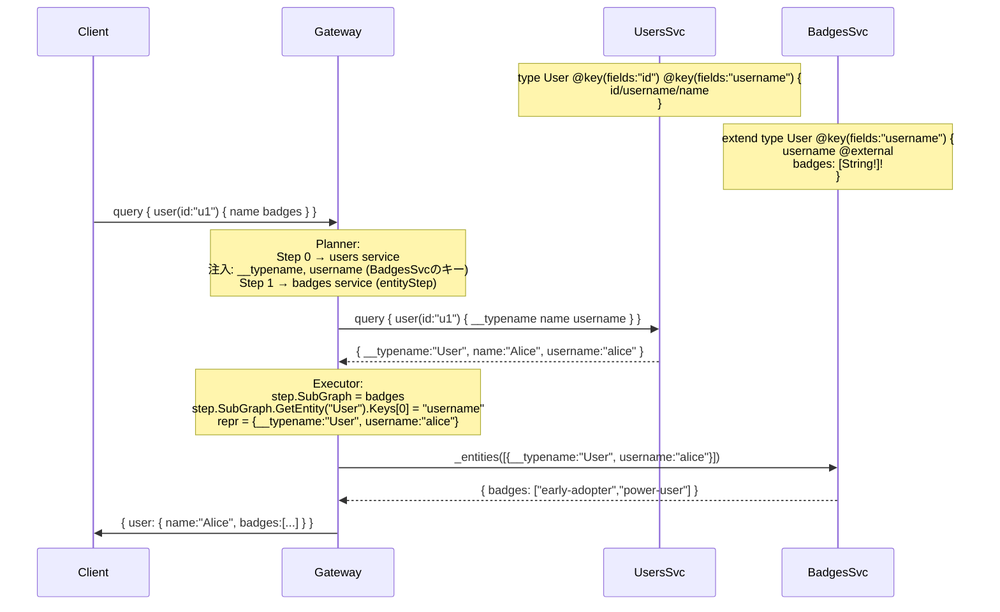

# Design Doc : Federation Multiple @key Directive Support (Fix)

## Background

Apollo Federation v2 では、1 つのエンティティ型が複数の `@key` ディレクティブを持てます。

```graphql
# users サービス
type User @key(fields: "id") @key(fields: "username") {
  id: ID!
  username: String!
  name: String!
}

# badges サービス（username キーで User を解決）
extend type User @key(fields: "username") {
  username: String! @external
  badges: [String!]!
}
```

この場合、`badges` フィールドを解決するエンティティステップでは、`username` キーを使って `_entities` クエリを実行しなければなりません。

**現在の実装の問題**: Executor が常に「エンティティオーナーの最初の @key」を使って representation を構築しているため、オーナーが `@key(fields: "id")` を最初に宣言している場合、別の @key を使う拡張サブグラフへのリクエストで **間違ったキー** が送信されます。

## Summary

本ドキュメントでは、Executor の `extractRepresentations()` および `navigatePathWithArrays()` が「ステップのターゲットサブグラフ (`step.SubGraph`)」の @key を使うように修正する設計方針を示します。Planner は既に修正済みです（前回の nestkey 対応で `injectKeyFieldsIntoParentStep` は `childSubGraph.GetEntity()` を参照している）。

## Goals

- 複数の `@key` を持つエンティティを、各拡張サブグラフが宣言したキーで正しく解決できる
- 既存のシングルキー動作を破壊しない
- Planner と Executor のキー選択ロジックを一致させる

## Non-Goals

- 実行時にどの @key を使うか動的に選択する最適化（e.g. N+1 削減目的）
- @key の resolvable: false の動的フォールバック

## Algorithm

### 問題の構造

```
現在（バグあり）:
  Planner:  injectKeyFieldsIntoParentStep → childSubGraph.GetEntity().Keys[0]  ← 正しい
  Executor: extractRepresentations        → ownerSubGraph.GetEntity().Keys[0]  ← 間違い！

修正後:
  Planner:  injectKeyFieldsIntoParentStep → childSubGraph.GetEntity().Keys[0]  ← 変更なし
  Executor: extractRepresentations        → step.SubGraph.GetEntity().Keys[0]  ← 修正
```

Planner が親ステップに注入するキーフィールドと、Executor が representation を構築するために参照するキーを **同一の subgraph** から取得することで、両者の一致が保証されます。

---

### フローチャート 1: キー選択の正しい流れ (Executor)

```mermaid
flowchart TD
    Start([extractRepresentations]) --> GetTargetSG[ターゲット subgraph = step.SubGraph]
    GetTargetSG --> GetEntity{step.SubGraph.GetEntity\nstep.ParentType}
    GetEntity -- 存在しない --> ReturnEmpty([空のリストを返す])
    GetEntity -- 存在する --> GetKey[entity.Keys\[0\].ParsedFields を取得]
    GetKey --> Build[buildRepresentationFromNodes で\nrepresentation を構築]
    Build --> Return([representations を返す])
```

---

### フローチャート 2: 修正前後の比較

```mermaid
flowchart LR
    subgraph 修正前_WRONG["修正前 (バグ)"]
        A1[step.ParentType = User] --> B1[GetEntityOwnerSubGraph\nowner = users service]
        B1 --> C1[owner.GetEntity.Keys\[0\]\n= 'id' キー]
        C1 --> D1["representation =\n{__typename:User, id:u1}"]
        D1 --> E1["badges サービスへ送信 ❌\n(badgesはusernameキーで解決)"]
    end

    subgraph 修正後_CORRECT["修正後 (正しい)"]
        A2[step.ParentType = User] --> B2[step.SubGraph\n= badges service]
        B2 --> C2[step.SubGraph.GetEntity.Keys\[0\]\n= 'username' キー]
        C2 --> D2["representation =\n{__typename:User, username:'alice'}"]
        D2 --> E2["badges サービスへ送信 ✅"]
    end
```

---

### 修正箇所

**ファイル**: `federation/executor/executor_v2.go`

#### 修正箇所 1: `extractRepresentations()` メインパス (line ~751)

```go
// 修正前:
ownerSubGraph := e.superGraph.GetEntityOwnerSubGraph(step.ParentType)
if ownerSubGraph == nil { return representations }
entity, exists := ownerSubGraph.GetEntity(step.ParentType)

// 修正後:
entity, exists := step.SubGraph.GetEntity(step.ParentType)
if !exists || len(entity.Keys) == 0 { return representations }
```

#### 修正箇所 2: `navigatePathWithArrays()` (line ~822)

```go
// 修正前:
if ownerSubGraph := e.superGraph.GetEntityOwnerSubGraph(step.ParentType); ownerSubGraph != nil {
    if entity, exists := ownerSubGraph.GetEntity(step.ParentType); ...

// 修正後:
if entity, exists := step.SubGraph.GetEntity(step.ParentType); exists && len(entity.Keys) > 0 {
```

---

## Request Sequence

### 複数 @key でのエンティティ解決



---

## 変更ファイル一覧

| ファイル | 変更内容 |
|---------|---------|
| `federation/executor/executor_v2.go` | `extractRepresentations()` と `navigatePathWithArrays()` でオーナーではなく `step.SubGraph` を使うよう修正 |
| `federation/executor/executor_v2_multiple_key_test.go` | 複数 @key のエンドツーエンドテスト（新規作成）|
| `_example/multikey/` | 統合テスト用新ドメイン（新規作成）|
| `_example/tests/multikey/cases.json` | 統合テストケース（新規作成）|
| `_example/Makefile` | `test-multikey` ターゲット追加 |

---

## Development Command For AI Agent

### Process

**重要:** 以下のプロセスは TDD（テスト駆動開発）を厳守すること。各ステップで **RED → GREEN → REFACTOR** のサイクルを守り、テストが失敗することを確認してから実装を行うこと。

---

#### Step 1 RED: Executor ユニットテストを書く

**対象ファイル**: `federation/executor/executor_v2_multiple_key_test.go`（新規作成）

以下のケースを書き、`go test ./federation/executor/... -run TestExecutorV2_MultipleKey` が **失敗** することを確認:

- users service が `@key(fields: "id") @key(fields: "username")` を持ち、badges service が `@key(fields: "username")` で User を拡張するシナリオ
- `user(id: "u1") { name badges }` を実行すると badges サービスに `{__typename:"User", username:"alice"}` が送信されること
- **現状**: `{__typename:"User", id:"u1"}` が送信される → テスト失敗

#### Step 1 GREEN: Executor を修正する

**対象ファイル**: `federation/executor/executor_v2.go`

- `extractRepresentations()`: `ownerSubGraph` → `step.SubGraph` に変更
- `navigatePathWithArrays()`: 同様に修正
- `go test ./federation/executor/... -run TestExecutorV2_MultipleKey` が **成功** することを確認

#### Step 1 REFACTOR: 全ユニットテストを確認

- `go test ./...` で全テストが通ることを確認

---

#### Step 2: 統合テストドメイン `multikey` を作成

**2.1** `_example/multikey/users/main.go` — users サービス
- `type User @key(fields: "id") @key(fields: "username")`
- `user(id: ID!): User` クエリ
- `_entities` 解決

**2.2** `_example/multikey/badges/main.go` — badges サービス
- `extend type User @key(fields: "username") { username @external; badges: [String!]! }`
- `_entities` 解決: username から badges を返す

**2.3** 設定ファイル群
- `docker-compose.yaml`, `gateway.yaml`, `gateway.docker.yaml`
- `docker-compose.gateway.yaml`, `docker-compose.apollo.yaml`

**2.4** `_example/tests/multikey/cases.json` — テストケース

**2.5** `_example/Makefile` に `test-multikey` 追加

**2.6** `cd _example && make test-multikey` で全テストが通ることを確認

---

### TDD チェックリスト

- [ ] Step 1 RED: 複数 @key のユニットテストを書き、失敗を確認したか？
- [ ] Step 1 GREEN: `extractRepresentations()` と `navigatePathWithArrays()` を修正してテストが通ったか？
- [ ] REFACTOR: `go test ./...` 全テストが通ったか？
- [ ] Step 2: `make test-multikey` で統合テストが通ったか？

### Expected Outcomes

- `@key(fields: "username")` で拡張している badges サービスに、`username` キーの representation が送信される
- 既存の単一 @key シナリオ（id キー）の動作を破壊しない
- `make test-all` で全 6 ドメインのテストが通る
