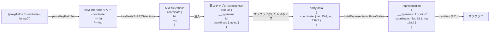
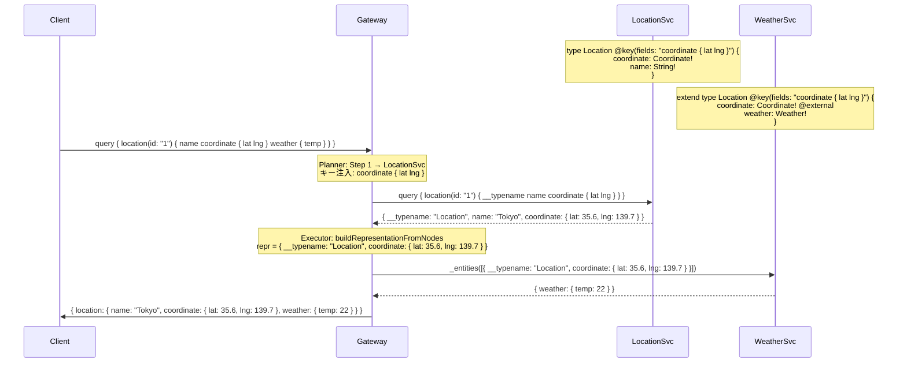

# Design Doc : Federation @key Nested Field Set Support

## Background

現在の go-graphql-federation-gateway は、`@key` ディレクティブのフィールドセットとして **フラットなフィールド名のみ** をサポートしています。

```graphql
@key(fields: "id")                        # ✅ 対応済み
@key(fields: "number departureDate")      # ✅ 対応済み（複合キー）
@key(fields: "coordinate { lat lng }")   # ❌ 未対応（ネストキー）
```

Apollo Federation v2 の仕様では、ネストしたオブジェクト型をキーとして使用できます。例えば地理座標を持つエンティティや、住所オブジェクトをキーとするエンティティがその典型例です。

```graphql
# Location サービス
type Location @key(fields: "coordinate { lat lng }") {
  coordinate: Coordinate!
  name: String!
}

type Coordinate {
  lat: Float!
  lng: Float!
}

# Weather サービス（Location をキーで参照）
extend type Location @key(fields: "coordinate { lat lng }") {
  coordinate: Coordinate! @external
  weather: Weather!
}
```

現在の実装では `strings.Fields("coordinate { lat lng }")` が `["coordinate", "{", "lat", "lng", "}"]` と誤って分割され、`buildRepresentation()` が `entity["{"]` を参照しようとして `nil` を返してしまいます。

## Summary

このドキュメントでは、`@key` ディレクティブのネストフィールドセット（例: `"coordinate { lat lng }"`）を完全にサポートするための設計方針と実装アプローチを提案します。

変更の中心は以下の 3 点です：

1. **パーサー追加**: フィールドセット文字列 → `KeyFieldNode` ツリーへのパース
2. **Planner 修正**: ネスト構造を考慮した親ステップへの AST セレクション注入
3. **Executor 修正**: ネストパスを再帰的にたどった representation 構築

## Goals

- `@key(fields: "nested { field }")` 形式のネストキーをサポートする
- 深くネストしたキー `@key(fields: "a { b { c } }")` をサポートする
- フラットキーとネストキーの混在 `@key(fields: "id location { lat lng }")` をサポートする
- 既存のフラット複合キー `@key(fields: "id name")` の動作を破壊しない

## Non-Goals

- `@requires` のネストフィールドセット対応（別 DesignDoc にて対応）
- `@provides` のネストフィールドセット対応
- クライアントクエリでの変数へのネストキーの注入

## Algorithm

### データ構造: KeyFieldNode

フィールドセット文字列を木構造として表現します。

```go
// KeyFieldNode はフィールドセット内の 1 フィールドを表す。
// 葉ノード（スカラー）: Fields == nil
// 非葉ノード（オブジェクト）: Fields != nil, len(Fields) > 0
type KeyFieldNode struct {
    Name   string         // フィールド名（例: "coordinate", "lat"）
    Fields []*KeyFieldNode // 子フィールド（nil = スカラー）
}
```

**変換例:**

| FieldSet 文字列 | KeyFieldNode ツリー |
|----------------|-------------------|
| `"id"` | `[{Name:"id", Fields:nil}]` |
| `"number departureDate"` | `[{Name:"number"}, {Name:"departureDate"}]` |
| `"coordinate { lat lng }"` | `[{Name:"coordinate", Fields:[{Name:"lat"},{Name:"lng"}]}]` |
| `"id location { address { zip } }"` | `[{Name:"id"}, {Name:"location", Fields:[{Name:"address", Fields:[{Name:"zip"}]}]}]` |

---

### フローチャート 1: parseKeyFieldSet() — フィールドセット文字列のパース

```mermaid
flowchart TD
    Start([parseKeyFieldSet]) --> Init[トークン列に分割<br>pos = 0]
    Init --> Loop{pos < len?}
    Loop -- No --> Return([KeyFieldNode リストを返す])
    Loop -- Yes --> ReadToken[次のトークンを読む]
    ReadToken --> IsLBrace{トークン == "{"?}
    IsLBrace -- Yes --> Error([エラー: 不正なトークン])
    IsLBrace -- No --> IsRBrace{トークン == "}"?}
    IsRBrace -- Yes --> ReturnUp([呼び出し元に戻る])
    IsRBrace -- No --> CreateNode[KeyFieldNode{Name: token} を作成<br>pos++]
    CreateNode --> PeekNext{次が "{"?}
    PeekNext -- No --> AppendLeaf[リストに追加]
    AppendLeaf --> Loop
    PeekNext -- Yes --> SkipLBrace[pos++ でLBrace消費]
    SkipLBrace --> Recurse[parseKeyFieldSet 再帰呼び出し]
    Recurse --> AssignChildren[node.Fields = 再帰結果]
    AssignChildren --> SkipRBrace[pos++ でRBrace消費]
    SkipRBrace --> AppendNode[リストに追加]
    AppendNode --> Loop
```

---

### フローチャート 2: Planner — ネストキーの親ステップへの注入

ネストキーを考慮して、親ステップの SelectionSet に正しいネスト構造を追加します。

```mermaid
flowchart TD
    Start([injectKeyFieldsIntoParentStep]) --> GetKeyFields[getKeyFields: エンティティの<br>KeyFieldNode ツリーを取得]
    GetKeyFields --> BuildSels[keyFieldsToASTSelections:<br>KeyFieldNode → AST Selection 変換]
    BuildSels --> Inject[ensureAndInjectKeySelections:<br>insertionPath を辿って注入]
    Inject --> End([完了])

    subgraph keyFieldsToASTSelections
        K1([入力: KeyFieldNode リスト]) --> K2{各 node を処理}
        K2 --> K3{node.Fields == nil?}
        K3 -- Yes: スカラー --> K4[ast.Field{Name: node.Name} を生成]
        K3 -- No: オブジェクト --> K5[ast.Field{Name: node.Name,<br>SelectionSet: 再帰生成} を生成]
        K4 --> K6[リストに追加]
        K5 --> K6
        K6 --> K2
        K2 -- 完了 --> K7([AST Selection リストを返す])
    end
```

---

### フローチャート 3: Executor — ネストキーを使った representation 構築

```mermaid
flowchart TD
    Start([buildRepresentationFromNodes]) --> Init["repr = {__typename: typeName}"]
    Init --> Loop{各 KeyFieldNode を処理}
    Loop -- 完了 --> Return([repr を返す])
    Loop -- 次のノード node --> CheckLeaf{node.Fields == nil?}
    CheckLeaf -- Yes: スカラー --> FetchVal{entity[node.Name] 存在?}
    FetchVal -- No --> ReturnNil([nil を返す: キー欠損])
    FetchVal -- Yes --> SetFlat[repr[node.Name] = entity[node.Name]]
    SetFlat --> Loop
    CheckLeaf -- No: オブジェクト --> FetchObj{entity[node.Name] 存在?}
    FetchObj -- No --> ReturnNil
    FetchObj -- Yes --> CastMap{map[string]interface{} に変換可能?}
    CastMap -- No --> ReturnNil
    CastMap -- Yes --> Recurse[再帰呼び出し<br>subEntity = entity[node.Name]]
    Recurse --> SubRepr{サブ repr が nil?}
    SubRepr -- Yes --> ReturnNil
    SubRepr -- No --> SetNested[repr[node.Name] = サブ repr の<br>node.Name 以外のフィールド群]
    SetNested --> Loop
```

---

### 全体のデータフロー



---

## Request Sequence

### ネストキーによるエンティティ解決の流れ



---

## 変更ファイル一覧

| ファイル | 変更内容 |
|---------|---------|
| `federation/graph/subgraph_v2.go` | `KeyFieldNode` 構造体追加、`parseKeyFieldSet()` 追加、`EntityKey.ParsedFields` フィールド追加 |
| `federation/planner/planner_v2.go` | `getKeyFieldNodes()` 追加、`keyFieldsToASTSelections()` 追加、`ensureAndInjectKeySelections()` 追加、`injectKeyFieldsIntoParentStep()` 修正 |
| `federation/executor/executor_v2.go` | `buildRepresentationFromNodes()` 追加、`buildRepresentation()` 修正 |
| `federation/graph/subgraph_v2_test.go` | `TestParseKeyFieldSet_*` テスト追加 |
| `federation/planner/planner_v2_nest_key_test.go` | ネストキー Planner テスト追加（新規作成）|
| `federation/executor/executor_v2_test.go` | ネストキー Executor テスト追加 |

---

## Development Command For AI Agent

### Process

**重要:** 以下のプロセスは TDD（テスト駆動開発）を厳守すること。各ステップで必ず RED → GREEN → REFACTOR のサイクルを守り、**テストが失敗することを確認してから実装を行うこと**。テストを書かずに実装してはならない。

---

#### Step 1: graph — KeyFieldNode パーサー (TDD)

**1.1. RED: テストを先に書く** — `federation/graph/subgraph_v2_test.go` に追記

以下のケースのテストを書いて、`go test ./federation/graph/...` が失敗することを確認する：
- `"id"` → `[{Name:"id"}]`（スカラー）
- `"number departureDate"` → `[{Name:"number"}, {Name:"departureDate"}]`（複合フラット）
- `"coordinate { lat lng }"` → `[{Name:"coordinate", Fields:[{Name:"lat"},{Name:"lng"}]}]`
- `"id location { address { zip } }"` → 混在ネスト
- `""` → `[]`（空）

**1.2. GREEN: 最小限の実装** — `federation/graph/subgraph_v2.go`

- `KeyFieldNode` 構造体を追加
- `parseKeyFieldSet(fieldSet string) []*KeyFieldNode` を実装
- `EntityKey` に `ParsedFields []*KeyFieldNode` を追加
- `parseEntityKeys()` で `ParsedFields` を設定
- `go test ./federation/graph/...` が通ることを確認

**1.3. REFACTOR:** エラーケースの処理、コメントの整備。テストが引き続き通ることを確認。

---

#### Step 2: Planner — ネストキーの AST 注入 (TDD)

**2.1. RED: テストを先に書く** — `federation/planner/planner_v2_nest_key_test.go`（新規作成）

以下のケースのテストを書いて、`go test ./federation/planner/...` が失敗することを確認する：
- `@key(fields: "coordinate { lat lng }")` を持つエンティティのクエリプランで、親ステップの SelectionSet に `coordinate { lat lng }` が含まれること
- `@key(fields: "id location { lat lng }")` の混在ネストキーで、両方が親ステップに注入されること

**2.2. GREEN: 最小限の実装** — `federation/planner/planner_v2.go`

- `getKeyFieldNodes(typeName string, subGraph *graph.SubGraphV2) []*graph.KeyFieldNode` を追加
- `keyFieldsToASTSelections(nodes []*graph.KeyFieldNode) []ast.Selection` を追加
- `injectKeyFieldsIntoParentStep()` を `getKeyFieldNodes` + `keyFieldsToASTSelections` ベースに修正
- `go test ./federation/planner/...` が通ることを確認

**2.3. REFACTOR:** 既存の `getKeyFields()` との整合性確認、重複コードの除去。

---

#### Step 3: Executor — ネストキーによる representation 構築 (TDD)

**3.1. RED: テストを先に書く** — `federation/executor/executor_v2_test.go` に追記

以下のケースのテストを書いて、`go test ./federation/executor/...` が失敗することを確認する：
- ネストキー `coordinate { lat lng }` で、`entity = {coordinate: {lat: 35.6, lng: 139.7}}` から `repr = {__typename: "Location", coordinate: {lat: 35.6, lng: 139.7}}` が構築されること
- キーフィールドが欠損する場合 `nil` が返ること
- 深いネスト `location { address { zip } }` が正しく動作すること

**3.2. GREEN: 最小限の実装** — `federation/executor/executor_v2.go`

- `buildRepresentationFromNodes(entity map[string]interface{}, typeName string, nodes []*graph.KeyFieldNode, requiredFields []string) map[string]interface{}` を追加
- `buildRepresentation()` を `ParsedFields` が存在する場合は `buildRepresentationFromNodes()` に委譲するよう修正
- `go test ./federation/executor/...` が通ることを確認

**3.3. REFACTOR:** 既存の `buildRepresentation()` との互換性確認。

---

#### Step 4: 全体テスト

**4.1.** `go test ./...` で全ユニットテストが通ることを確認

**4.2.** `cd _example && make test-all` で 全 117 テスト（ec:33, fintech:20, saas:23, social:21, travel:20）が通ることを確認

---

### TDD チェックリスト

- [ ] Step 1: `parseKeyFieldSet` のテストを先に書き、RED を確認したか？
- [ ] Step 1: GREEN（最小限の実装）後、テストが通ることを確認したか？
- [ ] Step 2: ネストキー注入のプランナーテストを先に書き、RED を確認したか？
- [ ] Step 2: GREEN 後、`go test ./federation/planner/...` が通ることを確認したか？
- [ ] Step 3: Executor の representation テストを先に書き、RED を確認したか？
- [ ] Step 3: GREEN 後、`go test ./federation/executor/...` が通ることを確認したか？
- [ ] Step 4: `go test ./...` で全テストが通ることを確認したか？
- [ ] Step 4: `make test-all` で統合テストが全て通ることを確認したか？

### Expected Outcomes

- `@key(fields: "nested { field }")` 形式のネストキーが正しくパースされる
- ネストキーを持つエンティティで、親ステップに正しい AST セレクションが注入される
- `buildRepresentation()` がネスト構造を正しく抽出して representation を構築する
- 既存のフラットキー・複合キーの動作に影響を与えない
- Apollo Federation v2 仕様のネストキーサポートに準拠する
