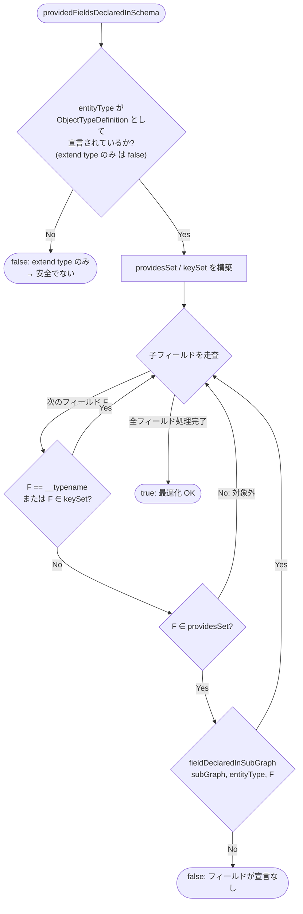
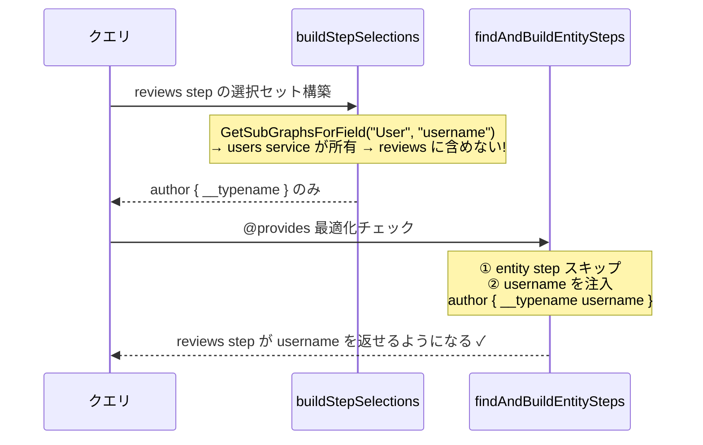
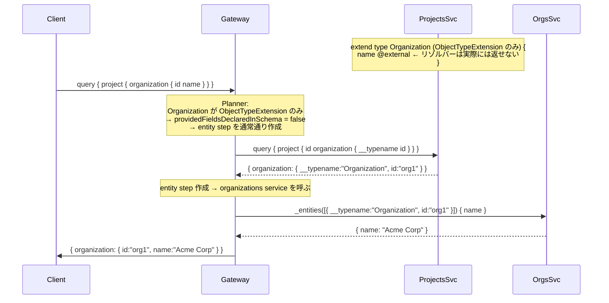

# Design Doc : @provides Optimization

## Background

Apollo Federation v2 の `@provides` ディレクティブは、サブグラフが特定のエンティティフィールドを「提供できる」と宣言するためのものです。これにより、ゲートウェイは通常必要となるエンティティフェッチ（追加の `_entities` クエリ）をスキップできます。

```graphql
# reviews サービス
type Review @key(fields: "id") {
  id: ID!
  author: User @provides(fields: "username")  # username を reviews が提供できる
}

type User @key(fields: "id") {
  id: ID! @external
  username: String! @external
}
```

## As-Is（問題のある現状動作）

`@provides` が宣言されていても、ゲートウェイは **常に** entity step を作成してしまう。

```
クエリ: { product { reviews { author { username } } } }

Step 1: reviews service に問い合わせ
  → _entities([{ __typename: "Product", id: "p1" }]) { reviews { author { id username } } }
  → レスポンス: author { id: "user1", username: "Alice" }

Step 2 (不要): users service に問い合わせ  ← @provides があっても作られる
  → _entities([{ __typename: "User", id: "user1" }]) { username }
  → レスポンス: { username: "User user1" }  ← reviews の "Alice" を上書き！

最終結果: username = "User user1"  ← 間違ったサービスのデータ
```

**問題**: entity step が作成され、別サービスの結果で @provides データが上書きされる。

## To-Be（最適化後の正しい動作）

`@provides` で宣言された全フィールドが安全に提供できると判断した場合、entity step をスキップする。

```
クエリ: { product { reviews { author { username } } } }

Step 1: reviews service に問い合わせ（@provides で username を注入済み）
  → _entities([{ __typename: "Product", id: "p1" }]) { reviews { author { __typename username } } }
  → レスポンス: author { __typename: "User", username: "Alice" }

Step 2: スキップ  ← @provides 最適化により users service は呼ばれない

最終結果: username = "Alice"  ✓ reviews service の @provides データが正しく使われる
```

## Summary

本ドキュメントでは `findAndBuildEntitySteps()` において、entity reference 型の境界フィールドを処理する際に **@provides 最適化チェック** を追加する設計を示す。

最適化が安全に適用できる条件は以下の **3つ** を全て満たす場合のみ：

1. `@provides` が全ての要求された子フィールドをカバーしている
2. 提供元サブグラフのスキーマで、エンティティ型が **フル型定義** (`type Foo { ... }` = ObjectTypeDefinition) として宣言されている（`extend type` ではない）
3. `@provides` フィールドがそのサブグラフのスキーマに宣言されている

### 条件 2 の重要性（実装上の核心）

`fieldDeclaredInSubGraph()` は `ObjectTypeDefinition` と `ObjectTypeExtension` の両方をチェックする。しかし、**`extend type` でのみ宣言されたエンティティ型**（例: `extend type Organization { name @external }`）は、リゾルバーが実際にそのフィールドを返す保証がない。

```graphql
# ✅ 最適化 OK: type User {...} = ObjectTypeDefinition
# reviews サービス
type User @key(fields: "id") {
  id: ID! @external
  username: String! @external  # ← reviews リゾルバーが実際に返す
}

# ❌ 最適化 NG: extend type Organization {...} = ObjectTypeExtension のみ
# projects サービス
extend type Organization @key(fields: "id") @shareable {
  id: ID! @external
  name: String! @external  # ← projects リゾルバーは実際には返せない（スキーマ合成目的のみ）
}
```

## Goals

- `@provides` で宣言された全フィールドが安全にカバーされる場合、entity step をスキップする
- 提供元サービスのデータが最終レスポンスにそのまま使われる
- 安全でない `@provides`（`extend type` のみ、解決不能）では entity step を維持する
- 既存の @provides なしシナリオの動作は変わらない

## Non-Goals

- ネスト @provides（`@provides(fields: "address { city }")`) の最適化（Phase 2）
- @provides の部分最適化（全カバーのみ対象）

## Algorithm

### 主な判定フロー

```mermaid
flowchart TD
    Start([findAndBuildEntitySteps]) --> IsBoundary{isBoundaryField?}
    IsBoundary -- No --> Recurse[子フィールドを再帰処理]
    IsBoundary -- Yes --> IsRef{entityTypeToResolve\n!= parentType?\n(entity reference)}
    IsRef -- No: extension --> CreateStep[entity step を作成]
    IsRef -- Yes: reference --> GetProvides[getFieldProvides\nparentStep.SubGraph, parentType, fieldName]
    GetProvides --> HasProvides{provides が存在?}
    HasProvides -- No --> CreateStep
    HasProvides -- Yes --> CheckCoverage[childFieldsCoveredByProvides\n全子フィールドが provides でカバーされているか]
    CheckCoverage -- No --> CreateStep
    CheckCoverage -- Yes --> CheckDeclared[providedFieldsDeclaredInSchema\n安全に最適化できるか]
    CheckDeclared -- No --> CreateStep
    CheckDeclared -- Yes --> InjectAndSkip["@provides フィールドを親ステップに注入\ncontinue (entity step スキップ)"]
    InjectAndSkip --> End([次のフィールドへ])
    CreateStep --> End
```

---

### providedFieldsDeclaredInSchema の判定ロジック



---

### なぜ親ステップへの注入が必要か

`buildStepSelections()` は supergraph の所有権マップを使う。**@external フィールドは所有権がないためスキップされる**ため、明示的に注入が必要。



---

## Request Sequence

### @provides 最適化あり（実装後）

```mermaid
sequenceDiagram
    participant Client
    participant Gateway
    participant ReviewsSvc
    participant UsersSvc

    Note over ReviewsSvc: type User (ObjectTypeDefinition) {<br>  id @external; username @external<br>}<br>type Review { author: User @provides(fields:"username") }

    Client->>Gateway: query { product { reviews { author { username } } } }
    Note over Gateway: Planner:<br>1. User が ObjectTypeDefinition ✓<br>2. username は @provides でカバー ✓<br>3. username は schema に宣言 ✓<br>→ username を注入 / entity step スキップ
    Gateway->>ReviewsSvc: _entities([...]) { reviews { author { __typename username } } }
    ReviewsSvc-->>Gateway: { author: { __typename:"User", username:"Alice" } }
    Note over Gateway: users service への entity step なし ✓
    Gateway->>Client: { author: { username:"Alice" } }
```

### @provides 最適化なし（extend type ケース）



---

## 変更ファイル一覧

| ファイル | 変更内容 |
|---------|---------|
| `federation/planner/planner_v2.go` | `getFieldProvides()`・`childFieldsCoveredByProvides()`・`providedFieldsDeclaredInSchema()`・`buildProvidesSelections()` 追加、`findAndBuildEntitySteps()` に @provides チェック追加 |
| `federation/planner/planner_v2_provides_test.go` | @provides 最適化の TDD テスト（新規/更新） |
| `_example/tests/ec/cases.json` | `@provides` テストケースの期待値を更新（"User user1" → "Alice"） |
| `_example/provides/` | 最適化の正確性を証明する統合テストドメイン（新規作成）|
| `_example/tests/provides/cases.json` | 統合テストケース（新規作成）|
| `_example/Makefile` | `test-provides` ターゲット追加 |

---

## Development Command For AI Agent

### Process

**重要:** 以下のプロセスは TDD（テスト駆動開発）を厳守すること。各ステップで **RED → GREEN → REFACTOR** のサイクルを守ること。**テストが失敗することを確認してから実装を行うこと。**

---

#### Step 1 RED: Planner ユニットテストを書く

**対象**: `federation/planner/planner_v2_provides_test.go`（更新/置換）

以下の **4ケース** を書き、`go test ./federation/planner/... -run TestPlannerV2_Provides` が **失敗** することを確認:

**ケース 1: @provides が全フィールドをカバー + ObjectTypeDefinition → entity step なし**
- posts schema: `type Post { author: User! @provides(fields: "name") }` + `type User { id @external; name @external }`
- Query: `{ post { author { name } } }`
- 期待: `countEntitySteps == 0`

**ケース 2: @provides が一部のみカバー → entity step あり**
- posts schema: `type Post { author: User! @provides(fields: "name") }` + `type User { id @external; name @external; email @external }`
- Query: `{ post { author { name email } } }` (email は @provides に含まれない)
- 期待: `countEntitySteps >= 1`

**ケース 3: @provides なし → entity step あり（回帰テスト）**
- posts schema: `type Post { author: User! }` (provides なし)
- Query: `{ post { author { name } } }`
- 期待: `countEntitySteps >= 1`

**ケース 4: エンティティ型が extend type のみ → entity step あり（安全性チェック）**
- schema: `extend type Organization { name @external }` (ObjectTypeExtension のみ)
- `@provides(fields: "name")` が宣言されていても最適化を適用しない
- 期待: `countEntitySteps >= 1`

`go test ./federation/planner/... -run TestPlannerV2_Provides` が **失敗** することを確認

#### Step 1 GREEN: Planner を修正する

**対象**: `federation/planner/planner_v2.go`

以下の関数を追加し、`findAndBuildEntitySteps()` に @provides チェックを組み込む:

1. `getFieldProvides(subGraph, parentType, fieldName string) []string`
   - entity マップ（types with @key）を優先チェック
   - 非エンティティ型は ObjectTypeDefinition の AST から @provides を検索

2. `childFieldsCoveredByProvides(childSels, provides, entityType, targetSG) bool`
   - 空の childSels → true（全カバー）
   - __typename・キーフィールドは除外
   - 残りの全フィールドが provides に含まれていれば true

3. `providedFieldsDeclaredInSchema(subGraph, entityType, childSels, provides, targetSG) bool`
   - **核心**: entityType が `ObjectTypeDefinition` として宣言されているか確認
   - `extend type` のみ → false を返す（最適化しない）
   - ObjectTypeDefinition として宣言 → フィールドが宣言されているかを確認

4. `buildProvidesSelections(requestedSels, provides) []ast.Selection`
   - @provides でカバーされたリクエストフィールドの AST セレクションを生成

5. `findAndBuildEntitySteps()` への追加:
   ```
   if entityTypeToResolve != parentType:
     provides = getFieldProvides(...)
     if covered && declared:
       inject provides fields into parent step
       continue (skip entity step)
   ```

`go test ./federation/planner/... -run TestPlannerV2_Provides` が **成功** することを確認

#### Step 1 REFACTOR: 全ユニットテストを確認

- `go test ./...` で全テストが通ることを確認
- **特に SaaS ドメイン**（`extend type` ケース）が正しく動作することを確認

---

#### Step 2: EC ドメインのテストケースを更新

**対象**: `_example/tests/ec/cases.json`

`"Federation v2: @provides - Optimized User Data"` の期待値を更新:
- `"username": "User user1"` → `"username": "Alice"` (reviews が @provides で直接提供)
- `"username": "User user2"` → `"username": "Bob"`
- description を更新: 最適化が適用された旨を明記

---

#### Step 3: 統合テストドメイン `provides` を作成

**_example/provides/posts/main.go** — posts サービス
- `type Post @key(fields: "id")` + `author: User! @provides(fields: "name")`
- `type User @key(fields: "id") { id @external; name @external }` (ObjectTypeDefinition)
- `author.name = "PROVIDED_<username>"` を直接返す（users と **区別可能な値**）

**_example/provides/users/main.go** — users サービス
- `name = "USERS_<id>"` を返す（最適化が壊れると出現する「間違った値」）
- 最適化が成功していれば **呼ばれない**

**テストケース (`_example/tests/provides/cases.json`)**:
- `{ post { author { name } } }` が `"PROVIDED_alice"` を返す → 最適化成功の証明
- `"USERS_alice"` が返った場合 → テスト失敗（最適化が壊れている）

`make test-provides` で **6テスト全てがパス** することを確認

---

#### Step 4: 全体テスト

- `make test-all` で全 8 ドメインのテストが通ることを確認
- EC: 33 tests, Fintech: 20, SaaS: 23, Social: 21, Travel: 20, nestkey: 6, multikey: 6, provides: 6 = 計 135 tests

---

### TDD チェックリスト

- [ ] Step 1 RED: 4ケースのプランナーテストを書き、**失敗** を確認したか？
- [ ] Step 1 GREEN: 4関数を実装してテストが通ったか？
- [ ] REFACTOR: `go test ./...` 全テストが通ったか？（SaaS の `extend type` ケースも含む）
- [ ] Step 2: EC テストケース期待値を更新したか？
- [ ] Step 3: `make test-provides` で統合テストが通ったか？
- [ ] Step 4: `make test-all` で全 8 ドメインのテストが通ったか？

---

## 実装上の重要な注意点

### buildStepSelections が @external フィールドを除外する理由

`buildStepSelections()` は `GetSubGraphsForField()` を使って supergraph の所有権マップを参照する。@external フィールドは別サービスが所有権を持つため、reviews step の選択セットに含まれない。

```
GetSubGraphsForField("User", "username") → [users service]  (users が所有)
subGraphContains([users], reviews)        → false
→ username は reviews step から除外される
```

**結果**: entity step をスキップするだけでなく、@provides フィールドを親ステップの SelectionSet に明示的に注入する必要がある。注入には `ensureAndInjectKeySelections()` を再利用する。

### `extend type` ケースを最適化しない理由

```graphql
# SaaS projects サービス
extend type Organization @key(fields: "id") @shareable {
  id: ID! @external
  name: String! @external  # @provides で宣言しても...
}
```

このケースでは:
- スキーマ合成目的で @external フィールドを宣言している
- 実際の projects リゾルバーは `organization: { id: "org1" }` しか返さない
- `@provides(fields: "name")` が宣言されていても、リゾルバーが `name` を返さない

**判定方法**: entityType が `ObjectTypeDefinition` として存在するかを確認。`ObjectTypeExtension` のみの場合は最適化を適用しない。
