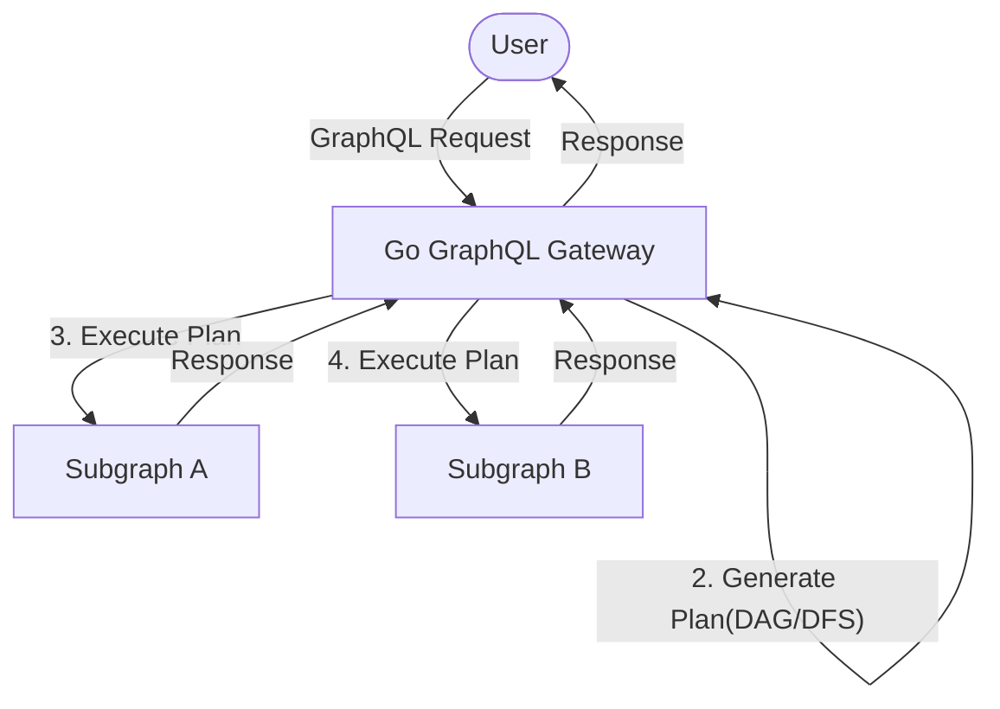
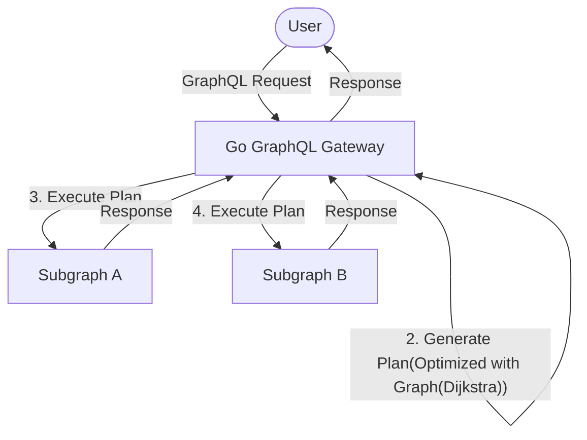
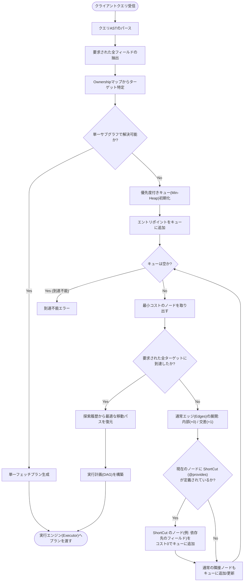
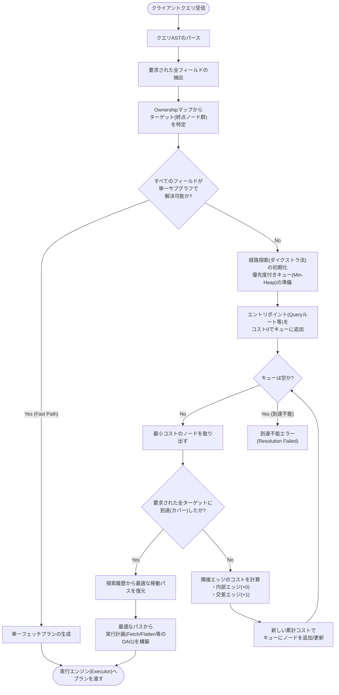

# Design Doc : Federation Reachability Analysis Optimization

## Background

現在の go-graphql-federation-gateway は、Apollo Federation v2 の基本機能をサポートしていますが、provides や sharable といったディレクティブが付与されたフィールドに対して、単純な DAG ベースの reachability チェックを行っています。この実装は、単純なケースでは大きな性能劣化を引き起こすことはありませんが、複雑なスキーマや多くのサブグラフを持つ場合には、リクエストのレイテンシが大幅に増加する可能性があります。

## Summary

このドキュメントでは、go-graphql-federation-gateway の reachability Analysis のアルゴリズムを改善し、性能を向上させるための設計方針と実装アプローチを提案します。

## Goals

- スキーマを読み込む際に、key, provides や sharable といったディレクティブが付与されたフィールドをベースに、サブグラフ間の依存関係を重み付き有向グラフ構造で表現する。
- 有向グラフ構造を用いて、リクエストのフィールドがどのサブグラフから提供されるかを効率的に判定するアルゴリズムを実装する。
- 大規模なスキーマや多くのサブグラフを持つ場合でも、リクエストのレイテンシが大幅に増加しないようにする。
- テストケースを追加し、性能の改善が確認できるようにする。
  - 単体テスト
    - key, provides, sharable ディレクティブが付与されたフィールドの依存関係を正しくグラフ構造に変換できているか
    - Plan 生成時に、グラフ構造を用いて最適化されたリクエストプランが生成されているか
  - 統合テスト
    - ApolloFederation 互換の複雑なスキーマを持つサブグラフを複数持つドメインのテストを追加し、v0.1.3 と改善後でリクエストのレイテンシが改善されているかを確認する

## Non-Goals

- Apollo Router と同等の高度なプランニングアルゴリズムの実装
- クエリプランのキャッシュ機能の実装

## Architecture

現在の go-graphql-federation-gateway のリクエスト処理のアーキテクチャは下記のようになっています。



今回の変更で、スキーマを読み込む際に、key, provides や sharable といったディレクティブが付与されたフィールドをベースに、サブグラフ間の依存関係を重み付き有向グラフ構造で表現する構成に変更します。



今(v0.1.3)の go-graphql-federation-gateway の SuperGraph はいくつかの SubGraph を実データとして保持しており、そのグラフと照合しながらクエリプランを構築しています。
今回の変更で SuperGraph は Dijkstra アルゴリズムを用いて、クエリプランを最適化するための重み付き有向グラフ構造を保持するように改修します。

具体的な SuperGraph の構造は以下のようになると想定されます。

```go
type SuperGraphV2 struct {
	SubGraphs []*SubGraphV2            // List of subgraphs
	Schema    *ast.Document            // Composed schema
	Ownership map[string][]*SubGraphV2 // Field ownership map (e.g., "Product.id" -> [SubGraph])
    Graph     *WeightedDirectedGraph // サブグラフ間の依存関係を表す重み付き有向グラフ
}

type WeightedDirectedGraph struct {
    Nodes map[string]*GraphNode
}

type GraphNode struct {
    Edges    map[string]int // 隣接ノードと重みのマップ
    ShortCut map[string]int // 最短経路のキャッシュ (例: "SubGraphA:Product.name" -> 0)
}
```

Nodes のマップのキーは`{SubGraphName}:{typeName}.{fieldName}`のような形でデータを保持する。
Edges のマップのキーは隣接ノードのキーになります。そのため、フォーマットは Nodes のキーと同じ形式になります。
値は重み（例えば、provides や sharable の数など）を表す整数になります。

## Request Sequence / Algorithms

実装対象は *_v2.go のファイルで実装をします。
PlannerV2 に実装しますが、新規に PlanV2 というメソッドを生やしてそこで実装をすることを想定しています。

### サブグラフの構築後に、サブグラフ間の依存関係を重み付き有向グラフで構築するアルゴリズム

下記のシーケンス図では、ゲートウェイ起動時にサブグラフのスキーマをフェッチした後に、サブグラフを構築し、スーパーグラフをコンポーズする際に、サブグラフ間の依存関係を重み付き有向グラフ構造で表現する流れを示しています。
このアルゴリズムが呼ばれるタイミングは、NewSuperGraph が呼ばれるタイミングになります。
このアリゴリズムは複雑であるため、別メソッドとして切り出して実装をすることを想定しています。



**グラフの初期エントリポイント**

初期エントリポイントは、Query ルートのフィールドや、Mutation/Subscription ルートのフィールドが定義されているサブグラフのノードになります。これらのノードは、重み0でグラフに追加されます。
仮に sharable なディレクティブが付与されたフィールドがあった場合は、そのフィールドを提供するサブグラフのノードも初期エントリポイントになります。
shareable な場合は、経路が複数存在することになった場合は最もコストの低い経路が選択されます。

**交差エッジの重みが1に設定される理由**

交差エッジの重みを1に設定する理由は、提供元サブグラフから提供先サブグラフへの移動が、同一サブグラフ内での移動（重み0）よりもコストが高いと見なされるためです。これにより、クエリプラン生成時に、可能な限り同一サブグラフ内でフィールドを解決しようとする傾向が生まれ、結果としてリクエストのレイテンシが改善されることが期待されます。
@provides では特定の経由してきたルートに限り、重み0のエッジを適用することとします。
その特定の経路は、GraphNode の ShortCut にストアされることとなります。

具体的なストアが発生するスキーマ定義は以下のようになります。

```gql
# SubGraph A
type Review {
  id: ID!
  body: String!
  # productフィールドを経由した場合のみ、Productのnameフィールドを自力で解決(provide)できる
  product: Product! @provides(fields: "name") 
}

extend type Product @key(fields: "upc") {
  upc: String! @external
  name: String @external
}

# SubGraph B
type Product @key(fields: "upc") {
  upc: String!
  name: String! # 本来の所有者
  price: Int!
}
```

ストアされた golang の構造体は下記のようなイメージをしています。

```go
// サブグラフAの "Review.product" に対応するノード
node := &GraphNode{
    // 通常のエッジ（型解決の基本ルート）
    Edges: map[string]int{
        "SubGraphA:Product": 0, // 戻り値の型(Product)ノードへの遷移
    },
    
    // @provides によって生成された静的なショートカットエッジ
    ShortCut: map[string]int{
        "SubGraphA:Product.name": 0, // 本来はサブグラフBへのジャンプが必要なフィールドへの直通パス
    },
}
```

### クエリプラン生成時に、重み付き有向グラフを用いて最適なプランを生成するアルゴリズム

下記のシーケンス図では、クエリプラン生成時に、重み付き有向グラフを用いて最適なプランを生成する流れを示しています。




## 7. Develpopment Command For AI Agent

### 7.1. Process

TDD を採用し、下記の順序で開発を進めます。

1. サブグラフの構築後に、サブグラフ間の依存関係を重み付き有向グラフで構築するアルゴリズム
  1.1. 重み付き有向グラフで構築するロジックのテストコードを実装 (カバレッジ: 100%)
  1.2. 重み付き有向グラフで構築するロジックの実装
  1.3. _examples 以下に ApolloFederation 互換の複雑なスキーマを持つサブグラフを複数持つドメインのテストを追加し、v0.1.3 と改善後でリクエストのレイテンシが改善されているかを確認する統合テストを実装
2. クエリプラン生成時に、重み付き有向グラフを用いて最適なプランを生成するアルゴリズム
  2.1. クエリプラン生成時に、重み付き有向グラフを用いて最適なプランを生成するロジックのテストコードを実装 (カバレッジ: 100%)
  2.2. クエリプラン生成時に、重み付き有向グラフを用いて最適なプランを生成するロジックの実装
    2.2.1. クエリプラン生成時に、重み付き有向グラフを用いて最適なプランを生成するロジックの実装
  2.3. _examples 以下に ApolloFederation 互換の複雑なスキーマを持つサブグラフを複数持つドメインのテストを追加し、v0.1.3 と改善後でリクエストのレイテンシが改善されているかを確認する統合テストを実装
3. CI のテストスイートに、上記のテストコードが含まれていることを確認する
4. パフォーマンスの改善が確認できるように、ベンチマークテストを追加する
    4.1. v0.1.3、改善後のクエリプラン生成のアルゴリズム、ApolloRouterのベンチマークテストを実装
    4.2. ベンチマークテストの結果を分析し、性能が確認できることを確認する(これはmd出力で良い)


