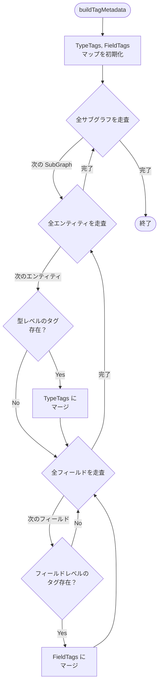
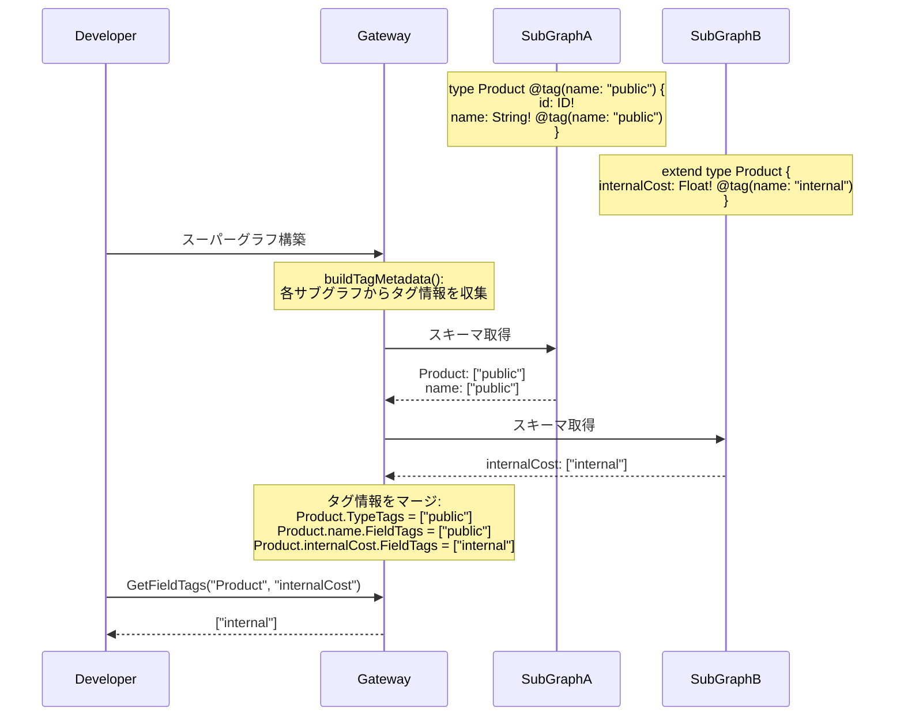
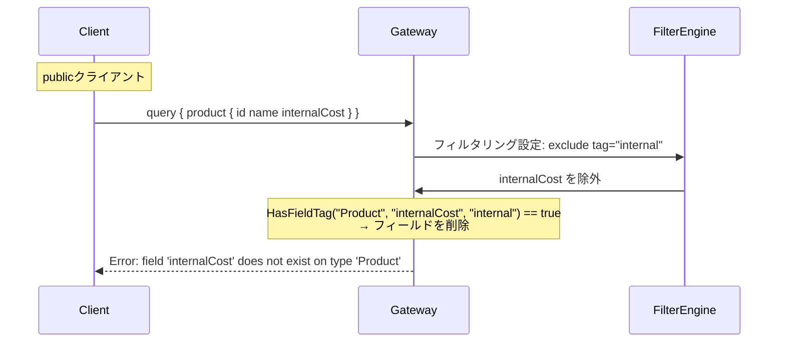

# Design Doc : Federation Tag Directive

## Background

現在の go-graphql-federation-gateway は、`@tag` ディレクティブのパース機能は実装されているものの、このディレクティブが持つ本来の役割である「メタデータの伝搬とフィルタリング」の活用機能が実装されていません。

Apollo Federation v2 の仕様では、`@tag` ディレクティブは以下の目的で使用されます：
- スキーマ要素（型、フィールド、引数）に任意のメタデータをタグ付けする
- タグ情報をスーパーグラフに伝搬する
- 契約バリアント（Contract Variants）でのフィルタリングに使用する
- ドキュメント生成やツールでのメタデータとして活用する

例えば、以下のようなユースケースがあります：

```graphql
type Product @key(fields: "id") {
  id: ID!
  name: String!
  price: Float! @tag(name: "public")
  internalCost: Float! @tag(name: "internal")
}
```

この場合、`@tag(name: "public")` はクライアント向けAPIに公開するフィールドをマークし、`@tag(name: "internal")` は内部ツール専用のフィールドをマークします。

## Summary

このドキュメントでは、`@tag` ディレクティブの情報をスーパーグラフに伝搬し、メタデータとして活用できるようにするための設計方針と実装アプローチを提案します。具体的には、タグ情報のスーパーグラフへのマージ、タグ情報の取得API、および将来的なフィルタリング機能の基盤を整備します。

## Goals

- `@tag` ディレクティブのタグ情報をスーパーグラフスキーマに伝搬する機能の実装
- フィールド、型、引数のタグ情報を取得するAPI の実装
- タグ情報をメタデータとして保持する構造の整備

## Non-Goals

- 契約バリアント（Contract Variants）の完全な実装
- タグベースのスキーマフィルタリング機能（将来的には検討）
- タグ情報のIntrospectionクエリへの露出（Apollo Studioとの互換性が必要な場合は将来実装）
- カスタムディレクティブとしての @tag の動的な定義

## Algorithm

### 現在の実装状況

**パース機能（実装済み）:**

```go
// subgraph_v2.go:214-220
case "tag":
    // Parse name argument of @tag directive
    for _, arg := range d.Arguments {
        if arg.Name.String() == "name" {
            tagName := strings.Trim(arg.Value.String(), "\"")
            f.Tags = append(f.Tags, tagName)
        }
    }

// subgraph_v2.go:259-261
func (f *Field) GetTags() []string {
    return f.Tags
}
```

**未実装箇所:**
- 型レベルの @tag パース
- 引数レベルの @tag パース
- タグ情報のスーパーグラフへのマージ
- タグ情報の取得API

### 修正箇所 1: subgraph_v2.go での型レベル @tag パース

**実装方針:**

```go
// Entity 構造にタグ情報を追加
type Entity struct {
    Keys              []EntityKey
    isExtension       bool
    Fields            map[string]*Field
    isInterfaceObject bool
    Tags              []string // ← 追加
}

// ObjectTypeDefinition の Directives から @tag を抽出
func parseTypeTags(directives []*ast.Directive) []string {
    var tags []string
    for _, d := range directives {
        if d.Name == "tag" {
            for _, arg := range d.Arguments {
                if arg.Name.String() == "name" {
                    tagName := strings.Trim(arg.Value.String(), "\"")
                    tags = append(tags, tagName)
                }
            }
        }
    }
    return tags
}

// Entity 作成時にタグを設定
entity := &Entity{
    Keys:              parseEntityKeys(objType.Directives),
    isExtension:       false,
    Fields:            make(map[string]*Field),
    isInterfaceObject: hasDirective(objType.Directives, "interfaceObject"),
    Tags:              parseTypeTags(objType.Directives),
}
```

### 修正箇所 2: super_graph_v2.go でのタグ情報のマージ

**実装方針:**

```go
// スーパーグラフにタグメタデータマップを追加
type SuperGraphV2 struct {
    Schema     *ast.Document
    SubGraphs  []*SubGraphV2
    TypeTags   map[string][]string       // typeName -> tags
    FieldTags  map[string]map[string][]string // typeName -> fieldName -> tags
    // ...
}

// buildTagMetadata() でタグ情報を収集
func (sg *SuperGraphV2) buildTagMetadata() {
    sg.TypeTags = make(map[string][]string)
    sg.FieldTags = make(map[string]map[string][]string)

    for _, subGraph := range sg.SubGraphs {
        for typeName, entity := range subGraph.GetEntities() {
            // 型レベルのタグをマージ
            if len(entity.Tags) > 0 {
                sg.TypeTags[typeName] = mergeUniqueTags(
                    sg.TypeTags[typeName],
                    entity.Tags,
                )
            }

            // フィールドレベルのタグをマージ
            if sg.FieldTags[typeName] == nil {
                sg.FieldTags[typeName] = make(map[string][]string)
            }
            for fieldName, field := range entity.Fields {
                if len(field.Tags) > 0 {
                    sg.FieldTags[typeName][fieldName] = mergeUniqueTags(
                        sg.FieldTags[typeName][fieldName],
                        field.Tags,
                    )
                }
            }
        }
    }
}

// タグの重複を排除してマージ
func mergeUniqueTags(existing, new []string) []string {
    tagSet := make(map[string]bool)
    for _, tag := range existing {
        tagSet[tag] = true
    }
    for _, tag := range new {
        tagSet[tag] = true
    }

    result := make([]string, 0, len(tagSet))
    for tag := range tagSet {
        result = append(result, tag)
    }
    sort.Strings(result) // 一貫性のためソート
    return result
}
```



### 修正箇所 3: タグ情報取得 API

**実装方針:**

```go
// SuperGraphV2 にタグ情報取得メソッドを追加

// GetTypeTags returns the tags for a given type
func (sg *SuperGraphV2) GetTypeTags(typeName string) []string {
    return sg.TypeTags[typeName]
}

// GetFieldTags returns the tags for a given field
func (sg *SuperGraphV2) GetFieldTags(typeName, fieldName string) []string {
    if fieldMap, ok := sg.FieldTags[typeName]; ok {
        return fieldMap[fieldName]
    }
    return nil
}

// HasTag checks if a type has a specific tag
func (sg *SuperGraphV2) HasTypeTag(typeName, tag string) bool {
    tags := sg.GetTypeTags(typeName)
    for _, t := range tags {
        if t == tag {
            return true
        }
    }
    return false
}

// HasFieldTag checks if a field has a specific tag
func (sg *SuperGraphV2) HasFieldTag(typeName, fieldName, tag string) bool {
    tags := sg.GetFieldTags(typeName, fieldName)
    for _, t := range tags {
        if t == tag {
            return true
        }
    }
    return false
}
```

### 修正箇所 4: スーパーグラフスキーマへのタグディレクティブの追加

**実装方針:**

```go
// mergeSchemaDeepPass1() でフィールドマージ時にタグディレクティブを保持
func mergeFieldWithTags(
    existingField *ast.FieldDefinition,
    newField *ast.FieldDefinition,
) {
    // 既存のタグディレクティブを収集
    existingTags := extractTagDirectives(existingField.Directives)
    newTags := extractTagDirectives(newField.Directives)

    // マージしたタグを新しいディレクティブとして追加
    mergedTags := mergeUniqueTags(existingTags, newTags)

    // 既存のタグディレクティブを削除
    existingField.Directives = removeTagDirectives(existingField.Directives)

    // マージしたタグを追加
    for _, tag := range mergedTags {
        tagDirective := createTagDirective(tag)
        existingField.Directives = append(existingField.Directives, tagDirective)
    }
}
```

---

## Request Sequence

### タグ情報の伝搬と取得



### 将来的なフィルタリング（参考）



---

## Development Command For AI Agent

### Process

**重要:** 以下のプロセスは TDD（テスト駆動開発）を厳守すること。各機能の実装前に必ずテストを書き、Red → Green → Refactor のサイクルを回すこと。

1. **SubGraph V2 拡張 (TDD)**
   1.1. **RED: テストを先に書く** - `subgraph_v2_test.go`
        - 型レベル @tag のパーステスト
        - フィールドレベル @tag のパーステスト（既存）
        - 複数タグの処理テスト
        - テストを実行して失敗することを確認
   1.2. **GREEN: 最小限の実装** - `subgraph_v2.go`
        - Entity 構造に Tags フィールドを追加
        - parseTypeTags() 関数を追加
        - Entity 作成時に型レベルのタグをパース
        - テストを実行して成功することを確認
   1.3. **REFACTOR: リファクタリング**
        - コードの重複を排除
        - 可読性を向上
        - テストが引き続き成功することを確認

2. **SuperGraph V2 拡張 (TDD)**
   2.1. **RED: テストを先に書く** - `super_graph_v2_test.go`
        - 複数サブグラフからのタグマージテスト
        - タグの重複排除テスト
        - タグ情報取得 API の動作確認テスト（GetTypeTags, GetFieldTags, HasTypeTag, HasFieldTag）
        - テストを実行して失敗することを確認
   2.2. **GREEN: 最小限の実装** - `super_graph_v2.go`
        - SuperGraphV2 構造に TypeTags, FieldTags マップを追加
        - buildTagMetadata() 関数を追加
        - mergeUniqueTags() ヘルパー関数を追加
        - NewSuperGraphV2() で buildTagMetadata() を呼び出し
        - タグ情報取得 API を追加（GetTypeTags, GetFieldTags, HasTypeTag, HasFieldTag）
        - テストを実行して成功することを確認
   2.3. **REFACTOR: リファクタリング**
        - コードの重複を排除
        - 可読性を向上
        - テストが引き続き成功することを確認

3. **スキーママージの改善（オプション・TDD）**
   3.1. **RED: テストを書く**
        - スーパーグラフスキーマに @tag ディレクティブがマージされることのテスト
   3.2. **GREEN: 実装**
        - mergeSchemaDeepPass1() でタグディレクティブを保持
        - スーパーグラフスキーマに @tag ディレクティブをマージ
   3.3. **REFACTOR: 改善**

4. **ドキュメントとサンプル**
   4.1. タグ機能の使用例を README に追加
   4.2. `_example` にタグ使用のサンプルを追加（オプション）

5. **結合テスト**
   5.1. `make test-all` で全ドメインのテストが通ることを確認
   5.2. タグ機能が既存の動作を壊していないことを確認

**TDD チェックリスト:**
- [ ] 各機能について、実装前にテストを書いたか？
- [ ] テストが最初は失敗することを確認したか？（RED）
- [ ] テストが成功する最小限のコードを書いたか？（GREEN）
- [ ] リファクタリング後もテストが成功することを確認したか？（REFACTOR）
- [ ] 全てのテストが通ることを確認したか？

### Expected Outcomes

- `@tag` ディレクティブのタグ情報がスーパーグラフに伝搬される
- タグ情報をメタデータとして取得できる API が提供される
- 将来的なフィルタリング機能の基盤が整備される
- スキーマのメタデータ管理が向上する
- ドキュメント生成やツールでタグ情報を活用できる
