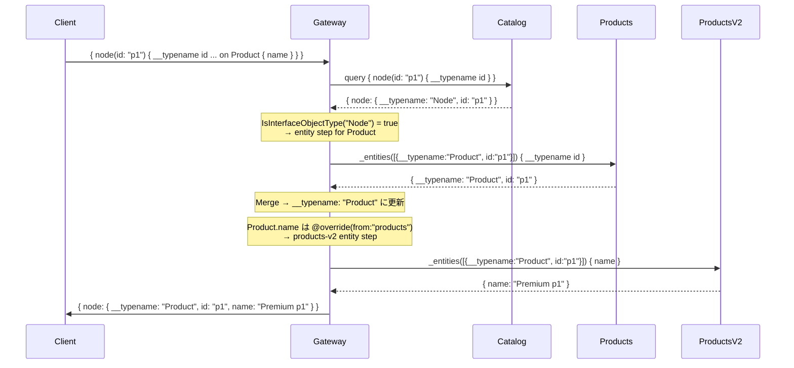
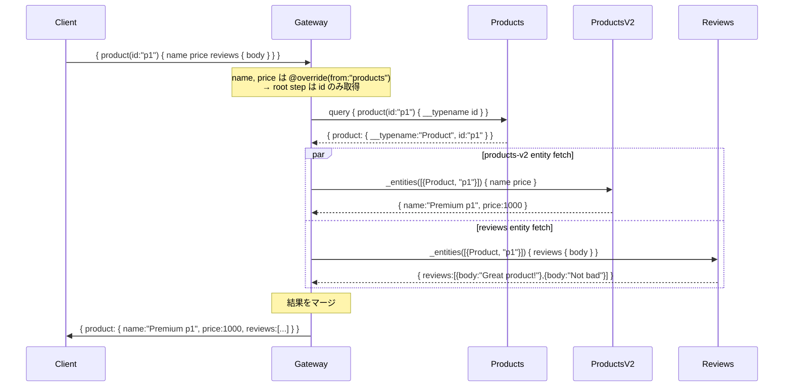

# Design Doc: Federation v2 Compliance v1

## Background

`federation-v2-compliance-v0` で `@requires`・`@key(resolvable: false)`・Mutation サポートなどの基盤実装を終えた後も、`make test-all` のインテグレーションテストは複数のドメインで失敗し続けていました。

失敗の原因は大きく 5 つに分類されます。

1. **テストケースの期待値がずれている** — `@override` による所有権移譲後の値（例: `name: "Premium p1"`）を、旧値（`name: "Product p1"`）で期待したままになっている。
2. **`GetEntityOwnerSubGraph` がスタブ型を Entity Owner として誤認する** — `@provides` のために参照用に宣言した外部型（例: reviews サブグラフの `type User @key(fields: "id") { id: ID! @external ... }`）が、キーフィールドに `@external` を持つにもかかわらず Entity Owner 候補に含まれ、非決定的に返されることがある。
3. **プランナーの Case 2 境界判定が誤動作する** — エンティティ型の Owner が現在のサブグラフと一致しない場合に不要なエンティティフェッチステップを生成してしまい、ルートクエリで返ったフィールドを上書きしてしまう。
4. **`@interfaceObject` 型へのインラインフラグメント（`... on ConcreteType`）が無視される** — `node(id: "p1") { __typename ... on Product { name } }` のようなクエリで具体型の解決ステップが生成されず、`__typename: "Node"` のまま返る。
5. **プルーナーがインラインフラグメントをスキップする** — レスポンスを元クエリの選択セットに合わせて刈り込む `pruneObject` が `*ast.InlineFragment` を処理せず、具体型の条件フィールドが最終レスポンスから欠落する。

加えて `@provides` のサンプルシナリオ（`Review.author: User @provides(fields: "username")`）に対応するスキーマとリゾルバーが reviews サブグラフに存在しておらず、`validateAccessibility` がフィールドなしと判断して `data: null` を返していた。

## Summary

上記 5 つの問題を修正し、`make test-all`（ec / fintech / saas / social / travel、計 117 テスト）を全件パスさせることを達成しました。

主な変更点：

| 変更対象 | 内容 |
|---|---|
| `_example/tests/*/cases.json` | `@override` 後の正しい期待値に更新 |
| `federation/graph/super_graph_v2.go` | `GetEntityOwnerSubGraph` のスタブ除外ロジック追加、`CanSubGraphResolveEntity` / `IsInterfaceObjectType` ヘルパー追加 |
| `federation/planner/planner_v2.go` | Case 2 の誤判定修正、`@interfaceObject` インラインフラグメント処理追加 |
| `federation/executor/executor_v2.go` | `pruneObject` でインラインフラグメントを処理するよう拡張 |
| `_example/ec/reviews/graph/` | `User` エンティティと `Review.author @provides` をスキーマ追加・gqlgen 再生成・リゾルバー実装 |

## Goals

- `@override` によるフィールド所有権の移譲が、インテグレーションテストレベルで正しく動作すること
- Entity Owner 判定がキーフィールドの `@external` を考慮し、スタブ参照型を誤って Owner と認識しないこと
- ルートクエリでエンティティを返すサブグラフに対して、不要なエンティティフェッチステップを生成しないこと
- `@interfaceObject` 型へのインラインフラグメント（`... on ConcreteType`）でコンクリート型フィールドを正しく解決し、`__typename` を具体型名で返すこと
- `@provides` を利用するサンプルシナリオが正常にクエリ実行できること（最適化 = フェッチ省略は将来課題）
- 既存のユニットテスト（`go test ./...`）が引き続き全件パスすること

## Non-Goals

- `@provides` の最適化（提供済みフィールドに対するエンティティフェッチの省略）— プランナーの TODO コメントに記載済み、今回は対象外
- `@interfaceObject` での `__typename` 逆引き（`node(id)` が実装型を返す際のコンクリート型自動判定）— 今回はインラインフラグメントを明示した場合のみ対応
- `@override` の progressive rollout（`label` 引数によるカナリアリリース）
- スキーマレジストリ経由でのサブグラフ動的登録

## Algorithm

### 修正 1: テストケースの期待値更新

`@override` が正しく動作した結果として返る値に期待値を合わせます。

例: ec ドメインの products-v2 サブグラフ

```go
// products-v2/graph/entity.resolvers.go
func (r *entityResolver) FindProductByID(ctx context.Context, id string) (*model.Product, error) {
    name := "Product " + id  // デフォルト
    price := 1000
    if id == "p1" {
        name = "Premium " + id  // p1 は名前をオーバーライド
    }
    if id == "p2" {
        price = 2500             // p2 は価格をオーバーライド
    }
    return &model.Product{ID: id, Name: name, Price: price, ...}, nil
}
```

- p1 の `name` → `"Premium p1"`（旧: `"Product p1"`）
- p2 の `price` → `2500`（旧: `1000`）
- Mutation 結果の `name` → `"Product 106"`（products-v2 がエンティティフェッチで上書き）

---

### 修正 2: `GetEntityOwnerSubGraph` のスタブ除外

`@provides` のためにスタブ型を宣言したサブグラフが Entity Owner として返される問題を修正します。

**問題のシナリオ**

```graphql
# reviews/graph/schema.graphqls（スタブ参照）
type User @key(fields: "id") {
  id: ID! @external        # ← キーが @external = 解決不可
  username: String! @external
}
```

`isExtension=false` かつ `IsResolvable=true` なので、修正前は reviews の User エンティティが Owner 候補として返されることがあった（Go の map イテレーション順が非決定的なため）。

**修正: キーフィールドの `@external` チェックを追加**

```go
// super_graph_v2.go
func (sg *SuperGraphV2) GetEntityOwnerSubGraph(typeName string) *SubGraphV2 {
    // 第1パス: 非拡張 + 解決可能 + キーが @external でない
    for _, subGraph := range sg.SubGraphs {
        if entity, exists := subGraph.GetEntity(typeName);
            exists && !entity.IsExtension() && entity.IsResolvable() {
            if len(entity.Keys) > 0 {
                keyField := strings.Fields(entity.Keys[0].FieldSet)[0]
                if sg.canResolveField(subGraph, typeName, keyField) {
                    return subGraph  // reviews.User は id @external なのでスキップされる
                }
            }
        }
    }
    // 第2パス: 拡張型のみの場合のフォールバック（同様のキーチェック付き）
    ...
}
```

---

### 修正 3: `CanSubGraphResolveEntity` ヘルパーと Case 2 の誤判定修正

**問題のシナリオ**

`GetEntityOwnerSubGraph("Product")` が products-v2 を返す場合（products と products-v2 どちらも非スタブのため）、products サービスの `product(id: ID!): Product` ルートフィールドを処理する際に Case 2 が誤作動する。

```
products.product が "Product" 型を返す
→ entityOwnerSubGraph = products-v2 ≠ parentStep.SubGraph = products
→ Case 2 発動 → products → products-v2 へのエンティティステップを誤生成
→ name/price を含むインラインフラグメントがスキップされ、フィールドが欠落
```

**修正: フィールド所有サブグラフが当該エンティティを直接解決できる場合は Case 2 を発動しない**

```go
// super_graph_v2.go
func (sg *SuperGraphV2) CanSubGraphResolveEntity(subGraph *SubGraphV2, typeName string) bool {
    entity, exists := subGraph.GetEntity(typeName)
    if !exists || !entity.IsResolvable() || len(entity.Keys) == 0 {
        return false
    }
    keyField := strings.Fields(entity.Keys[0].FieldSet)[0]
    return sg.canResolveField(subGraph, typeName, keyField)
}

// planner_v2.go - findAndBuildEntitySteps
} else if entityOwnerSubGraph != nil &&
    entityOwnerSubGraph.Name != parentStep.SubGraph.Name {
    // Case 2: フィールド所有サブグラフがエンティティを直接解決できる場合は境界にしない
    if !p.SuperGraph.CanSubGraphResolveEntity(fieldSubGraph, fieldType) {
        isBoundaryField = true
        targetSubGraph = entityOwnerSubGraph
    }
}
```

適用例:

| フィールド | fieldSubGraph | CanSubGraphResolveEntity | Case 2 |
|---|---|---|---|
| `product(id): Product` (products サービス) | products | `true` (id が @external でない) | 発動しない ✓ |
| `Review.product: Product` (reviews サービス) | reviews | `false` (id が @external) | 発動する ✓ |
| `Customer.accounts: [Account]` | customers | `false` (Account entity 未保有) | 発動する ✓ |

---

### 修正 4: `@interfaceObject` インラインフラグメント対応

`catalog` サービスが `type Node @interfaceObject @key(fields: "id")` で `node(id: ID!): Node` を提供し、具体型（Product / User）は他のサブグラフが定義するパターンに対応します。

**問題のクエリ**

```graphql
query { node(id: "p1") { __typename id ... on Product { name } } }
```

修正前は `... on Product` が「union discriminator」として無視され、`__typename: "Node"` のまま返っていた。

**修正: `findAndBuildEntitySteps` に `@interfaceObject` コンテキスト対応を追加**

```go
// planner_v2.go
if inlineFrag, ok := selection.(*ast.InlineFragment); ok {
    typeCondition := inlineFrag.TypeCondition.Name.String()
    if typeCondition == parentType {
        // 同型インラインフラグメント（通常の型条件）: 従来通り再帰処理
        p.findAndBuildEntitySteps(...)
    } else if p.SuperGraph.IsInterfaceObjectType(parentType) {
        // @interfaceObject コンテキスト: 具体型のエンティティステップを生成
        concreteType := typeCondition
        entityOwnerSubGraph := p.SuperGraph.GetEntityOwnerSubGraph(concreteType)
        if entityOwnerSubGraph != nil {
            stepKey := fmt.Sprintf(
                "%s:%s:%d:io:%s", entityOwnerSubGraph.Name,
                concreteType, parentStep.ID, strings.Join(currentPath, "."),
            )
            // エンティティステップを生成 (InsertionPath = currentPath)
            newStep := &StepV2{...}
            // 親ステップにキーフィールド (id) を注入
            p.injectKeyFieldsIntoParentStep(parentStep, concreteType, ...)
            // ネストした境界フィールド（@override などを含む）を再帰検索
            p.findAndBuildEntitySteps(inlineFrag.SelectionSet, newStep, ...)
        }
    }
    continue
}
```

**実行フロー（`{ node(id: "p1") { __typename id ... on Product { name } } }`）**



---

### 修正 5: `pruneObject` でのインラインフラグメント処理

レスポンスを元クエリの選択セットに刈り込む `pruneObject` を拡張し、`*ast.InlineFragment` を処理します。

executor 内の `expandFragmentsInSelections` はインラインフラグメントを展開（フラット化）しますが、プランナーが保持する `*ast.InlineFragment` が `pruneObject` に渡された場合にも対応が必要です（例: `@interfaceObject` の `... on Product { name }` が pruner に届くケース）。

```go
// executor_v2.go - pruneObject
case map[string]interface{}:
    result := make(map[string]interface{})
    for _, sel := range selections {
        switch s := sel.(type) {
        case *ast.Field:
            // 従来の処理（フィールド名でルックアップ）
            ...

        case *ast.InlineFragment:
            // __typename が型条件に一致する場合のみフラグメント内フィールドを含める
            if s.TypeCondition == nil {
                continue
            }
            typeCondition := s.TypeCondition.Name.String()
            objTypeName, hasTypename := v["__typename"].(string)
            if !hasTypename || objTypeName != typeCondition {
                continue
            }
            for _, childSel := range s.SelectionSet {
                childField, ok := childSel.(*ast.Field)
                if !ok { continue }
                // 通常フィールドと同様に値をルックアップして含める
                ...
            }
        }
    }
```

---

### 修正 6: `@provides` サンプルシナリオの整備

reviews サービスに `author: User @provides(fields: "username")` を追加し、`validateAccessibility` によるエラーを解消します。

```graphql
# reviews/graph/schema.graphqls（追加分）
type User @key(fields: "id") {
  id: ID! @external
  username: String! @external
}

type Review implements Node {
  ...
  author: User @provides(fields: "username")  # 追加
  ...
}
```

```go
// reviews/graph/entity.resolvers.go（更新）
{ID: "1", Body: "Great product!", AuthorName: "Alice",
    Author: &model.User{ID: "user1", Username: "Alice"}, ...}
```

> **Note**: `@provides` の最適化（users サービスへの追加フェッチを省略する最適化）は今回の対象外です。現在は users サービスの entity resolver を通じて `username: "User user1"` が返ります。プランナーの TODO コメントに将来の実装指針が記載されています。

---

## Request Sequence

### @override フィールドの解決



### Entity Owner 判定（スタブ型の除外）

```mermaid
flowchart TD
    Start([GetEntityOwnerSubGraph typeName]) --> Loop{全サブグラフを走査}
    Loop --> HasEntity{GetEntity 存在?}
    HasEntity -- No --> Loop
    HasEntity -- Yes --> IsExt{IsExtension?}
    IsExt -- Yes --> Loop
    IsExt -- No --> IsRes{IsResolvable?}
    IsRes -- No --> Loop
    IsRes -- Yes --> KeyCheck{キーフィールドが<br>@external でない?}
    KeyCheck -- No → スタブ型はスキップ --> Loop
    KeyCheck -- Yes --> Return([return subGraph])
    Loop -- 完了 --> SecondPass([第2パスへ: extension のみの場合])
```
