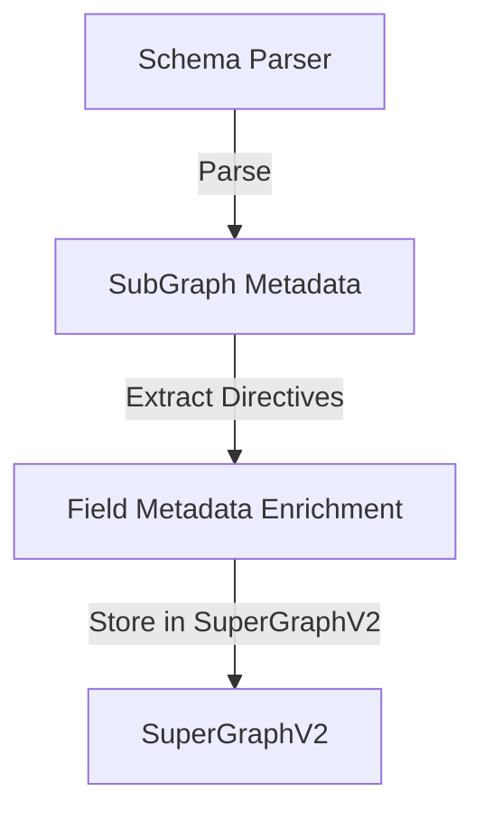

# Design Doc: Federation v2 Directive Full Support

## 1. Summary

現在の `go-graphql-federation-gateway` は、Apollo Federation v2 の基本機能（`_entities` クエリ生成など）を有していますが、下記のディレクティブについては完全なサポートがされていません。

- @override
- @inaccessible
- @tag
- @interfaceObject
- @composeDirective

本ドキュメントでは、これらの機能を実装し、Federation v2 仕様への適合性を高めるためのアーキテクチャ変更と実装指針を定義します。

## 2. Background & Problem Statement

完全な互換性が保証されていません。

**具体的な問題例**:
- `@override`: フィールド所有権の移行ができず、段階的マイグレーションが困難
- `@inaccessible`: 内部フィールドがクライアントに露出してしまう
- `@tag`: Apollo Studio での契約バリアント機能が使えない
- `@interfaceObject`: インターフェース型のエンティティ解決ができない

これらは Federation v2 の重要な機能であり、特に大規模なスキーマ管理や複雑なサービス間の依存関係を持つシナリオで必要とされるため、これらの機能をサポートすることが重要です。

## 3. Goals

1.  **ディレクトリブの完全サポート**: 上記のディレクティブを正しく解析し、Planner と Executor で適切に処理する。
2. **テストケースの追加**: 各ディレクティブに対する明示的なテストケースを追加し、機能の正確な動作を検証する。
3. **ドキュメントの更新**: README を始めとしたドキュメントを更新し、サポートされている機能とテストカバレッジを明確にする。

**成功基準**:
- 全ディレクティブの単体テストが pass
- 各ドメインで統合テストが pass (49 → 60+ tests)
- README の Supported Directives テーブルが 5/11 → 10/11 に更新

## 4. Non-Goals

- v2.1 以降の新機能（@authenticated, @requiresScopes, @policy など）
- **Supergraph 生成機能**（Rover/Apollo Studio の代替）
- **Query Plan Caching**（別タスクで対応予定）
- **Contract Variants 機能**（@tag の実行時フィルタリング）

## 5. Architecture

### 5.1. Subgraph Metadata Enrichment

現在の `SubGraph` 定義を拡張し、各ディレクティブのメタデータを保持する構造体を追加します。
実装イメージは以下の通りです。

```go
type OverrideMetadata struct {
    From string  // 移行元のサブグラフ名（例: "products"）
}

type Field struct {
    Name        string
    Type        ast.Type
    Requires    []string
    Provides    []string
    isShareable bool
    
    // 新規追加
    Override       *OverrideMetadata  // @override(from: "products")
    isInaccessible bool                // @inaccessible
    Tags           []string            // @tag(name: "public")
}

type Entity struct {
    Keys        []EntityKey
    isExtension bool
    Fields      map[string]*Field
    
    // 新規追加
    isInterfaceObject bool
}

type SubGraphV2 struct {
    Name     string
    Host     string
    Schema   *ast.Document
    entities map[string]*Entity
    
    // 新規追加
    ComposeDirectives []string
}
```

### 5.2. Extend Schema Parsing Logic

スキーマのパースロジックを拡張し、上記のディレクティブを正しく解析して `FieldMetadata` に格納します。



## 6. Implementation Details

### 6.1. @override 対応

**課題**: `@override(from: "SubGraphA")` が宣言されたフィールドは、元の定義を持つサブグラフ（SubGraphA）からではなく、オーバーライドを宣言したサブグラフから解決される必要があります。

**解決策**:
1.  `FieldMetadata` に `Override` フィールドを追加し、オーバーライドの情報を保持。
2.  Planner 内でフィールドの所有者を決定する際、`Override` メタデータを確認し、オーバーライド元のサブグラフではなく、オーバーライドを宣言したサブグラフを優先して選択するロジックを追加。

```go
func (sg *SuperGraphV2) GetFieldOwnerSubGraph(typeName, fieldName string) *SubGraph {
    for _, subgraph := range sg.subgraphs {
        entity, exists := subgraph.GetEntity(typeName)
        if !exists {
            continue
        }
        
        field, exists := entity.Fields[fieldName]
        if !exists {
            continue
        }
        
        if field.Override != nil {
            return subgraph
        }
    }
    
    return sg.getDefaultFieldOwner(typeName, fieldName)
}
```

### 6.2. @inaccessible 対応

**課題**: `@inaccessible` が宣言されたフィールドは、クエリプランナーがそのフィールドをクエリプランに含めないようにする必要があります。

**解決策**: Planner のクエリ分割ロジックに、フィールドの `Inaccessible` フラグを確認し、`true` の場合はそのフィールドをクエリプランから完全に除外するロジックを追加。

```go
// クエリバリデーション時にチェック
func (g *Gateway) HandleQuery(ctx context.Context, query string) (*Response, error) {
    doc := parseQuery(query)
    
    // @inaccessible チェック
    if err := g.validateAccessibility(doc); err != nil {
        return nil, err
    }
    
    // 通常のプランニング
    plan := g.planner.Plan(doc)
    return g.executor.Execute(ctx, plan)
}

func (g *Gateway) validateAccessibility(doc *ast.Document) error {
    var errs []error
    
    walkSelections(doc, func(sel *ast.Selection, path []string) {
        typeName := getTypeName(path)
        fieldName := sel.Name.String()
        
        field := g.superGraph.GetField(typeName, fieldName)
        if field != nil && field.isInaccessible {
            errs = append(errs, &graphql.Error{
                Message: fmt.Sprintf("Cannot query field \"%s\" on type \"%s\".", fieldName, typeName),
                Path:    path,
                Extensions: map[string]interface{}{
                    "code": "INACCESSIBLE_FIELD",
                },
            })
        }
    })
    
    if len(errs) > 0 {
        return &graphql.ErrorList{Errors: errs}
    }
    return nil
}
```

### 6.3. @tag 対応

**課題**: `@tag` が宣言されたフィールドやタイプは、SuperGraphV2 内でフィールドに紐づくタグ情報として保持される必要があります。

**解決策**: `FieldMetadata` に `Tags` フィールドを追加し、スキーマパース時に `@tag` ディレクティブの情報を抽出して格納するロジックを追加。

```go
func NewSubGraphV2(schema *ast.Schema) *SubGraphV2 {
    subGraph := &SubGraphV2{
        // 初期化ロジック
    }
    
    for _, typeDef := range schema.Types {
        for _, fieldDef := range typeDef.Fields {
            field := parseField(fieldDef) // @tag を含むフィールドの解析ロジックを追加
            subGraph.addFieldMetadata(typeDef.Name.String(), fieldDef.Name.String(), field)
        }
    }
    return subGraph
}

func NewSuperGraphV2(subGraphs []*SubGraph) *SuperGraphV2 {
    superGraph := &SuperGraphV2{
        // 初期化ロジック
    }
    
    for _, subGraph := range subGraphs {
        for entityName, entity := range subGraph.entities {
            // エンティティの統合ロジック
            superGraph.mergeEntity(entityName, entity, subGraph.Name)
        }
    }
    
    return superGraph
}


func parseField(fieldDef *ast.FieldDefinition) *Field {
    field := &Field{
        Name: fieldDef.Name.String(),
        Type: fieldDef.Type,
        Tags: []string{},
    }
    
    for _, directive := range fieldDef.Directives {
        switch directive.Name {
        case "tag":
            for _, arg := range directive.Arguments {
                if arg.Name.String() == "name" {
                    tagName := strings.Trim(arg.Value.String(), "\"")
                    field.Tags = append(field.Tags, tagName)
                }
            }
        case "override":
            // 同様に解析
        }
    }
    
    return field
}
```

### 6.4. @interfaceObject 対応

**課題**: `@interfaceObject` が宣言された型は、通常のインターフェースではなく、
**エンティティとして解決可能なインターフェース型**として扱われる必要があります。

**解決策**:
1. `SubGraphV2` で `@interfaceObject` が宣言された型を特定し、`FieldMetadata` の `InterfaceObject` フラグを `true` に設定します。

```go
// メタ情報として保持するだけ、特別な処理は不要
func parseObjectType(objType *ast.ObjectTypeDefinition) *Entity {
    entity := &Entity{
        isInterfaceObject: hasDirective(objType.Directives, "interfaceObject"),
    }
    return entity
}
```

### 6.5. @composeDirective 対応

**課題**: `@composeDirective` が宣言されたフィールドや型は、SuperGraphV2 の生成時にカスタムディレクティブを伝播させる必要があります。

**解決策**: `SubGraphV2` の初期化時に schema レベルで `@composeDirective` を解析し、`FieldMetadata` の `ComposeDirectives` フィールドにリストとして格納します。
@composeDirective はメタデータとしての振る舞いを持つので、Planner や Executor で特定のロジックを実装する必要はありませんが、将来的な拡張のためにメタデータとして保持しておきます。

```go
func NewSubGraphV2(name string, src []byte, host string) (*SubGraphV2, error) {
    doc := parseSchema(src)
    
    sg := &SubGraphV2{
        Name: name,
        Host: host,
        ComposeDirectives: extractSchemaComposeDirectives(doc),
    }
    return sg, nil
}

func extractSchemaComposeDirectives(doc *ast.Document) []string {
    var directives []string
    for _, def := range doc.Definitions {
        if schemaDef, ok := def.(*ast.SchemaDefinition); ok {
            for _, d := range schemaDef.Directives {
                if d.Name == "composeDirective" {
                    directives = append(directives, extractNameArg(d))
                }
            }
        }
    }
    return directives
}
```

## 7. Develpopment Command For AI Agent

### 7.1. Process

TDD を採用し、下記の順序で開発を進めます。

1. @override 対応
   - 1.1. `Field` 構造体に `Override *OverrideMetadata` フィールド追加
   - 1.2. `parseField()` に @override パースロジック追加
   - 1.3. @override の単体テスト追加（subgraph_v2_test.go）
   - 1.4. SuperGraphV2 での所有者判定ロジック実装
   - 1.5. 所有者判定の単体テスト追加（super_graph_v2_test.go）
   - 1.6. EC ドメイン統合テスト追加
   - 1.7. 全ドメインへの展開

2. @inaccessible 対応
    - 2.1. `Field` 構造体に `isInaccessible bool` フィールド追加
    - 2.2. `parseField()` に @inaccessible パースロジック追加
    - 2.3. @inaccessible の単体テスト追加（subgraph_v2_test.go）
    - 2.4. Gateway のバリデーションロジック実装（validateAccessibility）
    - 2.5. バリデーションの単体テスト追加（gateway_test.go）
    - 2.6. EC ドメイン統合テスト追加
    - 2.7. 全ドメインへの展開

3. @tag 対応
    - 3.1. `Field` 構造体に `Tags []string` フィールド追加
    - 3.2. `parseField()` に @tag パースロジック追加
    - 3.3. @tag の単体テスト追加（subgraph_v2_test.go）
    - 3.4. メタ情報の保持確認テスト
    - 3.5. EC ドメイン統合テスト追加
    - 3.6. 全ドメインへの展開

4. @interfaceObject 対応
    - 4.1. `Entity` 構造体に `isInterfaceObject bool` フィールド追加
    - 4.2. `parseObjectType()` に @interfaceObject パースロジック追加
    - 4.3. @interfaceObject の単体テスト追加（subgraph_v2_test.go）
    - 4.4. 新規テストドメイン `_example/interface-test/` を作成
    - 4.5. サブグラフで `@interfaceObject` を実装
    - 4.6. Gateway でメタ情報を正しくパースできることを確認
    - 4.7. (オプション) 実際のクエリ実行テスト

5. @composeDirective 対応
    - 5.1. `SubGraphV2` 構造体に `ComposeDirectives []string` フィールド追加
    - 5.2. `extractSchemaComposeDirectives()` 実装
    - 5.3. @composeDirective の単体テスト追加（subgraph_v2_test.go）
    - 5.4. メタ情報の保持確認テスト
    - 5.5. EC ドメイン統合テスト追加
    - 5.6. 全ドメインへの展開

### 7.2. Implementation Priority & Dependencies

| Step | Directive | 実装難易度 | 実行時影響 | 推定工数 | 依存関係 |
|:-----|:----------|:---------|:----------|:--------|:---------|
| 1 | @override | 🔴 高 | ✅ あり | 3-4 days | なし |
| 2 | @inaccessible | 🟡 中 | ✅ あり | 2-3 days | なし |
| 3 | @tag | 🟢 低 | ❌ なし | 1-2 days | なし |
| 4 | @composeDirective | 🟢 低 | ❌ なし | 0.5-1 day | なし |
| 5 | @interfaceObject | 🟡 中 | ❌ なし | 2-3 days | サブグラフ実装 |
