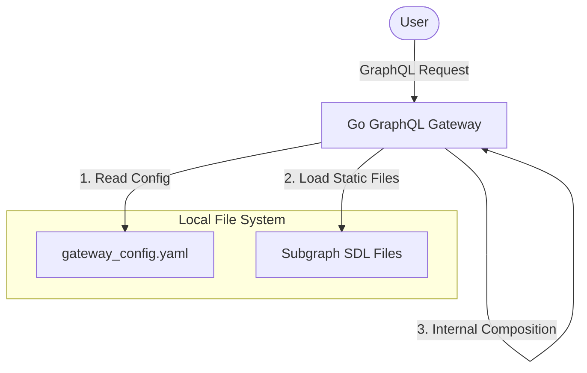
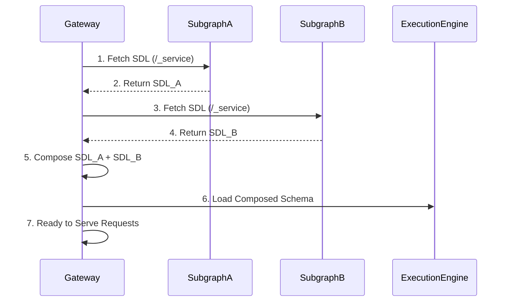
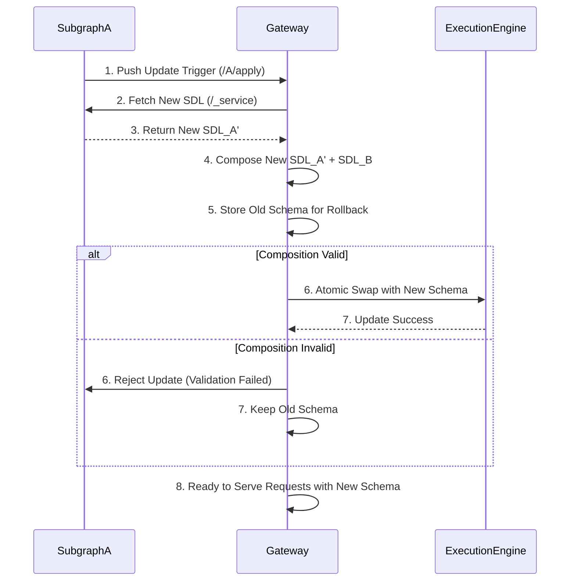
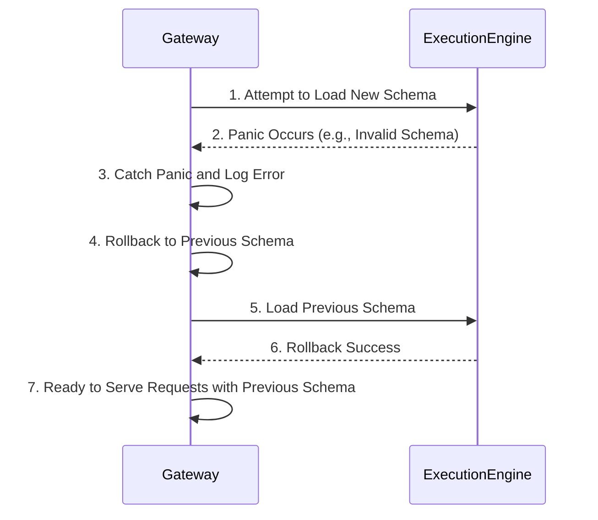

# Design Doc : Gateway Schema Registry

## Background

現在の go-graphql-federation-gateway は、Apollo Federation v2 の基本機能をサポートしていますが、スキーマ管理に関しては、各サブグラフのスキーマファイルをローカル環境からリードしており、動的なスキーマ管理やバージョニングの機能が不足しています。これにより、スキーマの変更を反映させるためには、ゲートウェイの再起動が必要となり、運用上の柔軟性が制限されています。

## Summary

このドキュメントでは、ゲートウェイのスキーマ管理機能を強化するための設計方針と実装アプローチを提案します。

## Goals

- スキーマの動的な管理とロールバック機能の実装
- サブグラフ間でのスキーマのバリデーション機能の追加
- サブグラフの push 型でのスキーマ登録機能の実装

## Non-Goals

- スキーマのバージョニング機能の実装
- スキーマのバージョン間の互換性チェック機能の実装

## Architecture

現在、スキーマを読み込むときのアーキテクチャは下記のようになっています。



今回の変更でサブグラフを「情報の正」とし、外部からのトリガー（/{name}/apply）によってメモリ上のスキーマをアトミックに差し替える構成に変更します。

```mermaid
graph LR
    subgraph Subgraphs [Subgraph Ecosystem]
        SG_A[Subgraph A]
        SG_B[Subgraph B]
    end

    subgraph Go_Gateway [Go GraphQL Gateway]
        direction TB
        Config[Config Loader]
        Poller[Schema Fetcher /_service]
        Applier[Apply Endpoint /{name}/apply]
        Composer[In-Memory Composer]
        Engine[Execution Engine /Atomic Value/]
    end

    %% 起動フロー
    Config -. 1. Load Host List .-> Poller
    Poller -- 2. Fetch SDL --> SG_A
    Poller -- 2. Fetch SDL --> SG_B
    Poller -- 3. Raw SDLs --> Composer
    Composer -- 4. Build Supergraph --> Engine

    %% 更新フロー
    SG_A -- 5. Push Update Trigger --> Applier
    Applier -- 6. On-demand Fetch --> SG_A
    SG_A -- 7. New SDL --> Applier
    Applier -- 8. Re-Compose & Validate --> Composer
    Composer -- 9. Atomic Swap if Valid --> Engine

    %% リクエストフロー
    User([User]) -- GraphQL Request --> Engine
```

具体的な gateway の変更は下記のような形になると想定される。

```go
type gateway struct {
    graphQLEndpoint string
    serviceName     string
    mu             sync.Mutex  // applyの同時実行を1つに絞る
    currentSchema  atomic.Value // *executionEngine
    previousSchema atomic.Value // *executionEngine (ロールバック用)
    inFlight sync.WaitGroup
}
```

## Request Sequence

### Gateway起動時のスキーマ読み込み

下記のシーケンス図では、ゲートウェイ起動時にサブグラフのスキーマをフェッチし、コンポーズして実行エンジンに反映する流れを示しています。



### Gateway がスキーマ更新を受け取るシーケンス

下記のシーケンス図では、サブグラフからのスキーマ更新トリガーを受けて、ゲートウェイが新しいスキーマをフェッチし、コンポーズして実行エンジンに反映する流れを示しています。



スキーマ更新の歳はFetch SDL(/_service)のエンドポイントを呼び出し、sdl を取得する。
実装は下記のような形になると想定される。

```go
// サブグラフからのフェッチ
resp, err := http.Post(subgraphHost+"/_service", "application/json", 
    bytes.NewBuffer([]byte(`{"query":"{_service{sdl}}"}`)))

// レスポンスのパース
type ServiceResponse struct {
    Data struct {
        Service struct {
            SDL string `json:"sdl"`
        } `json:"_service"`
    } `json:"data"`
}
```

コンポジションバリデーションでエラーが発生した場合は、ロールバックして前のスキーマを再度読み込む。
前のスキーマは `previousSchema` に保存しておき、必要に応じて `currentSchema` に再度セットする形になると想定される。
apply は gateway.yaml に回数分のリトライを行う設定を追加する。
リトライの yaml の例は下記のような形になると想定される。
このサービスごとの retry の設定は、applySubgraph 内でのコンポジション失敗時のリトライロジックに使用される。

```yaml
services:
- name: A
  url: http://localhost:4001/graphql
  retry:
    attempts: 5
    timeout: 5s
```

```go
func (g *gateway) applySubgraph(name string) error {
    current := g.current.Load().(*schemaStore)
    
    // 新しいSDLをフェッチ
    newSDL, err := fetchSDL(current.hosts[name])
    if err != nil { return err }
    
    // 新しいSDLマップを構築（旧マップはコピー、1つだけ差し替え）
    newSDLs := copyMap(current.sdls)
    newSDLs[name] = newSDL
    
    // コンポジション試行
    newEngine, err := buildEngine(newSDLs, current.hosts)
    if err != nil {
        // 失敗 → current はそのまま = ロールバック済み
        return fmt.Errorf("composition failed: %w", err)
    }
    
    // 成功 → Atomic Swap
    g.previous.Store(g.current.Load()) // ロールバック用に現在のスキーマを保存
    g.current.Store(&schemaStore{sdls: newSDLs, hosts: current.hosts, engine: newEngine})
    return nil
}
```

並行リクエストとスキーマ更新をする場合、graceful shutdown のような形で、リクエスト処理とスキーマ更新のロックを分ける必要がある。
このときの既存のリクエストを完了まで待つためのロジックは下記のような形になると想定される。
既存のリクエストのタイムアウト設定は gateway.yaml に追加する。
この requestTimeout の設定は inFlight の Wait のタイムアウトに使用される。

```yaml
requestTimeout: 30s
services:
- name: A
  host: http://localhost:4001/query
  # ...
```


```go
type gateway struct {
    currentSchema  atomic.Value // *executionEngine
    previousSchema atomic.Value // *executionEngine (ロールバック用)
    inFlight sync.WaitGroup
    mu       sync.Mutex  // applyの同時実行を1つに絞る
}

func (g *gateway) ServeHTTP(w http.ResponseWriter, r *http.Request) {
    engine := g.current.Load().(*schemaStore).engine
    g.inFlight.Add(1)
    defer g.inFlight.Done()
    
    // engine を使ってリクエスト処理
}

func (g *gateway) applySubgraph(name string) error {
    g.mu.Lock() // apply の直列化
    defer g.mu.Unlock()
    
    // ... コンポジション ...
    
    // 既存リクエストを完了まで待ってから差し替え
    // yaml で設定されたリトライ + タイムアウトの時間分 inFlight の Wait のタイムアウトを設定する
    // エラーが発生した場合はロールバックして前のスキーマを再度読み込む
    done := make(chan struct{})
    go func() {
        g.inFlight.Wait()
        close(done)
    }()
    select {
    case <-done:
        // 正常に全リクエスト完了
    case <-time.After(requestTimeout):
        return fmt.Errorf("timeout waiting for in-flight requests")
    }
    g.current.Store(newStore)
    return nil
}
```

### Gateway 全体で panic のエラーが発生した場合に、エラーをキャッチしてロールバックする




applySubgraph 内でのコンポジションやスキーマのロード処理も同様に panic をキャッチしてロールバックする形になると想定される。
具体的な実装は、以下のような形になると想定される。

```go
func Run() {
    // ... 省略 ...

    // applySubgraph 内での panic キャッチ
    defer func() {
        if err := recover(); err != nil {
            log.Printf("Panic during schema application: %v. Rolling back to previous schema.", err)
            g.rollbackToPreviousSchema()
        }
    }()

    // ... applySubgraph のロジック ...
}
```


## 7. Develpopment Command For AI Agent

### 7.1. Process

TDD を採用し、下記の順序で開発を進めます。

1. Gateway 起動時のユースケース
  1.1. Gateway 起動時にサブグラフのスキーマのフェッチするロジックのテストコードを実装
  1.2. Gateway 起動時にサブグラフのスキーマをコンポーズして実行エンジンに反映するロジックのテストコードを実装
  1.3. 既存のローカルファイルからスキーマを読み込むロジックをリファクタリングして、サブグラフからのフェッチロジックに置き換える(schema_files からの読み込み機能は削除する)
2. Gateway がスキーマ更新を受け取るユースケース
  2.1. サブグラフからのスキーマ更新トリガーを受けて、ゲートウェイが新しいスキーマをフェッチするロジックのテストコードを実装
  2.2. ゲートウェイが新しいスキーマをコンポーズして実行エンジンに反映するロジックのテストコードを実装
  2.3. サブグラフからのスキーマ更新トリガーを受けて、ゲートウェイが新しいスキーマをフェッチし、コンポーズして実行エンジンに反映するロジックの実装
  2.4. _examples/schema_update ディレクトリに、サブグラフのスキーマ更新のユースケースを再現するためのサンプルコードとドキュメントを追加
3. Gateway 全体で panic のエラーが発生した場合に、エラーをキャッチしてロールバックするユースケース
  3.1. Gateway 全体で panic のエラーが発生した場合に、エラーをキャッチしてロールバックするロジックのテストコードを実装
  3.2. Gateway 全体で panic のエラーが発生した場合に、エラーをキャッチしてロールバックするロジックの実装
  3.3. _examples/schema_update ディレクトリに、Gateway 全体で panic のエラーが発生した場合に、エラーをキャッチしてロールバックするユースケースを再現するためのサンプルコードとドキュメントを追加

