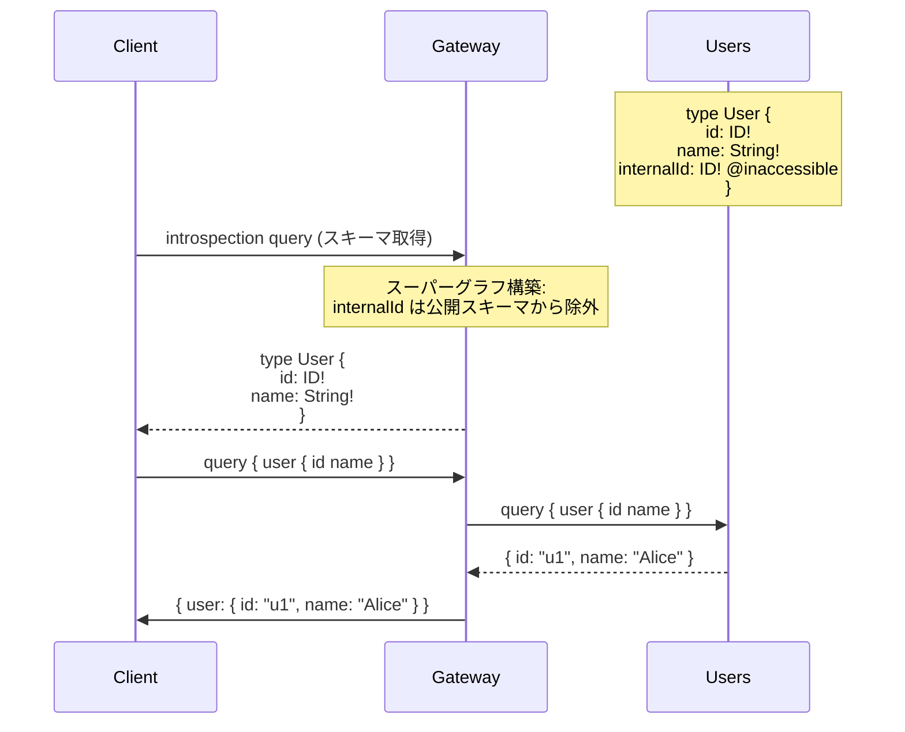
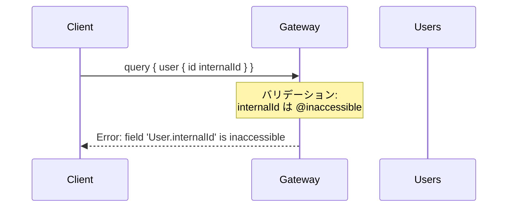

# Design Doc : Improve Directive Inaccessible

## Background

現在の go-graphql-federation-gateway は、`@inaccessible` ディレクティブのパース機能は実装されているものの、このディレクティブが持つ本来の役割である「公開スキーマからのフィールド/型の除外」が実装されていません。これにより、内部利用専用のフィールドがクライアントに公開されてしまう可能性があります。

Apollo Federation v2 の仕様では、`@inaccessible` ディレクティブは以下の目的で使用されます：
- サブグラフ間の連携に必要だが、クライアントには公開したくないフィールドをマークする
- 内部利用専用の型や列挙値を非公開にする
- 段階的な非推奨化の前段階として使用する

例えば、User.internalId フィールドがサブグラフ間の連携に必要だが、クライアントには公開したくない場合、`internalId: ID! @inaccessible` とマークすることで、スーパーグラフの公開スキーマから除外されます。

## Summary

このドキュメントでは、`@inaccessible` ディレクティブの完全な実装のための設計方針と実装アプローチを提案します。具体的には、スーパーグラフ構築時に `@inaccessible` でマークされたフィールド・型を公開スキーマから除外するロジック、およびクライアントが誤って inaccessible フィールドにアクセスした際のバリデーションエラー処理を追加します。

## Goals

- `@inaccessible` でマークされたフィールドを公開スーパーグラフスキーマから除外する機能の実装
- `@inaccessible` でマークされた型を公開スキーマから除外する機能の実装
- inaccessible フィールドへのクエリに対するバリデーションエラーの実装

## Non-Goals

- `@inaccessible` の段階的ロールアウト機能
- Gateway 内部での inaccessible フィールドの自動利用（将来的には @requires などで必要になる可能性がある）
- Introspection クエリでの inaccessible フィールドの完全な非表示（基本的なスキーマ除外のみを実装）

## Algorithm

### 現在の実装状況

**パース機能（実装済み）:**

```go
// subgraph_v2.go:212-213
case "inaccessible":
    f.isInaccessible = true

// subgraph_v2.go:254-256
func (f *Field) IsInaccessible() bool {
    return f.isInaccessible
}
```

**未実装箇所:**
- スーパーグラフ構築時の inaccessible フィールド除外
- inaccessible 型のサポート
- クライアントクエリのバリデーション

### 修正箇所 1: super_graph_v2.go のスキーママージ時除外

**現状の問題:**

```go
// super_graph_v2.go: mergeSchemaDeepPass1(), mergeSchemaDeepPass2()
// 全フィールドを無条件でスーパーグラフにマージしている
for _, field := range objType.Fields {
    mergedType.Fields = append(mergedType.Fields, field)
    // ← @inaccessible チェックなし
}
```

**修正方針:**

```go
// フィールドマージ時に @inaccessible チェックを追加
for _, field := range objType.Fields {
    // サブグラフのフィールドメタデータを取得
    if entity, ok := sg.GetEntity(typeName); ok {
        if f, ok := entity.Fields[field.Name.String()]; ok {
            if f.IsInaccessible() {
                continue // 公開スキーマから除外
            }
        }
    }
    mergedType.Fields = append(mergedType.Fields, field)
}
```

```mermaid
flowchart TD
    Start([スキーママージ]) --> Loop{全フィールドを走査}
    Loop -- 次のフィールド F --> GetMetadata[サブグラフから<br>フィールドメタデータ取得]
    GetMetadata --> CheckInaccessible{F.IsInaccessible()？}
    CheckInaccessible -- Yes --> Skip[スキップ<br>公開スキーマに含めない]
    CheckInaccessible -- No --> Merge[スーパーグラフに<br>マージ]
    Skip --> Loop
    Merge --> Loop
    Loop -- 完了 --> End([終了])
```

### 修正箇所 2: super_graph_v2.go の型レベル @inaccessible サポート

**実装方針:**

```go
// Entity 構造に isInaccessible フラグを追加
type Entity struct {
    Keys              []EntityKey
    isExtension       bool
    Fields            map[string]*Field
    isInterfaceObject bool
    isInaccessible    bool // ← 追加
}

// ObjectTypeDefinition の Directives から @inaccessible を検出
if hasDirective(objType.Directives, "inaccessible") {
    entity.isInaccessible = true
}

// スーパーグラフマージ時に型全体をスキップ
if entity.IsInaccessible() {
    continue // 型定義をスキップ
}
```

### 修正箇所 3: クエリバリデーション（オプション）

**将来的な拡張:**

```go
// planner_v2.go でクエリ時にフィールドの accessibility をチェック
func (p *PlannerV2) validateFieldAccess(typeName, fieldName string) error {
    subGraphs := p.SuperGraph.GetSubGraphsForField(typeName, fieldName)
    for _, sg := range subGraphs {
        if entity, ok := sg.GetEntity(typeName); ok {
            if field, ok := entity.Fields[fieldName]; ok {
                if field.IsInaccessible() {
                    return fmt.Errorf(
                        "field '%s.%s' is marked @inaccessible and cannot be queried",
                        typeName, fieldName,
                    )
                }
            }
        }
    }
    return nil
}
```

---

## Request Sequence

### @inaccessible フィールドの除外



### @inaccessible フィールドへのアクセス試行（バリデーション）



---

## Development Command For AI Agent

### Process

**重要:** 以下のプロセスは TDD（テスト駆動開発）を厳守すること。各機能の実装前に必ずテストを書き、Red → Green → Refactor のサイクルを回すこと。

1. **Entity 構造の拡張 (TDD)**
   1.1. **RED: テストを先に書く** - `subgraph_v2_test.go`
        - 型レベル @inaccessible のパーステスト
        - フィールドレベル @inaccessible のパーステスト（既存の確認）
        - テストを実行して失敗することを確認
   1.2. **GREEN: 最小限の実装** - `subgraph_v2.go`
        - Entity 構造に isInaccessible フラグを追加
        - parseEntityDirectives() で型レベルの @inaccessible を検出
        - テストを実行して成功することを確認
   1.3. **REFACTOR: リファクタリング**
        - コードの重複を排除
        - 可読性を向上
        - テストが引き続き成功することを確認

2. **SuperGraph V2 修正 (TDD)**
   2.1. **RED: テストを先に書く** - `super_graph_v2_test.go`
        - @inaccessible フィールドが公開スキーマから除外されることのテスト
        - @inaccessible 型が公開スキーマから除外されることのテスト
        - 非 inaccessible フィールドは正常にマージされることのテスト
        - テストを実行して失敗することを確認
   2.2. **GREEN: 最小限の実装** - `super_graph_v2.go`
        - mergeSchemaDeepPass1() を修正（フィールドマージ時に IsInaccessible() をチェック、inaccessible フィールドをスキップ）
        - mergeSchemaDeepPass2() を修正（Extension フィールドのマージ時も同様にチェック）
        - 型レベル @inaccessible の場合、型定義全体をスキップ
        - テストを実行して成功することを確認
   2.3. **REFACTOR: リファクタリング**
        - コードの重複を排除
        - 可読性を向上
        - テストが引き続き成功することを確認

3. **所有権マップの修正 (TDD)**
   3.1. **RED: テストを書く**
        - buildOwnershipMap() が inaccessible フィールドをスキップすることのテスト
        - GetSubGraphsForField() が inaccessible フィールドを返さないことのテスト
   3.2. **GREEN: 実装**
        - buildOwnershipMap() で inaccessible フィールドをスキップ
   3.3. **REFACTOR: 改善**

4. **バリデーション実装（オプション・TDD）**
   4.1. **RED: テストを先に書く** - `planner_v2_inaccessible_test.go` (新規作成)
        - inaccessible フィールドへのクエリに対するバリデーションエラーのテスト
        - テストを実行して失敗することを確認
   4.2. **GREEN: 実装** - `planner_v2.go`
        - validateFieldAccess() を追加
        - Plan() の開始時にクエリフィールドの accessibility をチェック
        - テストを実行して成功することを確認
   4.3. **REFACTOR: 改善**

5. **結合テスト**
   5.1. `_example` に inaccessible シナリオを追加（オプション）
   5.2. `make test-all` で全ドメインのテストが通ることを確認

**TDD チェックリスト:**
- [ ] 各機能について、実装前にテストを書いたか？
- [ ] テストが最初は失敗することを確認したか？（RED）
- [ ] テストが成功する最小限のコードを書いたか？（GREEN）
- [ ] リファクタリング後もテストが成功することを確認したか？（REFACTOR）
- [ ] 全てのテストが通ることを確認したか？

### Expected Outcomes

- `@inaccessible` フィールドが公開スキーマから除外される
- クライアントが inaccessible フィールドにアクセスできない
- 内部利用専用のフィールドがセキュアに保護される
- Apollo Federation v2 仕様への準拠度が向上する
