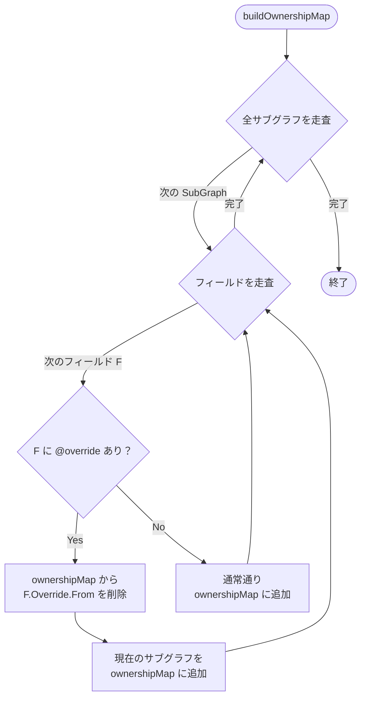
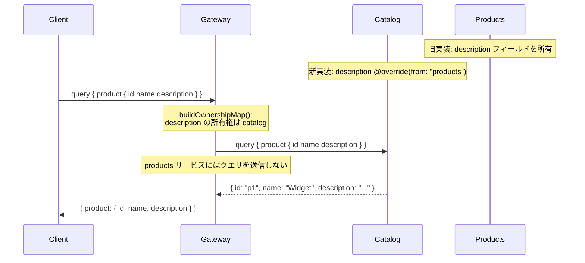
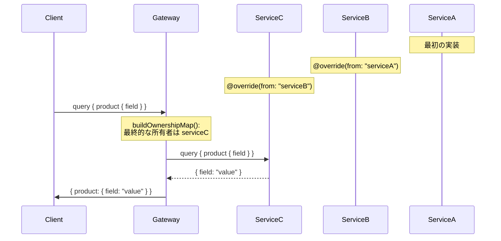

# Design Doc : Improve Directive Override

## Background

現在の go-graphql-federation-gateway は、`@override` ディレクティブのパース機能は実装されているものの、クエリプランニング時にフィールドの所有権オーバーライドを正しく適用する検証テストが不足しています。これにより、`@override(from: "subgraphA")` で指定されたフィールドが、実際にサブグラフBで解決されるべきところ、元のサブグラフAに送信されてしまう可能性があります。

Apollo Federation v2 の仕様では、`@override` ディレクティブはフィールドの所有権を別のサブグラフに移譲するために使用されます。例えば、Product.description フィールドが元々 products サービスで定義されていたが、後に catalog サービスに移行する場合、catalog サービスで `description: String! @override(from: "products")` と定義することで、Gateway は catalog サービスから description を取得するようになります。

## Summary

このドキュメントでは、`@override` ディレクティブの動作を検証し、フィールドの所有権オーバーライドが正しく機能することを確保するための設計方針と実装アプローチを提案します。具体的には、`super_graph_v2.go` の `buildOwnershipMap()` が @override を正しく処理していることの検証、および `planner_v2.go` がオーバーライドされたフィールドを正しいサブグラフに送信することの確認を行います。

## Goals

- `@override` ディレクティブによるフィールド所有権の移譲が正しく動作することの検証
- 複数サブグラフでの順次オーバーライド（A→B→C）のサポート確認
- オーバーライド元サブグラフへのクエリが送信されないことの確認

## Non-Goals

- `@override` の段階的ロールアウト機能（progressive @override）の実装
- `@override` のバリデーションエラー検出機能（存在しないサブグラフ名の検出など）
- スキーマ変更時の自動マイグレーション機能

## Algorithm

### 現在の実装状況

**パース機能（実装済み）:**

```go
// subgraph_v2.go:204-210
case "override":
    // Parse from argument of @override directive
    for _, arg := range d.Arguments {
        if arg.Name.String() == "from" {
            from := strings.Trim(arg.Value.String(), "\"")
            f.Override = &OverrideMetadata{From: from}
        }
    }
```

**所有権マップ構築（実装済み）:**

```go
// super_graph_v2.go:367-407
// buildOwnershipMap() で @override を考慮
if field.Override != nil {
    // @override(from: "subgraphName") がある場合、
    // 元のサブグラフを所有権マップから除外
    delete(ownershipMap, field.Override.From)
}
```

### 検証が必要な動作



### 修正箇所 1: super_graph_v2_test.go の検証テスト追加

**追加するテスト:**

```go
// TestSuperGraphV2_Override_BasicOverride
// - productsサービスで定義されたフィールドをcatalogサービスでオーバーライド
// - GetSubGraphsForField() がcatalogのみを返すこと

// TestSuperGraphV2_Override_ChainedOverride
// - A→B→Cの順次オーバーライド
// - 最終的なオーナーがCになること

// TestSuperGraphV2_Override_PartialFields
// - 一部のフィールドのみオーバーライド
// - オーバーライドされていないフィールドは元のサブグラフが所有
```

### 修正箇所 2: planner_v2_override_test.go の結合テスト追加

**追加するテスト:**

```go
// TestPlannerV2_Override_QueryRouting
// - クエリが正しいサブグラフにルーティングされること
// - オーバーライド元サブグラフへのクエリが生成されないこと

// TestPlannerV2_Override_WithEntityFetch
// - エンティティフェッチ時のオーバーライド動作
// - @override されたフィールドが正しいサブグラフで解決されること
```

---

## Request Sequence

### 基本的な @override の動作



### 順次オーバーライド (A→B→C)



---

## Development Command For AI Agent

### Process

**重要:** 以下のプロセスは TDD（テスト駆動開発）を厳守すること。既存の実装を検証するためのテストを先に書き、Red → Green → Refactor のサイクルを回すこと。

1. **SuperGraph V2 テスト追加 (TDD)**
   1.1. **RED: テストを先に書く** - `super_graph_v2_test.go`
        - 基本的な @override の所有権移譲テスト
        - 順次オーバーライド（A→B→C）テスト
        - 部分的なフィールドオーバーライドテスト
        - テストを実行（既存の実装で成功するはずだが、念のため確認）
   1.2. **GREEN: 実装の検証と修正**
        - 既存の実装で全テストが通ることを確認
        - テストが失敗した場合は実装を修正
        - テストカバレッジは 95% 以上を目指す
   1.3. **REFACTOR: リファクタリング**
        - 必要に応じてコードを改善
        - テストが引き続き成功することを確認

2. **Planner V2 テスト追加 (TDD)**
   2.1. **RED: テストを先に書く** - `planner_v2_override_test.go` (新規作成)
        - @override されたフィールドへのクエリが正しいサブグラフに送信されることのテスト
        - オーバーライド元サブグラフへのクエリが生成されないことのテスト
        - エンティティフェッチ時の @override 動作テスト
        - テストを実行（既存の実装で成功するはずだが、念のため確認）
   2.2. **GREEN: 実装の検証と修正**
        - 既存の実装で全テストが通ることを確認
        - テストが失敗した場合は実装を修正
   2.3. **REFACTOR: リファクタリング**
        - 必要に応じてコードを改善
        - テストが引き続き成功することを確認

3. **結合テスト**
   3.1. `_example` にオーバーライドシナリオを追加（オプション）
   3.2. `make test-all` で全ドメインのテストが通ることを確認

**TDD チェックリスト:**
- [ ] 各機能について、実装前（または既存実装の検証前）にテストを書いたか？
- [ ] テストを実行して、期待通りの結果が得られることを確認したか？
- [ ] テストが失敗した場合は実装を修正したか？（GREEN）
- [ ] リファクタリング後もテストが成功することを確認したか？（REFACTOR）
- [ ] 全てのテストが通ることを確認したか？

### Expected Outcomes

- `@override` ディレクティブの動作が包括的にテストされる
- フィールドの所有権移譲が正しく機能することが保証される
- 回帰テストとして将来の変更を保護できる
