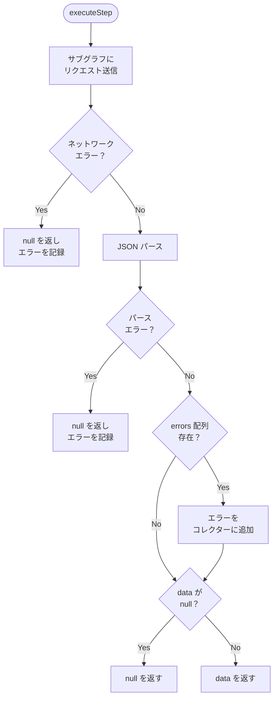
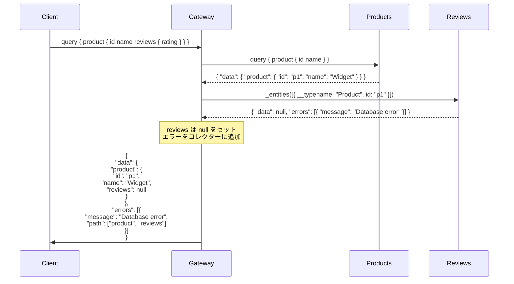
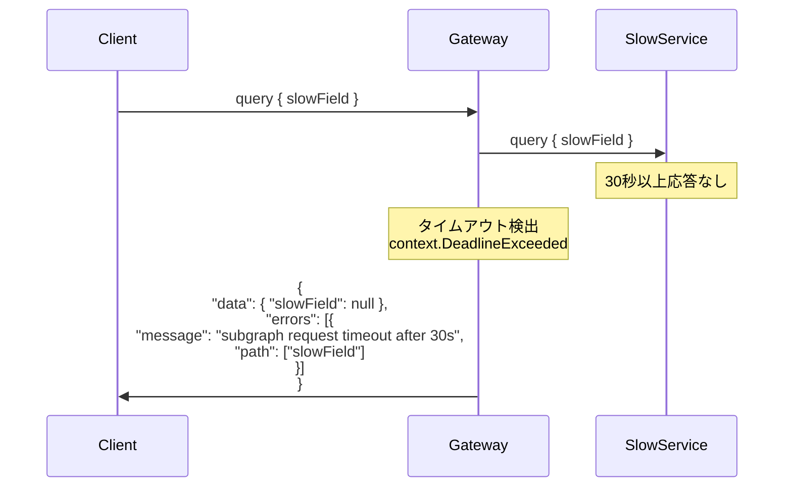

# Design Doc : Improve Error Handling

## Background

現在の go-graphql-federation-gateway は、基本的なクエリ実行とエンティティ解決機能は実装されていますが、エラーハンドリングの包括的なテストと堅牢性の向上が必要です。プロダクション環境では以下のようなエラーケースが発生する可能性があります：

- サブグラフサービスが HTTP 500 エラーを返す
- サブグラフサービスがタイムアウトする
- サブグラフサービスが不正な JSON レスポンスを返す
- サブグラフサービスが部分的なデータとエラーを返す（GraphQL の errors 配列）
- ネットワーク接続エラーが発生する

これらのエラーケースに対して、Gateway が適切に処理し、クライアントに有用なエラー情報を返すことが重要です。また、GraphQL 仕様に準拠したパーシャルレスポンス（一部のデータと errors 配列を含む）を返す必要があります。

## Summary

このドキュメントでは、エラーハンドリングの堅牢性を向上させるための設計方針と実装アプローチを提案します。具体的には、`executor_v2.go` のエラー処理ロジックの強化、タイムアウト処理の実装、およびパーシャルレスポンスの適切な生成を行います。

## Goals

- サブグラフエラー時のパーシャルレスポンス生成の検証と改善
- サブグラフタイムアウト処理の実装と検証
- 不正なレスポンス処理の実装と検証
- GraphQL エラー仕様に準拠したエラーレスポンスの生成
- エラー発生時のデバッグ情報（パス、エラーメッセージ）の適切な伝搬

## Non-Goals

- サブグラフのヘルスチェック機能
- サブグラフの自動リトライ機能（将来的には検討）
- サーキットブレーカーパターンの実装
- エラーメトリクスの収集（OpenTelemetry は別途実装済み）

## Algorithm

### 現在の実装状況

**基本的なエラー処理（実装済み）:**

```go
// executor_v2.go: executeStep()
resp, err := e.doRequest(ctx, step.SubGraph.Host, query, variables)
if err != nil {
    return nil, fmt.Errorf("request to %s failed: %w", step.SubGraph.Name, err)
}
```

**エラーパスの伝搬（実装済み）:**

```go
// executor_v2.go: 既存のエラーハンドリング
// エラー発生時に null をセットし、errors 配列に追加
```

### 修正箇所 1: サブグラフエラーのパーシャルレスポンス処理

**現状の課題:**

サブグラフが部分的なエラーを返した場合の処理が不完全な可能性があります。

**改善方針:**

```go
// サブグラフレスポンスの構造
type SubGraphResponse struct {
    Data   json.RawMessage   `json:"data"`
    Errors []GraphQLError    `json:"errors"`
}

type GraphQLError struct {
    Message    string        `json:"message"`
    Path       []interface{} `json:"path,omitempty"`
    Extensions map[string]interface{} `json:"extensions,omitempty"`
}

// エラー処理の強化
func (e *ExecutorV2) executeStep(ctx context.Context, step *planner.Step) (interface{}, error) {
    resp, err := e.doRequest(ctx, step.SubGraph.Host, query, variables)
    if err != nil {
        // ネットワークエラー: null を返し、エラーを記録
        return nil, &SubGraphError{
            SubGraph: step.SubGraph.Name,
            Message:  err.Error(),
            Path:     step.InsertionPath,
        }
    }

    var subGraphResp SubGraphResponse
    if err := json.Unmarshal(resp, &subGraphResp); err != nil {
        // 不正な JSON: null を返し、エラーを記録
        return nil, &SubGraphError{
            SubGraph: step.SubGraph.Name,
            Message:  "invalid JSON response",
            Path:     step.InsertionPath,
        }
    }

    // サブグラフがエラーを返した場合
    if len(subGraphResp.Errors) > 0 {
        // エラーをコレクターに追加（パスを調整）
        for _, err := range subGraphResp.Errors {
            e.addError(adjustErrorPath(err, step.InsertionPath))
        }
    }

    // データが null の場合も適切に処理
    if subGraphResp.Data == nil {
        return nil, nil
    }

    return subGraphResp.Data, nil
}
```



### 修正箇所 2: タイムアウト処理

**実装方針:**

```go
// ExecutorV2 に設定を追加
type ExecutorV2 struct {
    HTTPClient     *http.Client
    SubGraphTimeout time.Duration // ← 追加
    // ...
}

// doRequest() でタイムアウトを設定
func (e *ExecutorV2) doRequest(
    ctx context.Context,
    host string,
    query string,
    variables map[string]interface{},
) ([]byte, error) {
    // タイムアウト付きコンテキスト
    timeout := e.SubGraphTimeout
    if timeout == 0 {
        timeout = 30 * time.Second // デフォルト
    }

    ctx, cancel := context.WithTimeout(ctx, timeout)
    defer cancel()

    req, err := http.NewRequestWithContext(ctx, "POST", host, body)
    // ...

    resp, err := e.HTTPClient.Do(req)
    if err != nil {
        if ctx.Err() == context.DeadlineExceeded {
            return nil, fmt.Errorf("subgraph request timeout after %v", timeout)
        }
        return nil, err
    }
    // ...
}
```

### 修正箇所 3: HTTP ステータスコードの処理

**実装方針:**

```go
// doRequest() で HTTP ステータスコードをチェック
resp, err := e.HTTPClient.Do(req)
if err != nil {
    return nil, err
}
defer resp.Body.Close()

body, err := io.ReadAll(resp.Body)
if err != nil {
    return nil, fmt.Errorf("failed to read response body: %w", err)
}

// 4xx, 5xx エラーの処理
if resp.StatusCode >= 400 {
    return nil, fmt.Errorf(
        "subgraph returned HTTP %d: %s",
        resp.StatusCode,
        string(body),
    )
}
```

### 修正箇所 4: エラーパスの調整

**実装方針:**

```go
// サブグラフのエラーパスを Gateway のパスに変換
func adjustErrorPath(
    subGraphError GraphQLError,
    insertionPath []string,
) GraphQLError {
    adjusted := subGraphError

    // サブグラフのパスが ["_entities", 0, "field"] の場合
    // Gateway のパスは ["query", "product", "field"] に変換
    if len(subGraphError.Path) > 0 {
        adjusted.Path = make([]interface{}, 0)

        // insertionPath を追加
        for _, p := range insertionPath {
            adjusted.Path = append(adjusted.Path, p)
        }

        // サブグラフのパスから "_entities" をスキップして追加
        for i, p := range subGraphError.Path {
            if i == 0 && p == "_entities" {
                continue
            }
            adjusted.Path = append(adjusted.Path, p)
        }
    }

    return adjusted
}
```

---

## Request Sequence

### サブグラフエラー時のパーシャルレスポンス



### サブグラフタイムアウト時の処理



---

## Development Command For AI Agent

### Process

**重要:** 以下のプロセスは TDD（テスト駆動開発）を厳守すること。各機能の実装前に必ずテストを書き、Red → Green → Refactor のサイクルを回すこと。

1. **Executor V2 エラー処理の強化 (TDD)**
   1.1. **RED: テストを先に書く** - `executor_v2_test.go`
        - TestExecutorV2_SubGraphError: サブグラフが errors を返す場合のテスト
        - TestExecutorV2_SubGraphTimeout: タイムアウト処理のテスト
        - TestExecutorV2_InvalidJSON: 不正な JSON レスポンスのテスト
        - TestExecutorV2_HTTPError: HTTP 500 エラーのテスト
        - TestExecutorV2_NetworkError: ネットワークエラーのテスト
        - TestExecutorV2_PartialResponse: 部分的なデータとエラーのテスト
        - TestExecutorV2_ErrorPathAdjustment: エラーパスの調整のテスト
        - モックサーバーを使用してエラーケースを再現
        - テストを実行して失敗することを確認
   1.2. **GREEN: 最小限の実装** - `executor_v2.go`
        - SubGraphResponse 構造体の定義
        - GraphQLError 構造体の定義
        - adjustErrorPath() 関数の追加
        - executeStep() のエラー処理を改善（JSON パースエラー、サブグラフ errors 配列、null data の処理）
        - doRequest() の改善（HTTP ステータスコードチェック、レスポンスボディの読み取りエラー処理）
        - テストを実行して成功することを確認
   1.3. **REFACTOR: リファクタリング**
        - コードの重複を排除
        - 可読性を向上
        - テストが引き続き成功することを確認
        - テストカバレッジは 90% 以上を目指す

2. **タイムアウト処理の実装 (TDD)**
   2.1. **RED: テストを先に書く** - `executor_v2_test.go`（既に 1.1 で追加済み）
        - タイムアウト処理のテストが含まれていることを確認
   2.2. **GREEN: 実装** - `executor_v2.go`
        - ExecutorV2 構造体に SubGraphTimeout フィールドを追加
        - doRequest() でタイムアウト付きコンテキストを使用
        - タイムアウトエラーを適切に検出して処理
        - テストを実行して成功することを確認
   2.3. **REFACTOR: 改善**

3. **エラーコレクターの改善（必要に応じて・TDD）**
   3.1. **RED: テストを書く**
        - エラーの重複排除ロジックのテスト
        - エラーの優先順位付けのテスト
   3.2. **GREEN: 実装**
        - エラーの重複排除ロジック
        - エラーの優先順位付け（重大度順）
   3.3. **REFACTOR: 改善**

4. **結合テスト**
   4.1. `make test-all` で全ドメインのテストが通ることを確認
   4.2. エラーハンドリングが既存の動作を壊していないことを確認
   4.3. 必要に応じて、エラーケースを含む結合テストを追加

**TDD チェックリスト:**
- [ ] 各機能について、実装前にテストを書いたか？
- [ ] テストが最初は失敗することを確認したか？（RED）
- [ ] テストが成功する最小限のコードを書いたか？（GREEN）
- [ ] リファクタリング後もテストが成功することを確認したか？（REFACTOR）
- [ ] 全てのテストが通ることを確認したか？

### Expected Outcomes

- サブグラフエラー時に適切なパーシャルレスポンスが返される
- タイムアウト時にクライアントに有用なエラー情報が返される
- 不正なレスポンスが適切に処理される
- エラーパスが正しく調整され、クライアントがエラー箇所を特定できる
- プロダクション環境での信頼性が向上する
