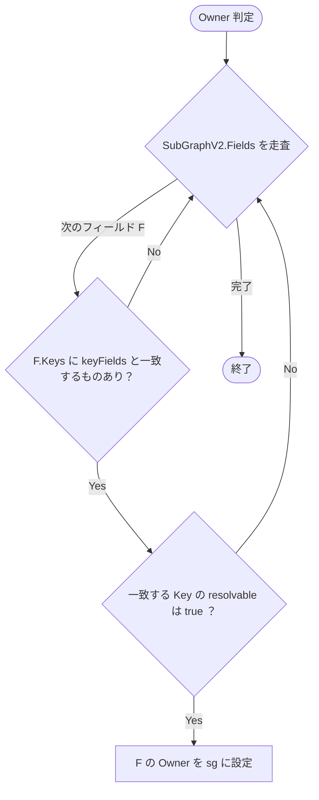
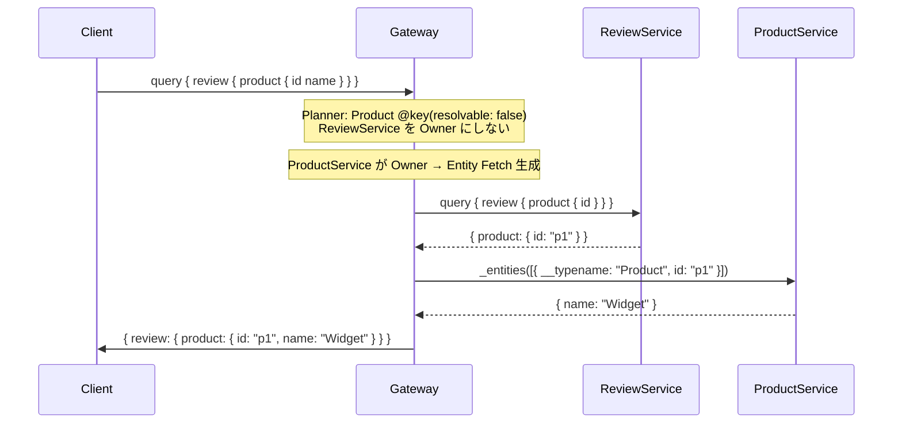

# Design Doc : Improve key resolvable false

## Background

現在の go-graphql-federation-gateway は、@key ディレクティブの resolvable: false オプションをサポートしていません。これにより、特定のエンティティタイプを Entity Fetch の対象から除外することができず、クエリの実行に失敗する可能性があります。例えば、Product タイプが @key(fields: "id", resolvable: false) を持つ場合、Gateway はこのタイプを Entity Fetch の起点として使用すべきではありませんが、現在の実装ではこの制約を適切に処理できていません。

## Summary

このドキュメントでは、@key ディレクティブの resolvable: false オプションをサポートするための設計方針と実装アプローチを提案します。具体的には、planner_v2.go の Entity Fetch 生成ロジックの修正を通じて、resolvable: false とマークされたエンティティタイプを Entity Fetch の対象から除外するロジックを追加します。

## Goals

- @key ディレクティブの resolvable: false オプションをサポートするロジックの実装
- resolvable: false とマークされたエンティティタイプを Entity Fetch の対象から除外するロジックの実装

## Non-Goals

- @key ディレクティブの resolvable: false オプションに関連するバージョニングや互換性チェックの実装

## Algorithm

### 修正箇所 1: super_graph_v2.go の Owner 判定

**現状の問題:**

super_graph_v2.go では、Owner判定の時に resolvable: false でも Owner になってしまうという問題があります。これにより、Gateway が resolvable: false のエンティティを Entity Fetch の起点として使用してしまう可能性があります。

```go
// super_graph_v2.go: Owner 判定（現状）
for _, key := range f.Keys {
    if key.Fields == keyFields {
        // ← resolvable: false でも Owner になってしまう
        f.Owner = sg
    }
}

// subgraph_v2.go: パース済みだが使われていない
type Key struct {
    Fields     string
    Resolvable bool  // ← パース済み・未活用
}
```

**修正方針:**
`super_graph_v2.go` の Owner 判定ロジックを修正し、`resolvable: false` のエンティティを Owner から除外する。



---

### 修正箇所 2: planner_v2.go の Entity Fetch 対象判定

**現状の問題:**

SuperGraph V2 を修正しただけでは、Executor が `buildRepresentation()` を呼び出す際に resolvable: false のエンティティを処理してしまう可能性があります。これにより、必要なフィールドが representation に含まれず、SubGraph に送信される Entity が不完全になる可能性があります。
そのため、`planner_v2.go` の Entity Fetch 生成ロジックも修正し、resolvable: false のエンティティを Entity Fetch の対象から除外する必要があります。

```go
// 修正前
if entity != nil {
    // Entity Fetch を生成
}

// 修正後
if entity != nil && entity.HasResolvableKey(keyFields) {
    // resolvable: false のエンティティは Entity Fetch をスキップ
}
```

SubGraphV2 には IsReolvable() メソッドを追加して、Key の resolvable フラグを参照できるようにする。

```go
// subgraph_v2.go: Key 構造体に IsResolvable() メソッドを追加
type Key struct {
    Fields     string
    Resolvable bool
}

// federation/graph/subgraph_v2.go の実際の Entity 構造
type Entity struct {
    Name   string
    Keys   []Key
    Fields map[string]*Field
    // IsResolvable() メソッドは存在しない
}

// subgraph_v2.go: Entity に HasResolvableKey() メソッドを追加
func (e *Entity) HasResolvableKey(keyFields string) bool {
    for _, key := range e.Keys {
        if key.Fields == keyFields && key.Resolvable {
            return true
        }
    }
    return false
}
```

## Request Sequence



## Development Command For AI Agent

### Process

1. **SuperGraph v2 修正**
   1.1. `super_graph_v2_test.go` に単体テストを追加
        - `@key(resolvable: false)` のエンティティが Owner から除外されること
        - 所有権判定が正しく行われること
   1.2. `super_graph_v2.go` の Owner 判定ロジックを修正して 1.1 を通す
   1.3. テストカバレッジは 95% 以上を目指す

2. **Planner V2 修正**
   2.1. `planner_v2_test.go` に単体テストを追加
        - `@key(resolvable: false)` のエンティティが Entity Fetch の対象から除外されること
        - Entity Fetch の生成ロジックが正しく動作すること
   2.2. `planner_v2.go` の Entity Fetch 生成ロジックを修正して 2.1 を通す
   2.3. テストカバレッジは 95% 以上を目指す
   2.4. `@key(resolvable: false)` のエンティティが Entity Fetch の対象から除外されることを確認するための結合テストを追加
