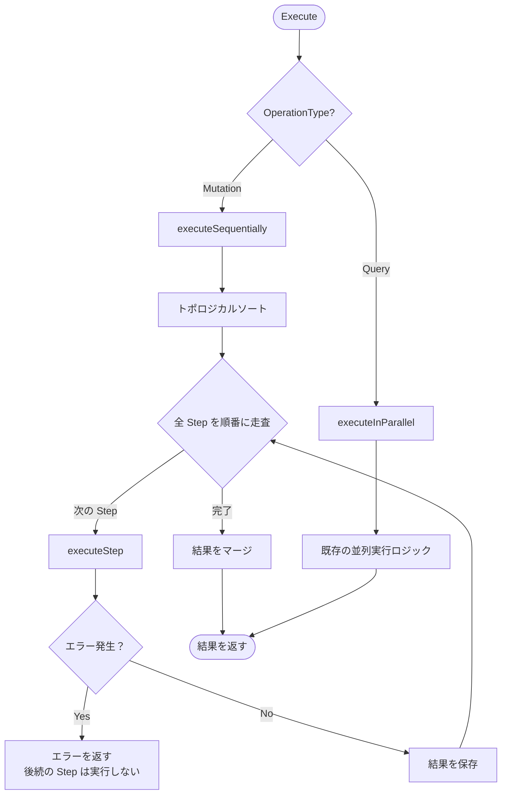
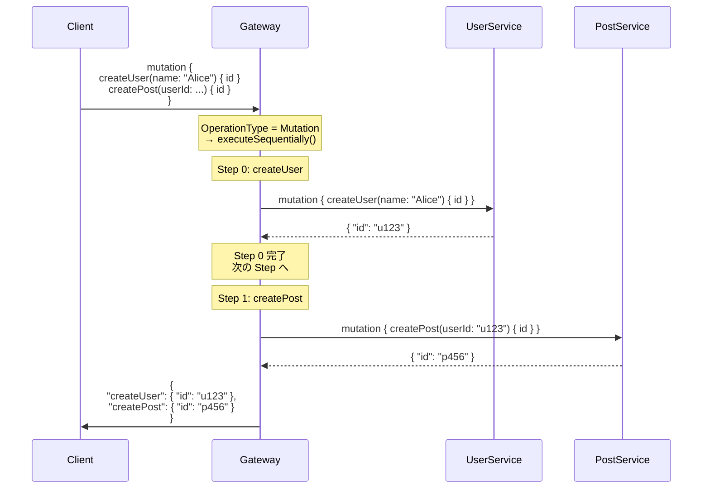
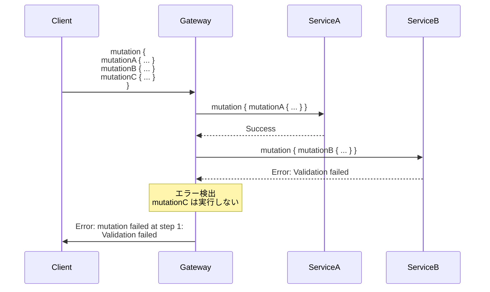
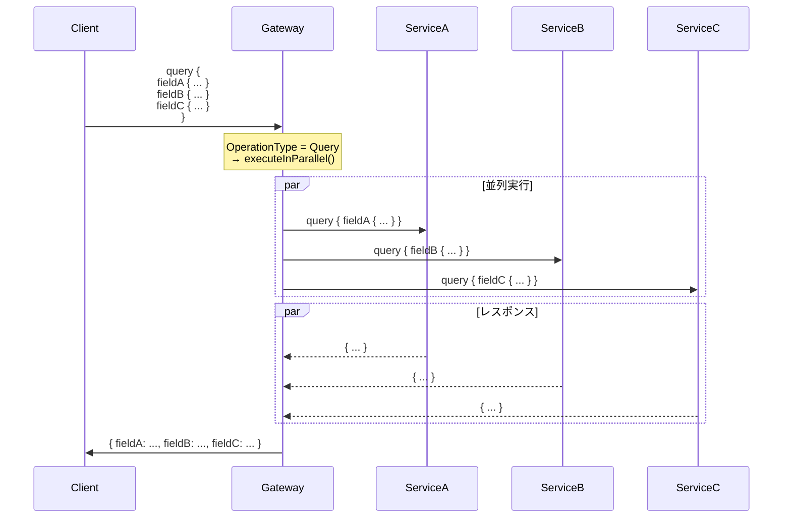

# Design Doc : Improve Mutation Data Order

## Background

現在の go-graphql-federation-gateway は、Mutation の OperationType 識別機能は実装されていますが、GraphQL 仕様で要求される **Mutation フィールドの順序実行** の保証が完全にテストされていません。

GraphQL 仕様では、Mutation 操作のフィールドは **定義された順序で直列実行** される必要があります。これは Query と異なり、Mutation がデータを変更する副作用を持つため、実行順序が結果に影響を与えるためです。

例えば、以下のような Mutation があった場合：

```graphql
mutation {
  createUser(name: "Alice") { id }
  createPost(userId: $newUserId, title: "Hello") { id }
}
```

`createUser` が完了してから `createPost` が実行される必要があります。もし並列実行されると、`createPost` が実行される時点で `userId` がまだ存在しない可能性があります。

## Summary

このドキュメントでは、Mutation フィールドの順序実行を保証するための設計方針と実装アプローチを提案します。具体的には、`executor_v2.go` の実行ロジックを修正し、Mutation の場合は Step の並列実行を無効化し、トポロジカルソート順に直列実行するようにします。

## Goals

- Mutation フィールドの順序実行の保証
- 複数 Mutation フィールドが異なるサブグラフに送信される場合の順序制御
- Mutation と Query の混在クエリの適切な処理
- 順序実行のテストケースの追加

## Non-Goals

- Mutation の並列実行の最適化（将来的に @parallel ディレクティブなどで検討）
- Subscription の順序制御
- トランザクション管理（各サブグラフは独立してトランザクションを管理）
- Mutation のロールバック機能

## Algorithm

### 現在の実装状況

**OperationType 識別（実装済み）:**

```go
// planner_v2.go: OperationType の判定
func (p *PlannerV2) getRootTypeName(operationType ast.OperationType) string {
    switch operationType {
    case ast.OperationTypeMutation:
        return "Mutation"
    case ast.OperationTypeSubscription:
        return "Subscription"
    default:
        return "Query"
    }
}

// PlanV2 構造
type PlanV2 struct {
    Steps           []*Step
    RootStepIndexes []int
    OperationType   ast.OperationType // ← 追加済み
}
```

**並列実行（現在の動作）:**

```go
// executor_v2.go: executeStepsInParallel()
// 依存関係のない Step を errgroup で並列実行
for _, stepIdx := range readySteps {
    stepIdx := stepIdx
    eg.Go(func() error {
        result, err := e.executeStep(ctx, plan.Steps[stepIdx])
        // ...
    })
}
```

**問題:**
Mutation の場合、依存関係がなくても順序を保証する必要があるが、現在の実装では並列実行される可能性があります。

### 修正箇所 1: executor_v2.go の実行ロジック修正

**実装方針:**

```go
// Execute() で OperationType を判定し、実行方法を切り替え
func (e *ExecutorV2) Execute(
    ctx context.Context,
    plan *planner.PlanV2,
) (map[string]interface{}, error) {
    // Mutation の場合は直列実行
    if plan.OperationType == ast.OperationTypeMutation {
        return e.executeSequentially(ctx, plan)
    }

    // Query の場合は並列実行（既存ロジック）
    return e.executeInParallel(ctx, plan)
}

// executeSequentially() を新規追加
func (e *ExecutorV2) executeSequentially(
    ctx context.Context,
    plan *planner.PlanV2,
) (map[string]interface{}, error) {
    results := make(map[int]interface{})
    executed := make(map[int]bool)

    // トポロジカルソート順に実行（既存のロジックを流用）
    sortedSteps, err := e.topologicalSort(plan)
    if err != nil {
        return nil, err
    }

    // 順番に1つずつ実行
    for _, stepIdx := range sortedSteps {
        step := plan.Steps[stepIdx]

        result, err := e.executeStep(ctx, step)
        if err != nil {
            // Mutation でエラーが発生した場合、後続の Mutation は実行しない
            return nil, fmt.Errorf("mutation step %d failed: %w", stepIdx, err)
        }

        results[stepIdx] = result
        executed[stepIdx] = true
    }

    // 結果をマージ
    return e.mergeResults(plan, results)
}

// executeInParallel() に既存のロジックをリファクタ
func (e *ExecutorV2) executeInParallel(
    ctx context.Context,
    plan *planner.PlanV2,
) (map[string]interface{}, error) {
    // 既存の並列実行ロジック
    // ...
}
```



### 修正箇所 2: Planner での Mutation フィールドの順序保持

**確認事項:**

Planner が Mutation フィールドを処理する際、フィールドの順序を保持していることを確認します。

```go
// planner_v2.go: Plan() での root フィールドの処理
for _, selection := range operation.SelectionSet {
    field := selection.(*ast.Field)
    // フィールドの順序は operation.SelectionSet の順序に依存
    // SelectionSet は AST のパース順序を保持しているため、順序は保証されている
}
```

**検証:**
- `operation.SelectionSet` がフィールドの定義順序を保持していることを確認
- Step の作成順序がフィールドの順序と一致していることを確認

### 修正箇所 3: エラーハンドリングの改善

**Mutation でのエラー処理:**

```go
// Mutation 中にエラーが発生した場合の処理
if plan.OperationType == ast.OperationTypeMutation {
    // 最初のエラーで実行を停止
    // パーシャルレスポンスではなく、完全なエラーを返す
    return nil, fmt.Errorf("mutation failed at step %d: %w", stepIdx, err)
}
```

**理由:**
- Mutation は副作用を持つため、中途半端な状態を避ける
- エラー後の Mutation フィールドは実行しない（all-or-nothing の挙動）

---

## Request Sequence

### Mutation の順序実行



### Mutation でのエラー処理



### Query との比較（並列実行）



---

## Development Command For AI Agent

### Process

**重要:** 以下のプロセスは TDD（テスト駆動開発）を厳守すること。各機能の実装前に必ずテストを書き、Red → Green → Refactor のサイクルを回すこと。

1. **Executor V2 修正 (TDD)**
   1.1. **RED: テストを先に書く** - `executor_v2_test.go`
        - TestExecutorV2_MutationSequentialExecution: Mutation が順序実行されることのテスト
        - TestExecutorV2_MutationErrorHandling: エラー時に後続の Mutation が実行されないことのテスト
        - TestExecutorV2_QueryParallelExecution: Query が並列実行されることのテスト（既存動作の確認）
        - モックサーバーを使用して実行順序を検証（サーバー側でタイムスタンプを記録）
        - Mutation の実行順序が定義順と一致することを確認するテスト
        - テストを実行して失敗することを確認
   1.2. **GREEN: 最小限の実装** - `executor_v2.go`
        - executeSequentially() 関数を追加
        - executeInParallel() に既存のロジックをリファクタ
        - Execute() で OperationType に応じて実行方法を切り替え
        - エラーハンドリングを改善（Mutation でエラーが発生した場合、後続の Step を実行しない、エラーメッセージに Step 番号を含める）
        - テストを実行して成功することを確認
   1.3. **REFACTOR: リファクタリング**
        - コードの重複を排除
        - 可読性を向上
        - テストが引き続き成功することを確認

2. **Planner の検証 (TDD)**
   2.1. **RED: テストを先に書く** - `planner_v2_mutation_test.go` (新規作成)
        - Mutation フィールドの順序が Step の順序に反映されることのテスト
        - トポロジカルソートが順序を崩さないことのテスト
        - テストを実行（既存の実装で成功するはずだが、念のため確認）
   2.2. **GREEN: 実装の検証と修正**
        - 既存の実装で全テストが通ることを確認
        - テストが失敗した場合は実装を修正
   2.3. **REFACTOR: 改善**

3. **結合テスト (TDD)**
   3.1. **RED: 結合テストを先に書く**
        - 複数サブグラフにまたがる Mutation のテスト
        - Mutation と Entity Fetch の組み合わせテスト
        - テストを実行して現状を確認
   3.2. **GREEN: 必要な調整**
        - テストが成功するように実装を調整
   3.3. **REFACTOR: 改善**

4. **ドキュメント**
   4.1. Mutation の順序実行について README に追記
   4.2. GraphQL 仕様への準拠を明記

5. **最終確認**
   5.1. `make test-all` で全ドメインのテストが通ることを確認

**TDD チェックリスト:**
- [ ] 各機能について、実装前にテストを書いたか？
- [ ] テストが最初は失敗することを確認したか？（RED）
- [ ] テストが成功する最小限のコードを書いたか？（GREEN）
- [ ] リファクタリング後もテストが成功することを確認したか？（REFACTOR）
- [ ] 全てのテストが通ることを確認したか？

### Expected Outcomes

- Mutation フィールドが GraphQL 仕様に準拠して順序実行される
- エラー発生時に後続の Mutation が実行されない
- Query の並列実行は維持される（既存動作）
- Mutation の実行順序が保証されることでデータ整合性が向上する
- GraphQL 仕様への準拠度が向上する
