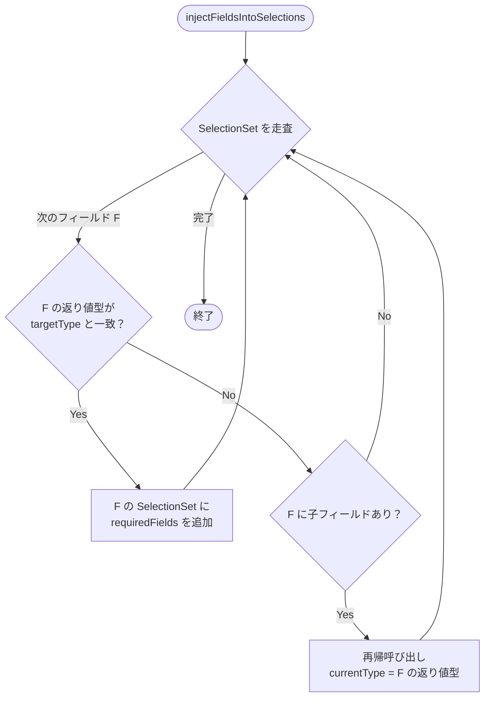
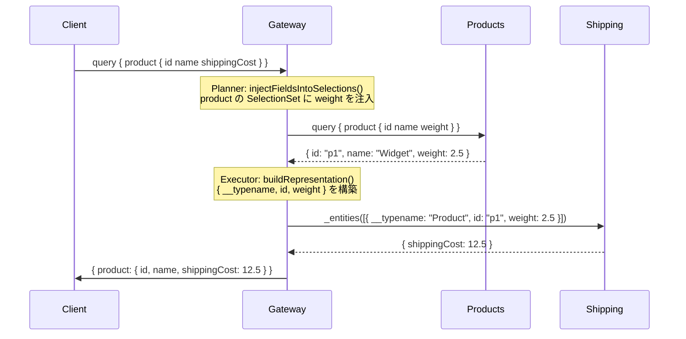

# Design Doc : Improve Requires DI

## Background

現在の go-graphql-federation-gateway は、@requires ディレクティブを利用し、サブグラフ間のフィールドの依存関係を適切に処理するためのロジックが不足しています。これにより、特定のクエリに対して正しいフィールドの注入が行われず、クエリの実行に失敗する可能性があります。例えば、User.reviewCount フィールドが @requires(fields: "reviews") を持ち、User.reviews フィールドが @requires(fields: "purchaseHistory") を持つ場合、purchaseHistory → reviews → reviewCount の順でフィールドを解決する必要がありますが、現在の実装ではこの依存関係を正しく処理できていません。

## Summary

このドキュメントでは、@requires ディレクティブを利用したフィールドの依存関係を適切に処理するための設計方針と実装アプローチを提案します。具体的には、planner_v2.go の injectFieldsIntoSelections() 関数の修正、および executor_v2.go の buildRepresentation() 関数の修正を通じて、必要なフィールドの注入ロジックを強化します。

## Goals

- @requires ディレクティブを利用したフィールドの依存関係を適切に処理するロジックの実装
- 注入対象のフィールドを正確に特定するロジックの実装

## Non-Goals

- @requires ディレクティブを利用したフィールドの依存関係のバージョニングや互換性チェックの実装

## Algorithm

### 修正箇所 1: Planner — `injectFieldsIntoSelections()` の注入先の修正

**現状の問題:**

`injectFieldsIntoSelections()` 自体は再帰処理を持っているが、
`getFieldReturnType(currentType, fieldName)` が `SubGraphV2.Field` に
`ReturnType` を持たないため、targetType との比較が常に失敗している。

```go
// getFieldReturnType("Query", "product") → "" （空文字）
// → targetType "Product" との比較が常に false
// → weight が product { ... } の SelectionSet に注入されない
```

**修正方針:**
型比較をスキップして、**フィールド名ベース**で注入先を特定するアプローチに変更する。
具体的には `SelectionSet` を再帰的に走査し、`targetType` を返すフィールドを
型情報ではなく `step.ParentType` と `SubGraphV2.Fields` の照合で特定する。



---

### 修正箇所 2: Executor — `buildRepresentation()` への required フィールドの値の注入

**現状の問題:**

`@requires` フィールドは `graph.SubGraphV2.Field.RequiredFields []string` に
格納されている。`buildRepresentation()` はこの情報を参照していないため、
`weight` などの required フィールドが representation に含まれない。

```go
// 現在: { "__typename": "Product", "id": "p1" } のみ送信
// 正しい: { "__typename": "Product", "id": "p1", "weight": 2.5 }
```

**`RequiredFields` の取得方法:**

```go
// graph.SubGraphV2.Field から取得する
// TypeName と FieldName で対象フィールドを特定する
for _, f := range subGraph.Fields {
    if f.TypeName == step.ParentType && f.FieldName == targetFieldName {
        requiredFields = f.RequiredFields  // []string{"weight"}
    }
}
```

**修正方針:**
`buildRepresentation()` に `requiredFields []string` 引数を追加し、
呼び出し元で `SubGraphV2.Fields` から `step.ParentType` に一致する
`RequiredFields` を収集して渡す。

```go
// 修正後のシグネチャ
func buildRepresentation(
    entity map[string]interface{},
    keyFields []string,
    requiredFields []string,  // ← 追加
) map[string]interface{}

// representation に requiredFields の値も追加
for _, rf := range requiredFields {
    if val, ok := entity[rf]; ok {
        repr[rf] = val
    }
}
```

---

### 修正箇所 3: ネストした `@requires` の依存順序

トポロジカルソートが必要なのは **Step の実行順序**ではなく、
**`injectRequiresDependencies()` 内で複数の `@requires` を処理する順序**である。

```
fieldA @requires(fields: "fieldB")
fieldB @requires(fields: "fieldC")

→ 注入順序: fieldC → fieldB → fieldA
→ 注入先の parentStep にはすべてが含まれている必要がある
```

**修正方針:**
`injectRequiresDependencies()` 内で、`RequiredFields` の依存グラフを構築し、
トポロジカルソートで注入順序を決定する。

---

## Request Sequence



---

## Development Command For AI Agent

### Process

1. **Planner 修正**
   1.1. `planner_v2_requires_test.go` にテストを追加
        - `product { shippingCost }` → Planner が `product { shippingCost weight }` を生成すること
        - ネスト `@requires`（fieldA→fieldB→fieldC）の注入順序が正しいこと
   1.2. `getFieldReturnType()` をフィールド名ベースの照合に変更して 1.1 を通す
   1.3. `injectRequiresDependencies()` にトポロジカルソートを実装して 1.1 を通す

2. **Executor 修正**
   2.1. `executor_v2_test.go` にテストを追加
        - `buildRepresentation()` が `@requires` フィールドの値を representation に含めること
   2.2. `buildRepresentation()` に `requiredFields` 引数を追加し、`SubGraphV2.Fields` から取得するロジックを実装して 2.1 を通す

3. **結合テスト**
   3.1. `_example/ec/success_test_runner.sh` の以下を通す
        - `ShippingCost Computation via @requires`
   3.2. `make test-all` で全ドメイン（73テスト）が通ることを確認