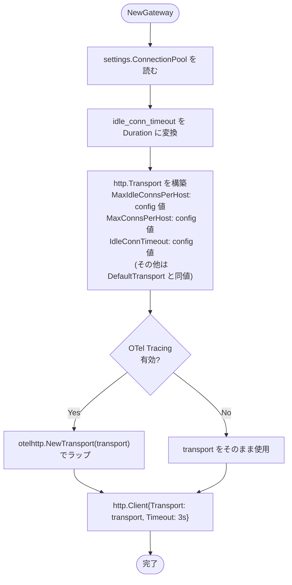
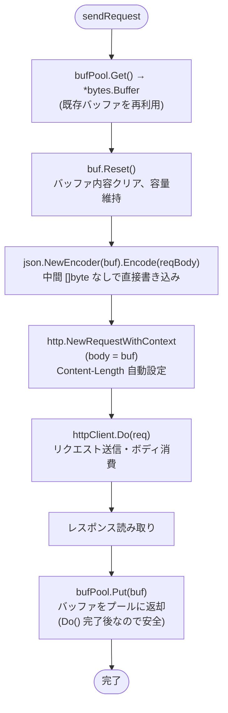

# Design Doc : @external + @requires Cross-Service 性能改善

## Background

[docs/inspection-requires-federation/ja/designdoc.md](../../inspection-requires-federation/ja/designdoc.md) の分析により、Go Gateway が Apollo Router より ~12% 遅い主な原因として以下の 2 点が特定された：

1. **HTTP コネクションプール未設定**: `http.DefaultTransport` の `MaxIdleConnsPerHost: 2` のため、concurrency 50 では大部分のリクエストが新規 TCP 接続を確立する
2. **リクエストごとのアロケーション**: `sendRequest` 内で毎回 `map[string]interface{}` + `json.Marshal` + `bytes.NewReader` を生成する

## Goals

- HTTP コネクションプールの最大接続数を `gateway.yaml` から設定可能にする
- `init` コマンドで生成される `gateway.yaml` にコネクションプール設定を含める
- `sendRequest` のリクエストボディ構築を `sync.Pool` でプール化し、ヒープアロケーションを削減する

## Non-Goals

- Executor の mutex 細粒度化（P2 対応）
- `collectRequiredFields` のプラン時キャッシュ（P2 対応）

## Algorithm

### 変更 1: ConnectionPoolSetting を gateway.yaml から設定

```yaml
# gateway.yaml に追加
connection_pool:
  max_idle_conns_per_host: 32   # デフォルト: 32
  max_conns_per_host: 0         # デフォルト: 0 (無制限)
  idle_conn_timeout: "90s"      # デフォルト: "90s"
```



**デフォルト値の根拠**:

| パラメータ | デフォルト | 根拠 |
|-----------|-----------|------|
| `max_idle_conns_per_host` | 32 | concurrency 50 に対して余裕を持たせつつメモリを節約 |
| `max_conns_per_host` | 0 | アクティブ接続数は制限しない（timeout で保護）|
| `idle_conn_timeout` | "90s" | `http.DefaultTransport` と同じ |

---

### 変更 2: sendRequest のリクエストボディを sync.Pool でプール化

**現在の問題（毎リクエスト発生するアロケーション）:**

```
map[string]interface{}{...}   → ヒープ確保 (reqBody)
json.Marshal(reqBody)         → []byte 新規確保 (bodyBytes)
bytes.NewReader(bodyBytes)    → Reader ラッパー確保
```

**修正後の流れ:**



**安全性の根拠:**
- `httpClient.Do()` はリクエストボディを完全に読み終えてから return する（HTTP/1.1 同期型）
- `defer e.bufPool.Put(buf)` は `Do()` 完了後に実行されるため、バッファ再利用は安全
- `bytes.Buffer` は `io.Reader` を実装しており `http.NewRequestWithContext` に直接渡せる
- Go の net/http は `*bytes.Buffer` を検出して `Content-Length` を自動設定する

**削減されるアロケーション:**

| 項目 | 修正前 | 修正後 |
|------|--------|--------|
| リクエストボディ用 `map` | 毎回確保 | 毎回確保（変更なし、小さいため許容）|
| JSON エンコード結果 `[]byte` | 毎回新規確保 | **プール済みバッファに直接書き込み** |
| `bytes.NewReader` | 毎回確保 | **不要（`*bytes.Buffer` を直接使用）** |

---

## 変更ファイル一覧

| ファイル | 変更内容 |
|---------|---------|
| `gateway/gateway.go` | `ConnectionPoolSetting` 構造体追加、`GatewayOption` に `ConnectionPool` フィールド追加、`NewGateway` でカスタム Transport 構築 |
| `cmd/go-graphql-federation-gateway/main.go` | `SampleGatewaySetting` に `ConnectionPool` デフォルト値を追加 |
| `federation/executor/executor_v2.go` | `ExecutorV2` に `bufPool sync.Pool` 追加、`sendRequest` をプール使用に変更 |

---

## Development Command For AI Agent

### Process

**重要:** 以下のプロセスは TDD（テスト駆動開発）を厳守すること。各ステップで **RED → GREEN → REFACTOR** のサイクルを守ること。

---

#### Step 1 RED: gateway.go の ConnectionPool 設定テストを書く

**対象**: `gateway/gateway_test.go`（既存に追記）

以下を書き、`go test ./gateway/... -run TestConnectionPool` が **失敗** することを確認:

- `GatewayOption.ConnectionPool.MaxIdleConnsPerHost` が未定義でコンパイルエラーになること

#### Step 1 GREEN: GatewayOption に ConnectionPool を追加

**対象**: `gateway/gateway.go`

1. `ConnectionPoolSetting` 構造体を追加
2. `GatewayOption` に `ConnectionPool ConnectionPoolSetting` フィールドを追加
3. `NewGateway` でカスタム `http.Transport` を構築

`go build ./...` でコンパイルが通ることを確認

---

#### Step 2 RED: sendRequest プール化のベンチマーク/テストを書く

**対象**: `federation/executor/executor_v2_test.go`（既存に追記）

`sendRequest` が返すデータを検証するテストが既存で通ることを確認（RED なし、回帰確認）

#### Step 2 GREEN: ExecutorV2 に bufPool を追加

**対象**: `federation/executor/executor_v2.go`

1. `ExecutorV2` に `bufPool sync.Pool` を追加
2. `newExecutorV2` でプールを初期化（`*bytes.Buffer` を返す）
3. `sendRequest` をプール使用に変更

`go test ./federation/executor/...` が通ることを確認

---

#### Step 3 REFACTOR: init コマンドを更新

**対象**: `cmd/go-graphql-federation-gateway/main.go`

`SampleGatewaySetting` に `ConnectionPool` デフォルト値を追加

---

#### Step 4: 全体テスト

- `go test ./...` で全ユニットテストが通ることを確認
- `cd _example && make test-all` で全結合テスト（8 ドメイン計 135 テスト）が通ることを確認

---

### TDD チェックリスト

- [ ] `ConnectionPoolSetting` が `GatewayOption` に追加されたか？
- [ ] `NewGateway` でカスタム Transport が構築されるか？
- [ ] `SampleGatewaySetting` に ConnectionPool が含まれるか？
- [ ] `ExecutorV2.bufPool` が `sync.Pool` で初期化されるか？
- [ ] `sendRequest` がバッファプールを使うか？
- [ ] `go test ./...` 全テストが通るか？
- [ ] `make test-all` 全 8 ドメイン 135 テストが通るか？
