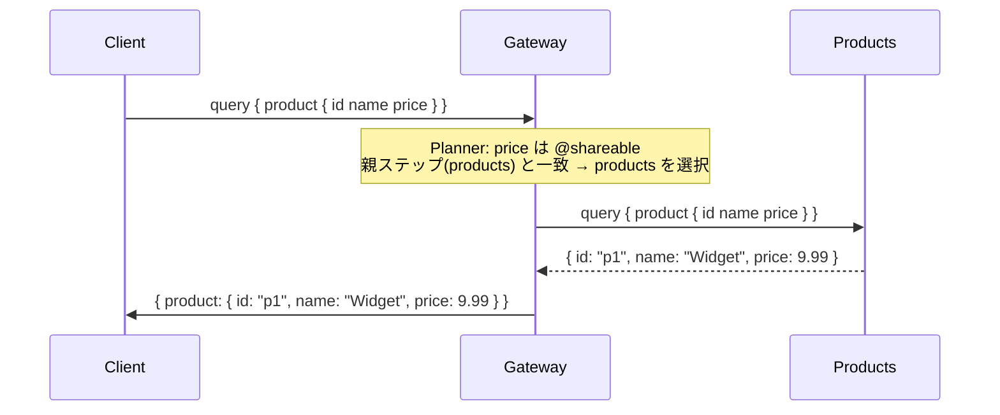
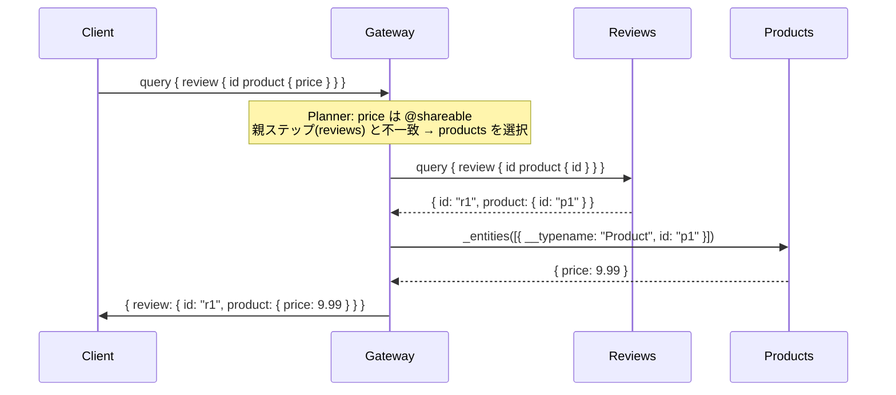

# Design Doc : Improve Shareable

## Background

現在の go-graphql-federation-gateway は、`@shareable` ディレクティブで複数のサブグラフが同一フィールドを所有する場合、`GetSubGraphsForField()` は複数の `*SubGraphV2` を返すが、Planner は `subGraphs[0]` しか使用しない。これにより、最適なサブグラフ選択が行われず、不必要な Entity Fetch が発生する可能性がある。

例えば、`Product.price` が `products` と `pricing` の両方に `@shareable` で定義されている場合、クライアントが `products` サービスのフィールドと一緒に `price` を要求したとき、`pricing` サービスへの不要な Entity Fetch が発生してしまう。

## Summary

このドキュメントでは、`@shareable` フィールドに対して最適なサブグラフを選択するための設計方針と実装アプローチを提案します。具体的には、`planner_v2.go` の `GetSubGraphsForField()` 結果から親ステップと同一サブグラフを優先選択するロジックを追加します。

## Goals

- `@shareable` フィールドに対して、親ステップと同一サブグラフを優先選択するロジックの実装
- 不必要な Entity Fetch の削減

## Non-Goals

- `@shareable` フィールドの負荷分散（ラウンドロビン等）の実装
- `@shareable` フィールドのバリデーション（スキーマ検証）の実装

## Algorithm

### 修正箇所 1: planner_v2.go の `@shareable` フィールド選択

**現状の問題:**

```go
// planner_v2.go（現状）
subGraphs := p.SuperGraph.GetSubGraphsForField(rootTypeName, fieldName)
subGraph := subGraphs[0]
// Use the first subgraph (for @shareable fields there may be multiple,
// but use the first one for now)  ← 未実装であることが明記されている
```

`subGraphs[0]` は登録順に依存するため、親ステップと異なるサブグラフが選ばれ、
不必要な Entity Fetch が発生する。

**修正方針:**
`selectSubGraphForField()` ヘルパー関数を新規追加し、
`parentStep.SubGraph` と一致するサブグラフを優先選択する。

```go
// 新規追加: selectSubGraphForField()
func selectSubGraphForField(
    subGraphs []*graph.SubGraphV2,
    parentSubGraphName string,
) *graph.SubGraphV2 {
    // 1. 親ステップと同一サブグラフを優先
    for _, sg := range subGraphs {
        if sg.Name == parentSubGraphName {
            return sg
        }
    }
    // 2. 一致しない場合は最初のサブグラフを返す（既存の動作を維持）
    return subGraphs[0]
}
```

```mermaid
flowchart TD
    Start([selectSubGraphForField]) --> Loop{subGraphs を走査}
    Loop -- 次の sg --> CheckMatch{sg.Name == parentSubGraphName？}
    CheckMatch -- Yes --> ReturnMatch[sg を返す]
    CheckMatch -- No --> Loop
    Loop -- 完了（一致なし） --> ReturnFirst[subGraphs[0] を返す]
```

---

### 修正箇所 2: planner_v2.go の呼び出し元の修正

**現状:**
```go
subGraphs := p.SuperGraph.GetSubGraphsForField(rootTypeName, fieldName)
subGraph := subGraphs[0]  // ← 修正対象
```

**修正後:**
```go
subGraphs := p.SuperGraph.GetSubGraphsForField(rootTypeName, fieldName)
subGraph := selectSubGraphForField(subGraphs, parentStep.SubGraph.Name)
```

---

## Request Sequence

### `@shareable` フィールドが同一サブグラフで解決される場合（修正後）



### `@shareable` フィールドが別サブグラフで解決される場合（修正後）



---

## Development Command For AI Agent

### Process

1. **Planner V2 修正**
   1.1. `planner_v2_shareable_test.go` にテストを追加
        - `@shareable` フィールドが親ステップと同一サブグラフで解決されること
        - `@shareable` フィールドが親ステップと異なるサブグラフの場合、最初のサブグラフが選ばれること
        - 非 `@shareable` フィールドの動作が変わらないこと（リグレッションテスト）
   1.2. `planner_v2.go` に `selectSubGraphForField()` を追加して 1.1 を通す
   1.3. `subGraphs[0]` の呼び出し元を `selectSubGraphForField()` に置き換えて 1.1 を通す
   1.4. テストカバレッジは 95% 以上を目指す

2. **結合テスト**
   2.1. `make test-all` で全ドメイン（73テスト）が通ることを確認